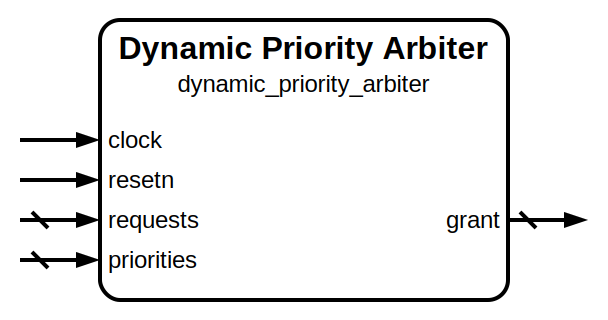

# Dynamic Priority Arbiter

|         |                                           |
| ------- | ----------------------------------------- |
| Module  | Dynamic Priority Arbiter                  |
| Project | OmniCores-BuildingBlocks                  |
| Author  | Louis Duret-Robert - louisduret@gmail.com |
| Website | louis-dr.github.io                        |
| License | MIT License - https://mit-license.org/    |

## Overview

Arbiters between different request channels based on externally supplied priority values. The grant is given to the requesting channel with the highest priority value. If multiple requesting channels share the highest priority value, the fallback arbiter is used. It can be configured to a static priority arbiter, or a round-robin arbiter.

## Parameters

| Name               | Type    | Allowed Values                       | Default                 | Description                                              |
| ------------------ | ------- | ------------------------------------ | ----------------------- | -------------------------------------------------------- |
| `SIZE`             | integer | `>1`                                 | `4`                     | Number of channels.                                      |
| `PRIORITY_WIDTH`   | integer | `>0`                                 | `log2(SIZE)=2`          | Bit width of the priority value for each channel.        |
| `PRIORITIES_WIDTH` | integer | `>1`                                 | `PRIORITY_WIDTH*SIZE=8` | Bit width of the combined priority array.                |
| `FALLBACK_ARBITER` | string  | `"static_priority"`, `"round_robin"` | `"static_priority"`     | Fallback arbiter for multiple highest priority requests. |
| `FALLBACK_VARIANT` | string  | `"fast"`, `"small"`                  | `"fast"`                | Variant for the fallback arbiter.                        |

## Ports

| Name         | Direction | Width                   | Clock        | Reset    | Reset value | Description                                                                                                                                   |
| ------------ | --------- | ----------------------- | ------------ | -------- | ----------- | --------------------------------------------------------------------------------------------------------------------------------------------- |
| `clock`      | input     | 1                       | self         |          |             | Clock signal.                                                                                                                                 |
| `resetn`     | input     | 1                       | asynchronous | self     | `0`         | Asynchronous reset signal. Resets the priority pointer.                                                                                       |
| `requests`   | input     | `SIZE`                  | `clock`      |          |             | Request channels. `1`: requesting a grant. `0`: idle.                                                                                 |
| `priorities` | input     | `SIZE * PRIORITY_WIDTH` | `clock`      |          |             | Priority values for each channel. Packed array: `{priority[N-1], ..., priority[1], priority[0]}`. Higher value means higher priority. |
| `grant`      | output    | `SIZE`                  | `clock`      | `resetn` |             | Channel receiving the grant. One-hot encoding. `1`: grant given. `0`: no grant.                                                       |

## Operation

The arbiter first unpacks the priority array and classifies the requests per priority class, then it finds the highest priority class with an active request and filters corresponding requests, and finally it feeds those requests to the fallback arbiter to get the correct grant.

## Paths

| From         | To      | Type          | Comment |
| ------------ | ------- | ------------- | ------- |
| `requests`   | `grant` | combinational |         |
| `priorities` | `grant` | combinational |         |

## Complexity

| `FALLBACK_ARBITER`  | `FALLBACK_VARIANT` | Delay | Gates | Comment |
| ------------------- | ------------------ | ----- | ----- | ------- |
| `"static_priority"` | `"fast"` (default) |       |       |         |
| `"static_priority"` | `"small"`          |       |       |         |
| `"round_robin"`     | `"fast"`           |       |       |         |
| `"round_robin"`     | `"small"`          |       |       |         |

## Verification

The arbiter is verified using a SystemVerilog testbench with concurrent assertions and three check sequences. It uses a helper function to calculate the mask of active highest priority requests.

| Number | Check                 | Description                                                                                                                    |
| ------ | --------------------- | ------------------------------------------------------------------------------------------------------------------------------ |
| 1      | Single request active | Activate each request one at a time and check that it is granted over all prority configurations.                              |
| 2      | All requests active   | Activate all requests and check over all prority configurations that the grant is within the highest priority active requests. |
| 3      | Random stimulus       | Random value of the request and priorities buses and check that the grant is within the highest priority active requests.      |

The folowing table lists the parameter values verified by the testbench.

| `SIZE` |           |
| ------ | --------- |
| 4      | (default) |

## Constraints

There are no synthesis and implementation constraints for this block.

## Deliverables

| Type              | File                               | Description                                         |
| ----------------- | ---------------------------------- | --------------------------------------------------- |
| Design            | `dynamic_priority_arbiter.v`       | Verilog design.                                     |
| Testbench         | `dynamic_priority_arbiter_tb.sv`   | SystemVerilog verification testbench.               |
| Waveform script   | `dynamic_priority_arbiter_tb.gtkw` | Script to load the waveforms in GTKWave.            |
| Symbol descriptor | `dynamic_priority_arbiter.sss`     | Symbol descriptor for SiliconSuite-SymbolGenerator. |
| Symbol image      | `dynamic_priority_arbiter.svg`     | Generated vector image of the symbol.               |
| Datasheet         | `dynamic_priority_arbiter.md`      | Markdown documentation datasheet.                   |

## Dependencies

| Module                                                                             | Path                                                                  | Comment                                 |
| ---------------------------------------------------------------------------------- | --------------------------------------------------------------------- | --------------------------------------- |
| [`static_priority_arbiter`](../static_priority_arbiter/static_priority_arbiter.md) | `omnicores-buildingblocks/sources/arbiter/static_priority_arbiter`    |                                         |
| `first_one`                                                                        | `omnicores-buildingblocks/sources/operations/first_one`               |                                         |
| `fast_first_one`                                                                   | `omnicores-buildingblocks/sources/operations/first_one`               | For the default `fast` variant.         |
| `small_first_one`                                                                  | `omnicores-buildingblocks/sources/operations/first_one`               | For the `small` variant.                |
| [`round_robin_arbiter`](../round_robin_arbiter/round_robin_arbiter.md)             | `omnicores-buildingblocks/sources/arbiter/round_robin_arbiter`        | For the `round_robin` fallback arbiter. |
| `barrel_rotator_left`                                                              | `omnicores-buildingblocks/sources/operations/barrel_rotator_left`     | For the `round_robin` fallback arbiter. |
| `barrel_rotator_right`                                                             | `omnicores-buildingblocks/sources/operations/barrel_rotator_right`    | For the `round_robin` fallback arbiter. |
| `wrapping_increment_counter`                                                       | `omnicores-buildingblocks/sources/counter/wrapping_increment_counter` | For the `round_robin` fallback arbiter. |

## Related modules

| Module                                                                             | Path                                                               | Comment                             |
| ---------------------------------------------------------------------------------- | ------------------------------------------------------------------ | ----------------------------------- |
| [`static_priority_arbiter`](../static_priority_arbiter/static_priority_arbiter.md) | `omnicores-buildingblocks/sources/arbiter/static_priority_arbiter` | Arbiter with static priority order. |
| [`round_robin_arbiter`](../round_robin_arbiter/round_robin_arbiter.md)             | `omnicores-buildingblocks/sources/arbiter/round_robin_arbiter`     | Simpler fair arbiter.               |
