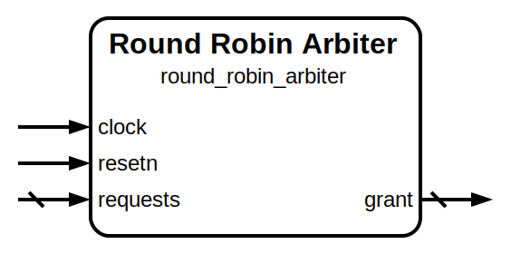

# Round-Robin Arbiter

|         |                                                                                  |
| ------- | -------------------------------------------------------------------------------- |
| Module  | Round-Robin Arbiter                                                              |
| Project | [OmniCores-BuildingBlocks](https://github.com/Louis-DR/OmniCores-BuildingBlocks) |
| Author  | Louis Duret-Robert - [louisduret@gmail.com](mailto:louisduret@gmail.com)         |
| Website | [louis-dr.github.io](https://louis-dr.github.io)                                 |
| License | MIT License - https://mit-license.org/                                           |

## Overview

Arbiters between different request channels using a round-robin scheme. The grant priority rotates among the requesting channels at each cycle, ensuring fairness. This is the wrapper between the different variants of the round-robin arbiter.

## Parameters

| Name              | Type    | Allowed Values                   | Default      | Description                                         |
| ----------------- | ------- | -------------------------------- | ------------ | --------------------------------------------------- |
| `SIZE`            | integer | `>1`                             | `4`          | Number of channels.                                 |
| `ROTATE_ON_GRANT` | integer | `0`,`1`                          | `0`          | `0`: rotate every cycles. `1`: rotate on grant. |
| `VARIANT`         | string  | `"small"`,`"balanced"`, `"fast"` | `"balanced"` | Implementation variant.                             |

## Ports

| Name       | Direction | Width  | Clock        | Reset    | Reset value | Description                                                                             |
| ---------- | --------- | ------ | ------------ | -------- | ----------- | --------------------------------------------------------------------------------------- |
| `clock`    | input     | 1      | self         |          |             | Clock signal.                                                                           |
| `resetn`   | input     | 1      | asynchronous | self     | `0`         | Asynchronous reset signal. Resets the priority pointer.                                 |
| `requests` | input     | `SIZE` | `clock`      |          |             | Request channels. `1`: requesting a grant. `0`: idle.                           |
| `grant`    | output    | `SIZE` | `clock`      | `resetn` |             | Channel receiving the grant. One-hot encoding. `1`: grant given. `0`: no grant. |

## Operation

This module is a wrapper between the different implementation variants of the round-robin arbiter. The details about the operation of each variant is available in their datasheets.

## Paths

| From       | To      | Type          | Comment |
| ---------- | ------- | ------------- | ------- |
| `requests` | `grant` | combinational |         |

## Complexity

| Variant                | Delay          | Gates               | Comment |
| ---------------------- | -------------- | ------------------- | ------- |
| `"small"`              | `O(SIZE)`      | `O(SIZE log₂ SIZE)` |         |
| `"balanced"` (default) | `O(log₂ SIZE)` | `O(SIZE)`           |         |
| `"fast"`               | `O(log₂ SIZE)` | `O(SIZE²)`          |         |

Note that the `fast` variant is sligthly faster than the `balanced` variant, but only by a stage of AND gates.

Note that even though the `small` variant has worse gate count complexity than the `balanced` variant, for small number of channels, it might still be smaller as the size of the core static priority arbiter might dominate over the barrel rotators. The `small` variant is also simpler and can be easily pipelined.

## Verification

The arbiter is verified using a SystemVerilog testbench with concurrent assertions and three check sequences.

The following table lists the checks performed by the testbench.

| Number | Check                        | Description                                                                             |
| ------ | ---------------------------- | --------------------------------------------------------------------------------------- |
| 1      | Single request active        | Activate each request one at a time and check that it is granted over multiple cycles.  |
| 2      | All requests active          | Activate all requests and check that after a few cycles they have all been granted.     |
| 3      | Random stimulus and fairness | Random value of the request vector and check that the arbiter is fair between channels. |

The following table lists the parameter values verified by the testbench.

| `SIZE` |           |
| ------ | --------- |
| 4      | (default) |

## Constraints

There are no synthesis and implementation constraints for this block.

## Deliverables

| Type              | File                                                         | Description                                         |
| ----------------- | ------------------------------------------------------------ | --------------------------------------------------- |
| Design            | [`round_robin_arbiter.v`](round_robin_arbiter.v)             | Verilog design.                                     |
| Testbench         | [`round_robin_arbiter_tb.sv`](round_robin_arbiter_tb.sv)     | SystemVerilog verification testbench.               |
| Waveform script   | [`round_robin_arbiter_tb.gtkw`](round_robin_arbiter_tb.gtkw) | Script to load the waveforms in GTKWave.            |
| Symbol descriptor | [`round_robin_arbiter.sss`](round_robin_arbiter.sss)         | Symbol descriptor for SiliconSuite-SymbolGenerator. |
| Symbol image      | [`round_robin_arbiter.svg`](round_robin_arbiter.svg)         | Generated vector image of the symbol.               |
| Datasheet         | [`round_robin_arbiter.md`](round_robin_arbiter.md)           | Markdown documentation datasheet.                   |

## Dependencies

| Module                                                                                               | Path                                                                     | Comment                             |
| ---------------------------------------------------------------------------------------------------- | ------------------------------------------------------------------------ | ----------------------------------- |
| [`static_priority_arbiter`](../static_priority_arbiter/static_priority_arbiter.md)                   | `omnicores-buildingblocks/sources/arbiter/static_priority_arbiter`       |                                     |
| [`small_round_robing_arbiter`](../small_round_robing_arbiter/small_round_robing_arbiter.md)          | `omnicores-buildingblocks/sources/arbiter/small_round_robing_arbiter`    | For the `small` variant.            |
| [`balanced_round_robing_arbiter`](../balanced_round_robing_arbiter/balanced_round_robing_arbiter.md) | `omnicores-buildingblocks/sources/arbiter/balanced_round_robing_arbiter` | For the default `balanced` variant. |
| [`fast_round_robing_arbiter`](../fast_round_robing_arbiter/fast_round_robing_arbiter.md)             | `omnicores-buildingblocks/sources/arbiter/fast_round_robing_arbiter`     | For the `fast` variant.             |
| [`first_one`](../../operations/first_one/first_one.md)                                               | `omnicores-buildingblocks/sources/operations/first_one`                  |                                     |
| [`small_first_one`](../../operations/first_one/small_first_one.md)                                   | `omnicores-buildingblocks/sources/operations/small_first_one`            | For the `small` variant.            |
| [`fast_first_one`](../../operations/first_one/fast_first_one.md)                                     | `omnicores-buildingblocks/sources/operations/fast_first_one`             | For the `fast` variant.             |
| `barrel_rotator_left`                                                                                | `omnicores-buildingblocks/sources/operations/barrel_rotator_left`        | For the `small` variant.            |
| `barrel_rotator_right`                                                                               | `omnicores-buildingblocks/sources/operations/barrel_rotator_right`       | For the `small` variant.            |
| [`shift_left`](../../operations/shift_left/shift_left.md)                                            | `omnicores-buildingblocks/sources/operations/shift_left`                 | For the default `balanced` variant. |
| [`rotate_left`](../../operations/rotate_left/rotate_left.md)                                         | `omnicores-buildingblocks/sources/operations/rotate_left`                | For the `fast` variant.             |
| [`rotate_right`](../../operations/rotate_right/rotate_right.md)                                      | `omnicores-buildingblocks/sources/operations/rotate_right`               | For the `fast` variant.             |
| `wrapping_increment_counter`                                                                         | `omnicores-buildingblocks/sources/counter/wrapping_increment_counter`    |                                     |

## Related modules

| Module                                                                                               | Path                                                                     | Comment                                             |
| ---------------------------------------------------------------------------------------------------- | ------------------------------------------------------------------------ | --------------------------------------------------- |
| [`small_round_robing_arbiter`](../small_round_robing_arbiter/small_round_robing_arbiter.md)          | `omnicores-buildingblocks/sources/arbiter/small_round_robing_arbiter`    | Small but slow variant of the round-robing arbiter. |
| [`balanced_round_robing_arbiter`](../balanced_round_robing_arbiter/balanced_round_robing_arbiter.md) | `omnicores-buildingblocks/sources/arbiter/balanced_round_robing_arbiter` | Balanced variant of the round-robing arbiter.       |
| [`fast_round_robing_arbiter`](../fast_round_robing_arbiter/fast_round_robing_arbiter.md)             | `omnicores-buildingblocks/sources/arbiter/fast_round_robing_arbiter`     | Fast but big variant of the round-robing arbiter.   |
| [`static_priority_arbiter`](../static_priority_arbiter/static_priority_arbiter.md)                   | `omnicores-buildingblocks/sources/arbiter/static_priority_arbiter`       | Simpler but unfair arbiter.                         |
| [`dynamic_priority_arbiter`](../dynamic_priority_arbiter/dynamic_priority_arbiter.md)                | `omnicores-buildingblocks/sources/arbiter/dynamic_priority_arbiter`      | Arbiter with per-channel dynamic priority.          |

## References

- [Wikipedia, “Round-robin scheduling”.](https://en.wikipedia.org/wiki/Round-robin_scheduling)
- [M. Weber, “Arbiters: design ideas and coding styles”, SNUG Boston, 2001.](https://abdullahyildiz.github.io/files/Arbiters-Design_Ideas_and_Coding_Styles.pdf)
