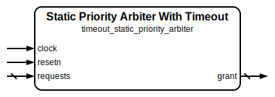

# Static Priority Arbiter With Timeout

|         |                                                                                  |
| ------- | -------------------------------------------------------------------------------- |
| Module  | Static Priority Arbiter With Timeout                                             |
| Project | [OmniCores-BuildingBlocks](https://github.com/Louis-DR/OmniCores-BuildingBlocks) |
| Author  | Louis Duret-Robert - [louisduret@gmail.com](mailto:louisduret@gmail.com)         |
| Website | [louis-dr.github.io](https://louis-dr.github.io)                                 |
| License | MIT License - https://mit-license.org/                                           |

## Overview

Arbiters between different request channels. The grant is given to the first ready request channel, except if a channel has not been granted its requests `TIMEOUT` times, then it becomes prioritized until granted once. This avoids starvations but the arbiter is not fair.

## Parameters

| Name      | Type    | Allowed Values      | Default  | Description             |
| --------- | ------- | ------------------- | -------- | ----------------------- |
| `SIZE`    | integer | `>1`                | `4`      | Number of channels.     |
| `TIMEOUT` | integer | `≥SIZE-1`           | `8`      | Implementation variant. |
| `VARIANT` | string  | `"fast"`, `"small"` | `"fast"` | Implementation variant. |

## Ports

| Name       | Direction | Width  | Clock        | Reset | Reset value | Description                                                                             |
| ---------- | --------- | ------ | ------------ | ----- | ----------- | --------------------------------------------------------------------------------------- |
| `clock`    | input     | 1      | self         |       |             | Clock signal.                                                                           |
| `resetn`   | input     | 1      | asynchronous | self  | `0`         | Asynchronous reset signal. Resets the registers of the timeout logic.                   |
| `requests` | input     | `SIZE` | asynchronous |       |             | Request channels. `1`: requesting a grant. `0`: idle.                           |
| `grant`    | output    | `SIZE` | `clock`      |       |             | Channel receiving the grant. One-hot encoding. `1`: grant given. `0`: no grant. |

## Operation

The path from `requests` to `grant` is combinational, but the logic for the timeout is sequential and affects the requests during the next cycle. Each channel has a timeout countdown, except the first channel because it has the highest priority and cannot be denied except if another channel has timedout.

When a channel's request is denied, and if it is not already timedout, then its countdown is decremented. Once the countdown reaches zero, the channel is in timeout and its requests are prioritized until it gets a grant. The timeout countdown is reset when the channel is granted its request.

If multiple channels are timedout, then they get grants in order. If no channels are timedout, or the timedout channels are not requesting, standard static priority arbitration is used.

The countdowns and timeout status is not reset if the channels stops requesting, so the timeout is per channel and not per request. This allows the arbiter to prevent starvation even for sparse requesting.

## Paths

| From       | To      | Type          | Comment                                                               |
| ---------- | ------- | ------------- | --------------------------------------------------------------------- |
| `requests` | `grant` | combinational | The logic for the timeout is sequential but valid for the next cycle. |

## Complexity

| `VARIANT`          | Delay | Gates | Comment |
| ------------------ | ----- | ----- | ------- |
| `"fast"` (default) |       |       |         |
| `"small"`          |       |       |         |

## Verification

The arbiter is verified using a SystemVerilog testbench with concurrent assertions and six check sequences.

The following table lists the checks performed by the testbench.

| Number | Check                                                                     | Description                                                                                                                               |
| ------ | ------------------------------------------------------------------------- | ----------------------------------------------------------------------------------------------------------------------------------------- |
| 1      | Exhaustive test without timeout                                           | Check that the grant is correct for all combinations of the request vector by reseting after each request to ignore the timeout mechanic. |
| 2      | Single request timeout                                                    | Enable the requests for both the first channel and one other and check that the timeout works.                                            |
| 3      | All requests timeout                                                      | Enable all the request channels and check the timeout works when all countdowns reach zero at the same time.                              |
| 4      | Single request timeout by pulses                                          | Same as check 2 but by pulsing the second request instead of keeping it active.                                                           |
| 5      | First channel requesting, other channels random and fairness between them | Request on the first channel and randomize the others, and check fairness between them.                                                   |
| 6      | Random stimulus                                                           | Fully randomize the requests and use the concurrent assertions.                                                                           |

The following table lists the parameter values verified by the testbench.

| `SIZE` | `TIMEOUT` | `VARIANT` |           |
| ------ | --------- | --------- | --------- |
| 4      | 8         | `"fast"`  | (default) |

## Constraints

There are no synthesis and implementation constraints for this block.

## Deliverables

| Type              | File                                                                                               | Description                                         |
| ----------------- | -------------------------------------------------------------------------------------------------- | --------------------------------------------------- |
| Design            | [`timeout_static_priority_arbiter.v`](timeout_static_priority_arbiter.v)                           | Verilog design.                                     |
| Testbench         | [`timeout_static_priority_arbiter.testbench.sv`](timeout_static_priority_arbiter.testbench.sv)     | SystemVerilog verification testbench.               |
| Waveform script   | [`timeout_static_priority_arbiter.testbench.gtkw`](timeout_static_priority_arbiter.testbench.gtkw) | Script to load the waveforms in GTKWave.            |
| Symbol descriptor | [`timeout_static_priority_arbiter.symbol.sss`](timeout_static_priority_arbiter.symbol.sss)         | Symbol descriptor for SiliconSuite-SymbolGenerator. |
| Symbol image      | [`timeout_static_priority_arbiter.symbol.svg`](timeout_static_priority_arbiter.symbol.svg)         | Generated vector image of the symbol.               |
| Datasheet         | [`timeout_static_priority_arbiter.md`](timeout_static_priority_arbiter.md)                         | Markdown documentation datasheet.                   |

## Dependencies

| Module                                                                             | Path                                                               | Comment                         |
| ---------------------------------------------------------------------------------- | ------------------------------------------------------------------ | ------------------------------- |
| [`static_priority_arbiter`](../static_priority_arbiter/static_priority_arbiter.md) | `omnicores-buildingblocks/sources/arbiter/static_priority_arbiter` |                                 |
| [`first_one`](../../operations/first_one/first_one.md)                             | `omnicores-buildingblocks/sources/operations/first_one`            |                                 |
| [`fast_first_one`](../../operations/fast_first_one/fast_first_one.md)              | `omnicores-buildingblocks/sources/operations/fast_first_one`       | For the default `fast` variant. |
| [`small_first_one`](../../operations/small_first_one/small_first_one.md)           | `omnicores-buildingblocks/sources/operations/small_first_one`      | For the `small` variant.        |
| [`shift_left`](../../operations/shift_left/shift_left.md)                          | `omnicores-buildingblocks/sources/operations/shift_left`           | For the default `fast` variant. |

## Related modules

| Module                                                                                | Path                                                                | Comment                                                     |
| ------------------------------------------------------------------------------------- | ------------------------------------------------------------------- | ----------------------------------------------------------- |
| [`static_priority_arbiter`](../static_priority_arbiter/static_priority_arbiter.md)    | `omnicores-buildingblocks/sources/arbiter/static_priority_arbiter`  | Simpler without the timeout mechanic but allows starvation. |
| [`round_robin_arbiter`](../round_robin_arbiter/round_robin_arbiter.md)                | `omnicores-buildingblocks/sources/arbiter/round_robin_arbiter`      | Fair arbiter without starvation.                            |
| [`dynamic_priority_arbiter`](../dynamic_priority_arbiter/dynamic_priority_arbiter.md) | `omnicores-buildingblocks/sources/arbiter/dynamic_priority_arbiter` | Arbiter with per-channel dynamic priority.                  |
