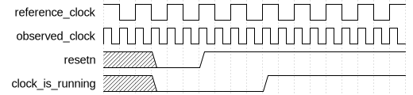

# Clock Detector

|         |                                                                                  |
| ------- | -------------------------------------------------------------------------------- |
| Module  | Clock Detector                                                                   |
| Project | [OmniCores-BuildingBlocks](https://github.com/Louis-DR/OmniCores-BuildingBlocks) |
| Author  | Louis Duret-Robert - [louisduret@gmail.com](mailto:louisduret@gmail.com)         |
| Website | [louis-dr.github.io](https://louis-dr.github.io)                                 |
| License | MIT License - [mit-license.org](https://mit-license.org)                         |

## Overview

Detects if an observed clock is running or not using a reference clock.

## Usage

The `resetn` can be asserted asynchronously, but must be deasserted synchronously to `reference_clock`, or when `reference_clock` is not running. During and after reset, the `clock_is_running` output is deasserted. If `observed_clock` is running when `resetn` is deasserted, `clock_is_running` is asserted on average `SYNCHRONIZER_STAGES` after.

When the `observed_clock` starts, the `clock_is_running` is asserted after a short delay.

When the `observed_clock` stops, the `clock_is_running` is deasserted after a short delay.

The average delay for assertion and deassertion are noted $T_{assertion}$ and $T_{deassertion}$ respectively. They depend on `SYNCHRONIZER_STAGES`, the number of synchronization stages, and `DETECTOR_STAGES`, the number of detection stages. Their formulae are given below, with $T_{\mathrm{reference}}$ and $f_{\mathrm{reference}}$ the period and frequency of the reference clock,.

$$T_{assertion} = (\mathrm{SYNCHRONIZER\\_STAGES} - 0.5) \times T_{\mathrm{reference}} = \frac{\mathrm{SYNCHRONIZER\\_STAGES} - 0.5}{f_{\mathrm{reference}}}$$

$$
\begin{aligned}
T_{deassertion} &= (\mathrm{SYNCHRONIZER\\_STAGES} + \mathrm{DETECTOR\\_STAGES} - 0.5) \times T_{\mathrm{reference}} \\
&= \frac{\mathrm{SYNCHRONIZER\\_STAGES} + \mathrm{DETECTOR\\_STAGES} - 0.5}{f_{\mathrm{reference}}}
\end{aligned}
$$

During operation, the `reference_clock` must be running for the block to work correctly. Moreover, the `observed_clock` must stay low when not running. If it stops and keeps a high value, this block doesn't work and `clock_is_running` stays high. Furthermore, for reliable operation, `DETECTOR_STAGES` must be respect the following formula:

$$
\begin{aligned}
\mathrm{DETECTOR\\_STAGES} &> \frac{T_{\mathrm{observed}}}{2 \times T_{\mathrm{reference}}} \\
&> \frac{f_{\mathrm{reference}}}{2 \times f_{\mathrm{observed}}}
\end{aligned}
$$

If `SYNCHRONIZER_STAGES` is zero, the `clock_is_running` output is unstable and must be resynchronizer to a clock. By default, it is resynchronized to the `reference_clock`.

## Parameters

| Name                  | Type    | Allowed Values | Default | Description                         |
| --------------------- | ------- | -------------- | ------- | ----------------------------------- |
| `DETECTOR_STAGES`     | integer | `≥1`           | `2`     | Depth of the detection stage.       |
| `SYNCHRONIZER_STAGES` | integer | `≥0`           | `2`     | Depth of the synchronization stage. |

## Ports

| Name               | Direction | Width | Clock             | Reset    | Reset value | Description                                                                                       |
| ------------------ | --------- | ----- | ----------------- | -------- | ----------- | ------------------------------------------------------------------------------------------------- |
| `reference_clock`  | input     | 1     | self              |          |             | Reference clock signal.                                                                           |
| `observed_clock`   | input     | 1     | self              |          |             | Observed clock signal. Low when stopped.                                                          |
| `resetn`           | input     | 1     | asynchronous      | self     | active-low  | Asynchronous active-low reset.                                                                    |
| `clock_is_running` | output    | 1     | `reference_clock` | `resetn` | `0`         | Running status of `observed_clock`. • `0`: clock is not running. • `1`: clock is running. |

## Operation

The detection logic relies on a chain of flip-flops, `detection_stages`, clocked by `reference_clock`. The set pin of each flop is driven by `observed_clock`, so when it is running, the chain output is kept high. The input of the chain is tied low, so when `observed_clock` is not running, the low value propagates and the output of the chain stays low.

The output of the last detection stage is unstable because of the asynchronous set by `observed_clock`, so it is resynchronized to the `reference_clock` domain through a standard multi-stage synchronizer to produce the stable `clock_is_running` output.

## Paths

| From             | To                 | Type       | Comment                                                                                                                  |
| ---------------- | ------------------ | ---------- | ------------------------------------------------------------------------------------------------------------------------ |
| `observed_clock` | `clock_is_running` | sequential | Through set pin of the flops of the detection stage, and through the data pin of the flops of the synchronization stage. |

## Complexity

The module uses one flop per stage of both the detector or synchronizer.

## Verification

The clock detector is verified using a SystemVerilog testbench with four check sequences.

| Number | Check                   | Description                                               |
| ------ | ----------------------- | --------------------------------------------------------- |
| 1      | Reset value             | The output should be low after reset.                     |
| 2      | Disabled observed clock | The observed clock is disabled and the output is checked. |
| 3      | Enabled observed clock  | The observed clock starts and the output is checked.      |
| 4      | Disabled observed clock | The observed clock stops and the output is checked.       |

## Constraints

As this is a behavioral model, the primary constraint is that it should not be synthesized directly. Use vendor-specific ICG cells instead.

## Deliverables

| Type              | File                                                             | Description                                         |
| ----------------- | ---------------------------------------------------------------- | --------------------------------------------------- |
| Design            | [`clock_detector.v`](clock_detector.v)                           | Verilog design.                                     |
| Testbench         | [`clock_detector.testbench.sv`](clock_detector.testbench.sv)     | SystemVerilog verification testbench.               |
| Waveform script   | [`clock_detector.testbench.gtkw`](clock_detector.testbench.gtkw) | Script to load the waveforms in GTKWave.            |
| Symbol descriptor | [`clock_detector.symbol.sss`](clock_detector.symbol.sss)         | Symbol descriptor for SiliconSuite-SymbolGenerator. |
| Symbol image      | [`clock_detector.symbol.svg`](clock_detector.symbol.svg)         | Generated vector image of the symbol.               |
| Symbol shape      | [`clock_detector.symbol.drawio`](clock_detector.symbol.drawio)   | Generated DrawIO shape of the symbol.               |
| Datasheet         | [`clock_detector.md`](clock_detector.md)                         | Markdown documentation datasheet.                   |

## Dependencies

| Module         | Path                                                   | Comment                               |
| -------------- | ------------------------------------------------------ | ------------------------------------- |
| `synchronizer` | `omnicores-buildingblocks/sources/timing/synchronizer` | Used for output signal stabilization. |

## Related modules

| Module                                                                                   | Path                                                               | Comment                                                   |
| ---------------------------------------------------------------------------------------- | ------------------------------------------------------------------ | --------------------------------------------------------- |
| [`clock_gater`](../clock_gater/clock_gater.md)                                           | `omnicores-buildingblocks/sources/clock/clock_gater`               | Clock gater model.                                        |
| [`clock_multiplexer`](../clock_multiplexer/clock_multiplexer.md)                         | `omnicores-buildingblocks/sources/clock/clock_multiplexer`         | Multiplexer to select between clocks using the detector.  |
| [`switchover_clock_selector`](../switchover_clock_selector/switchover_clock_selector.md) | `omnicores-buildingblocks/sources/clock/switchover_clock_selector` | Selector that switches to a second clock onces it starts. |
| [`priority_clock_selector`](../priority_clock_selector/priority_clock_selector.md)       | `omnicores-buildingblocks/sources/clock/priority_clock_selector`   | Selector that switches to a priority clock automatically. |
