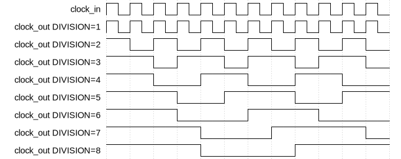

# Clock Divider

|         |                                                                                  |
| ------- | -------------------------------------------------------------------------------- |
| Module  | Clock Divider                                                                    |
| Project | [OmniCores-BuildingBlocks](https://github.com/Louis-DR/OmniCores-BuildingBlocks) |
| Author  | Louis Duret-Robert - [louisduret@gmail.com](mailto:louisduret@gmail.com)         |
| Website | [louis-dr.github.io](https://louis-dr.github.io)                                 |
| License | MIT License - [mit-license.org](https://mit-license.org)                         |

## Overview


Divides the frequency of the input clock `clock_in` by the `DIVISION` factor. The output clock `clock_out` runs `DIVISION` times slower than the input clock. If `DIVISION` is 1 or less, `clock_in` is directly passed through to `clock_out` without any logic. If `DIVISION` is a power of two, the MSB of a free‑running binary counter is used, producing an exact 50% duty cycle. Otherwise, for non-power-of-two values, a counter with decode is used. For odd `DIVISION` values greater than 1, the high pulse of `clock_out` is one `clock_in` cycle longer than the low pulse, resulting in a duty cycle slightly greater than 50%. For even non-power-of-two `DIVISION` values greater than 1, the duty cycle is exactly 50%.



## Parameters

| Name       | Type    | Allowed Values | Default | Description                                          |
| ---------- | ------- | -------------- | ------- | ---------------------------------------------------- |
| `DIVISION` | integer | `>0`           | `2`     | Factor by which to divide the input clock frequency. |

## Ports

| Name        | Direction | Width | Clock        | Reset    | Reset value | Description                                                                |
| ----------- | --------- | ----- | ------------ | -------- | ----------- | -------------------------------------------------------------------------- |
| `clock_in`  | input     | 1     | self         |          |             | Input clock signal.                                                        |
| `resetn`    | input     | 1     | asynchronous | self     | `0`         | Asynchronous active-low reset signal. Resets the counter and output clock. |
| `clock_out` | output    | 1     | derived      | `resetn` | `0`         | Divided clock output signal.                                               |

## Operation

If `DIVISION < 2`, `clock_out` is directly assigned to `clock_in`.

If `DIVISION` is a power of two and at least 2, the module uses a free‑running binary counter and drives `clock_out` with the counter MSB. This yields an exact 50% duty cycle, avoids wide equality comparisons, and keeps the design fully synchronous.

Otherwise, the module uses an internal counter that increments on each positive edge of `clock_in`. The counter counts from `0` up to `DIVISION - 1`. When the counter reaches `DIVISION / 2 - (1 - DIVISION % 2)` (which simplifies to `DIVISION / 2 - 1` for even `DIVISION` and `(DIVISION - 1) / 2` for odd `DIVISION`), `clock_out` transitions low. When the counter reaches `DIVISION - 1`, `clock_out` transitions high, and the counter resets to `0`. The asynchronous reset `resetn` forces `clock_out` low and resets the `counter` to `0`.

## Paths

| From       | To          | Type         | Comment                                   |
| ---------- | ----------- | ------------ | ----------------------------------------- |
| `clock_in` | `clock_out` | pass-through | If `DIVISION < 2`.                        |
| `clock_in` | `clock_out` | sequential   | If `DIVISION >= 2`. Output is registered. |

## Complexity

| `DIVISION` | Logic                | Delay  | Gates              |
| ---------- | -------------------- | ------ | ------------------ |
| `<2`       | None (pass-through)  | `0`    | `0`                |
| `≥2`       | Counter, 1 flip-flop | `O(1)` | `O(log₂ DIVISION)` |

## Verification

The clock divider is verified using a SystemVerilog testbench with multiple DUTs with different parameters, and a single common check sequence. It uses a helper macro to measure the frequency of the output clock.

The following table lists the checks performed by the testbench.

| Number | Check                    | Description                               |
| ------ | ------------------------ | ----------------------------------------- |
| 1      | Output divided frequency | Checks the frequency of the output clock. |

The following table lists the parameter values verified by the testbench.

| `DIVISION` |           |
| ---------- | --------- |
| 1          |           |
| 2          | (default) |
| 3          |           |
| 4          |           |
| 5          |           |
| 6          |           |
| 7          |           |
| 8          |           |
| 9          |           |
| 10         |           |

## Constraints

The constraints file `clock_divider.sdc` contains the procedure `::omnicores::buildingblocks::timing::clock_divider::apply_constraints_to_instance`. It takes as parameter the hierarchical path to the instance of the clock divider and applies constraints to it, and optionally the division factor. If the division factor is not provided to the function call, the procedure will try to determine it.

```tcl
set clock_divider_path "path/to/clock_divider"
set division_factor 2

::omnicores::buildingblocks::timing::clock_divider::apply_constraints_to_instance $clock_divider_path $division_factor
```

The procedure fetches all the clocks defined on the input clock pin, and creates a generated clock on the output clock pin for each of them. The generated clocks have the correct divided frequency, and edges for odd division factor to specify the asymetric duty cycle. The generated clocks are considered logically exclusive using a clock group.

To call the procedure automatically on all instances of the clock divider, use the common procedure `::omnicores::common::apply_constraints_to_all_module_instances` with the module name `clock_divider` and the constraints procedure `::omnicores::buildingblocks::timing::clock_divider::apply_constraints_to_instance`. It will search the design for all instances of the module and call the constraints procedure on each.

```tcl
::omnicores::common::apply_constraints_to_all_module_instances "clock_divider" "::omnicores::buildingblocks::timing::clock_divider::apply_constraints_to_instance"
```

**Important:** the constraints procedure should be called after all clocks on the input pin have been declared. If the input clocks are defined by other OmniCores procedures, they should be called in order of the clock tree. The procedure will print a warning if no clocks are defined on an input clock pin, but it cannot detect if other clocks are added after the procedure is called. This is especially important when applying the constraints automatically on all instances as the order cannot be controlled.

Special gates (AND, OR, NOT) made for clock paths can be used for better results if they are available in the technology node.

## Deliverables

| Type                | File                                                           | Description                                         |
| ------------------- | -------------------------------------------------------------- | --------------------------------------------------- |
| Design              | [`clock_divider.v`](clock_divider.v)                           | Verilog design.                                     |
| Testbench           | [`clock_divider.testbench.sv`](clock_divider.testbench.sv)     | SystemVerilog verification testbench.               |
| Waveform script     | [`clock_divider.testbench.gtkw`](clock_divider.testbench.gtkw) | Script to load the waveforms in GTKWave.            |
| Constraint script   | [`clock_divider.sdc`](clock_divider.sdc)                       | Tickle SDC constraint script for synthesis.         |
| Symbol descriptor   | [`clock_divider.symbol.sss`](clock_divider.symbol.sss)         | Symbol descriptor for SiliconSuite-SymbolGenerator. |
| Symbol image        | [`clock_divider.symbol.svg`](clock_divider.symbol.svg)         | Generated vector image of the symbol.               |
| Waveform descriptor | [`clock_divider.wavedrom.json`](clock_divider.wavedrom.json)   | Waveform descriptor for Wavedrom.                   |
| Waveform image      | [`clock_divider.wavedrom.svg`](clock_divider.wavedrom.svg)     | Generated image of the waveform.                    |
| Datasheet           | [`clock_divider.md`](clock_divider.md)                         | Markdown documentation datasheet.                   |

## Dependencies

This module has no dependency.

## Related modules

| Module                                                                                   | Path                                                               | Comment                                                   |
| ---------------------------------------------------------------------------------------- | ------------------------------------------------------------------ | --------------------------------------------------------- |
| [`clock_multiplier`](../clock_multiplier/clock_multiplier.md)                            | `omnicores-buildingblocks/sources/clock/clock_multiplier`          | Static clock multiplier behavioral model.                 |
| [`clock_gater`](../clock_gater/clock_gater.md)                                           | `omnicores-buildingblocks/sources/clock/clock_gater`               | Clock gater behavioral model.                             |
| [`clock_multiplexer`](../clock_multiplexer/clock_multiplexer.md)                         | `omnicores-buildingblocks/sources/clock/clock_multiplexer`         | Multiplexer to select between clocks.                     |
| [`fast_clock_multiplexer`](../fast_clock_multiplexer/fast_clock_multiplexer.md)          | `omnicores-buildingblocks/sources/clock/fast_clock_multiplexer`    | Faster clock multiplexer.                                 |
| [`nonstop_clock_multiplexer`](../nonstop_clock_multiplexer/nonstop_clock_multiplexer.md) | `omnicores-buildingblocks/sources/clock/nonstop_clock_multiplexer` | Clock multiplexer working when one clock is not running.  |
| [`switchover_clock_selector`](../switchover_clock_selector/switchover_clock_selector.md) | `omnicores-buildingblocks/sources/clock/switchover_clock_selector` | Selector that switches to a second clock onces it starts. |
| [`priority_clock_selector`](../priority_clock_selector/priority_clock_selector.md)       | `omnicores-buildingblocks/sources/clock/priority_clock_selector`   | Selector that switches to a priority clock automatically. |
