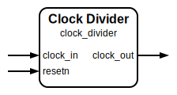

# Clock Divider

|         |                                           |
| ------- | ----------------------------------------- |
| Module  | Clock Divider                             |
| Project | OmniCores-BuildingBlocks                  |
| Author  | Louis Duret-Robert - louisduret@gmail.com |
| Website | louis-dr.github.io                        |
| License | MIT License - https://mit-license.org/    |

## Overview



Divides the frequency of the input clock `clock_in` by the `DIVISION` factor. The output clock `clock_out` runs `DIVISION` times slower than the input clock. If `DIVISION` is 1 or less, `clock_in` is directly passed through to `clock_out` without any logic. If `DIVISION` is 2 or more, a counter is used. For odd `DIVISION` values greater than 1, the high pulse of `clock_out` is one `clock_in` cycle longer than the low pulse, resulting in a duty cycle slightly greater than 50%. For even `DIVISION` values greater than 1, the duty cycle is exactly 50%.


## Parameters

| Name       | Type    | Allowed Values | Default | Description                                          |
| ---------- | ------- | -------------- | ------- | ---------------------------------------------------- |
| `DIVISION` | integer | `>0`           | `2`     | Factor by which to divide the input clock frequency. |

## Ports

| Name        | Direction | Width | Clock      | Reset    | Reset value | Description                                                                |
| ----------- | --------- | ----- | ---------- | -------- | ----------- | -------------------------------------------------------------------------- |
| `clock_in`  | input     | 1     | self       |          |             | Input clock signal.                                                        |
| `resetn`    | input     | 1     | `clock_in` | self     | `0`         | Asynchronous active-low reset signal. Resets the counter and output clock. |
| `clock_out` | output    | 1     | derived    | `resetn` | `0`         | Divided clock output signal.                                               |

## Operation

If `DIVISION < 2`, `clock_out` is directly assigned to `clock_in`. Else, the module uses an internal counter that increments on each positive edge of `clock_in`. The counter counts from `0` up to `DIVISION - 1`. When the counter reaches `DIVISION / 2 - (1 - DIVISION % 2)` (which simplifies to `DIVISION / 2 - 1` for even `DIVISION` and `(DIVISION - 1) / 2` for odd `DIVISION`), `clock_out` transitions low. When the counter reaches `DIVISION - 1`, `clock_out` transitions high, and the counter resets to `0`. The asynchronous reset `resetn` forces `clock_out` low and resets the `counter` to `0`.

## Paths

| From       | To          | Type         | Comment                                   |
| ---------- | ----------- | ------------ | ----------------------------------------- |
| `clock_in` | `clock_out` | pass-through | If `DIVISION < 2`.                        |
| `clock_in` | `clock_out` | sequential   | If `DIVISION >= 2`. Output is registered. |

## Complexity

| `DIVISION` | Logic                | Delay  | Gates              |
| ---------- | -------------------- | ------ | ------------------ |
| `<2`       | None (pass-through)  | `0`    | `0`                |
| `≥2`       | Counter, 1 flip-flop | `O(1)` | `O(log₂ DIVISION)` |

## Verification

The clock divider is verified using a SystemVerilog testbench with multiple DUTs with different parameters, and a single common check sequence. It uses a helper macro to measure the frequency of the output clock.

| Number | Check                    | Description                               |
| ------ | ------------------------ | ----------------------------------------- |
| 1      | Output divided frequency | Checks the frequency of the output clock. |

The folowing table lists the parameter values verified by the testbench.

| `DIVISION` |           |
| ---------- | --------- |
| 1          |           |
| 2          | (default) |
| 3          |           |
| 4          |           |
| 5          |           |
| 6          |           |
| 7          |           |
| 8          |           |
| 9          |           |
| 10         |           |

## Constraints

A `generated_clock` should be created on the output pin of the `clock_divided` flip-flop of the clock divider. For even division factors, `-divide_by` can be used since the duty cycle is 50%. For odd divisions factors, `-edges` must be used instead, with the high pulses being one more input clock cycle than the low pulses.

```tcl
# For an even division factor, the -divide_by argument can be used as the duty cycles is 50%
create_generated_clock -name  -source [get_pins clock_divider/clock_in] -divide_by 2 [get_pins clock_divider/clock_divider_reg/Q]

# For an odd division factor, the -edges argument should be used instead
create_generated_clock -name  -source [get_pins clock_divider/clock_in] -edges {0 4 6} [get_pins clock_divider/clock_divider_reg/Q]
```

## Deliverables

| Type                | File                          | Description                                         |
| ------------------- | ----------------------------- | --------------------------------------------------- |
| Design              | `clock_divider.v`             | Verilog design.                                     |
| Testbench           | `clock_divider_tb.sv`         | SystemVerilog verification testbench.               |
| Waveform script     | `clock_divider_tb.gtkw`       | Script to load the waveforms in GTKWave.            |
| Symbol descriptor   | `clock_divider.sss`           | Symbol descriptor for SiliconSuite-SymbolGenerator. |
| Symbol image        | `clock_divider.svg`           | Generated vector image of the symbol.               |
| Waveform descriptor | `clock_divider.wavedrom.json` | Waveform descriptor for Wavedrom.                   |
| Waveform image      | `clock_divider.wavedrom.svg`  | Generated image of the waveform.                    |
| Datasheet           | `clock_divider.md`            | Markdown documentation datasheet.                   |

## Dependencies

This module has no dependency.

## Related modules

| Module                                                                          | Path                                                            | Comment                               |
| ------------------------------------------------------------------------------- | --------------------------------------------------------------- | ------------------------------------- |
| [`clock_gater`](../clock_gater/clock_gater.md)                                  | `omnicores-buildingblocks/sources/clock/clock_gater`            | Clock gater model.                    |
| [`clock_multiplexer`](../clock_multiplexer/clock_multiplexer.md)                | `omnicores-buildingblocks/sources/clock/clock_multiplexer`      | Multiplexer to select between clocks. |
| [`fast_clock_multiplexer`](../fast_clock_multiplexer/fast_clock_multiplexer.md) | `omnicores-buildingblocks/sources/clock/fast_clock_multiplexer` | Faster clock multiplexer.             |