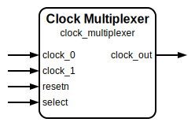

# Clock Multiplexer

|         |                                                                                  |
| ------- | -------------------------------------------------------------------------------- |
| Module  | Clock Multiplexer                                                                |
| Project | [OmniCores-BuildingBlocks](https://github.com/Louis-DR/OmniCores-BuildingBlocks) |
| Author  | Louis Duret-Robert - [louisduret@gmail.com](mailto:louisduret@gmail.com)         |
| Website | [louis-dr.github.io](https://louis-dr.github.io)                                 |
| License | MIT License - https://mit-license.org/                                           |

## Overview



Multiplexes between two input clocks, `clock_0` and `clock_1`, based on the `select` signal, with a glitch-free transition on the output clock `clock_out`.

Fast to slow switching :


Slow to fast switching :


The formula for the average switching time between the edge of the `select` to the first rising edge of the new frequency on the `clock_out` port noted $T_{switch\ avg}$, and for the average downtime being the duration for which `clock_out` is low between the last pulse at the old frequency and the first pulse at the new frequency noted $T_{downtime\ avg}$ are given below. They both depend on $STAGES$ the number of stages of the synchronizers, and $T_{from}$ and $T_{to}$ the periods of the old and new clocks. The formula are also given with the frequencies $f_{from}$ and $f_{to}$.

$$T_{switch\ avg} = (STAGES - 0.5) \times T_{from} + STAGES \times T_{to} = \frac{STAGES - 0.5}{f_{from}} + \frac{STAGES}{f_{to}} $$

$$T_{downtime\ avg} = STAGES \times T_{to} = \frac{STAGES}{f_{to}} $$

## Parameters

| Name     | Type    | Allowed Values | Default | Description                                                                                                                                                                   |
| -------- | ------- | -------------- | ------- | ----------------------------------------------------------------------------------------------------------------------------------------------------------------------------- |
| `STAGES` | integer | `≥1`           | `2`     | Number of synchronization stages for the internal enable logic.<br/>If both clocks are synchronous and the `select` signal is synchronous to them, then it can be set to `1`. |

## Ports

| Name        | Direction | Width | Clock        | Reset    | Reset value | Description                                                                                    |
| ----------- | --------- | ----- | ------------ | -------- | ----------- | ---------------------------------------------------------------------------------------------- |
| `clock_0`   | input     | 1     | self         |          |             | Input clock 0.                                                                                 |
| `clock_1`   | input     | 1     | self         |          |             | Input clock 1.                                                                                 |
| `resetn`    | input     | 1     | asynchronous | self     | `0`         | Asynchronous active-low reset for the internal synchronizers.                                  |
| `select`    | input     | 1     | asynchronous |          |             | Select which clock drives `clock_out`.<br/>`0`: selects `clock_0`.<br/>`1`: selects `clock_1`. |
| `clock_out` | output    | 1     | derived      | `resetn` | `0`         | Glitch-free multiplexed output clock.                                                          |

## Operation

The multiplexer uses a cross-coupled enable scheme to ensure glitch-free switching. When the `select` is low, it enables `clock_0` to drive `clock_out`. When the `select` is high, it enables `clock_1` to drive `clock_out`.

The enable signals for both clocks, `enable_clock_0` and `enable_clock_1`, are synchronized to the inversion of their respective clocks. This ensures that the clocks are not enabled or disabled during their high pulse.

The enable signals are driven by the correct value of `select` (`0` for `enable_clock_0` and `1` for `enable_clock_1`), but only when the synchronized enable signal of the other clock is low. This ensures that both clocks cannot be enabled at once.

Those two mecanisms ensure the glitch-free operation of the multiplexer. The clocks are gated by their enable signal using a simple AND gate, and are then ORed together to get `clock_out`.

## Paths

| From      | To          | Type          | Comment                            |
| --------- | ----------- | ------------- | ---------------------------------- |
| `clock_0` | `clock_out` | combinational | Active path when `select` is low.  |
| `clock_1` | `clock_out` | combinational | Active path when `select` is high. |
| `select`  | `clock_out` | sequential    | Through synchronizers.             |

## Complexity

The module instantiates two `synchronizer` modules with `STAGES` number of flip-flops each, and uses a few standard or clock gates (AND, OR, NOT).

## Verification

The clock divider is verified using a SystemVerilog testbench with multiple DUTs with different parameters, and a single common check sequence. It uses a helper macro to measure the frequency of the output clock.

| Number | Check                    | Description                                                                                               |
| ------ | ------------------------ | --------------------------------------------------------------------------------------------------------- |
| 1      | Switching back and forth | Toggle the `select` input and check the frequency of the `output_clock`.                                  |
| 2      | Glitch-free output clock | Toggle the `select` randomly and check that the output pulses duration correspond to either input clocks. |

The following table lists the parameter values verified by the testbench.

| `STAGES` |           |
| -------- | --------- |
| 2        | (default) |

The following table lists the clock frequencies verified by the testbench.

| `clock_0` | `clock_1` | Ratio |
| --------- | --------- | ----- |
| 10MHz     | 3.1831MHz | 1/π   |

## Constraints

The constraints file `clock_multiplexer.sdc` contains the procedure `::omnicores::buildingblocks::timing::clock_multiplexer::apply_constraints_to_instance`. It takes as parameter the hierarchical path to the instance of the clock multiplexer and applies constraints to it.

```tcl
set clock_multiplexer_path "path/to/clock_multiplexer"

::omnicores::buildingblocks::timing::clock_multiplexer::apply_constraints_to_instance $clock_multiplexer_path
```

The procedure fetches all the clocks defined on the input clock pins, and creates a generated clock on the output clock pin for each of them. The generated clocks are considered logically exclusive using a clock group. The procedure then calls the constraints procedure for the two synchronizers.

To call the procedure automatically on all instances of the clock multiplexer, use the common procedure `::omnicores::common::apply_constraints_to_all_module_instances` with the module name `clock_multiplexer` and the constraints procedure `::omnicores::buildingblocks::timing::clock_multiplexer::apply_constraints_to_instance`. It will search the design for all instances of the module and call the constraints procedure on each.

```tcl
::omnicores::common::apply_constraints_to_all_module_instances "clock_multiplexer" "::omnicores::buildingblocks::timing::clock_multiplexer::apply_constraints_to_instance"
```

**Important:** the constraints procedure should be called after all clocks on the input pins have been declared. If the input clocks are defined by other OmniCores procedures, they should be called in order of the clock tree. The procedure will print a warning if no clocks are defined on an input clock pin, but it cannot detect if other clocks are added after the procedure is called. This is especially important when applying the constraints automatically on all instances as the order cannot be controlled.

Special gates (AND, OR, NOT) made for clock paths can be used for better results if they are available in the technology node.

## Deliverables

| Type                | File                                                                         | Description                                                     |
| ------------------- | ---------------------------------------------------------------------------- | --------------------------------------------------------------- |
| Design              | [`clock_multiplexer.v`](clock_multiplexer.v)                                 | Verilog design.                                                 |
| Testbench           | [`clock_multiplexer_tb.sv`](clock_multiplexer_tb.sv)                         | SystemVerilog verification testbench.                           |
| Waveform script     | [`clock_multiplexer_tb.gtkw`](clock_multiplexer_tb.gtkw)                     | Script to load the waveforms in GTKWave.                        |
| Constraint script   | [`clock_multiplexer.sdc`](clock_multiplexer.sdc)                             | Tickle SDC constraint script for synthesis.                     |
| Symbol descriptor   | [`clock_multiplexer.sss`](clock_multiplexer.sss)                             | Symbol descriptor for SiliconSuite-SymbolGenerator.             |
| Symbol image        | [`clock_multiplexer.svg`](clock_multiplexer.svg)                             | Generated vector image of the symbol.                           |
| Waveform descriptor | [`clock_multiplexer_f2s.wavedrom.json`](clock_multiplexer_f2s.wavedrom.json) | Waveform descriptor for Wavedrom of the fast-to-slow switching. |
| Waveform descriptor | [`clock_multiplexer_s2f.wavedrom.json`](clock_multiplexer_s2f.wavedrom.json) | Waveform descriptor for Wavedrom of the slow-to-fast switching. |
| Waveform image      | [`clock_multiplexer_f2s.wavedrom.svg`](clock_multiplexer_f2s.wavedrom.svg)   | Generated image of the waveform of the fast-to-slow switching.  |
| Waveform image      | [`clock_multiplexer_s2f.wavedrom.svg`](clock_multiplexer_s2f.wavedrom.svg)   | Generated image of the waveform of the slow-to-fast switching.  |
| Datasheet           | [`clock_multiplexer.md`](clock_multiplexer.md)                               | Markdown documentation datasheet.                               |

## Dependencies

| Module         | Path                                                   | Comment                                 |
| -------------- | ------------------------------------------------------ | --------------------------------------- |
| `synchronizer` | `omnicores-buildingblocks/sources/timing/synchronizer` | Used for enable signal synchronization. |

## Related modules

| Module                                                                          | Path                                                            | Comment                                      |
| ------------------------------------------------------------------------------- | --------------------------------------------------------------- | -------------------------------------------- |
| [`fast_clock_multiplexer`](../fast_clock_multiplexer/fast_clock_multiplexer.md) | `omnicores-buildingblocks/sources/clock/fast_clock_multiplexer` | Variant with slightly faster switching time. |
| [`clock_gater`](../clock_gater/clock_gater.md)                                  | `omnicores-buildingblocks/sources/clock/clock_gater`            | Clock gater behavioral model.                |
| [`clock_divider`](../clock_divider/clock_divider.md)                            | `omnicores-buildingblocks/sources/clock/clock_divider`          | Static clock divider.                        |

## References

- [B. S. Haroun, H.-C. Lin, and T. Foo, “Glitch free clock multiplexing circuit with asynchronous switch control and minimum switch over time”, US Patent 6,600,345 B1, 2003.](https://patents.google.com/patent/US6600345B1)
