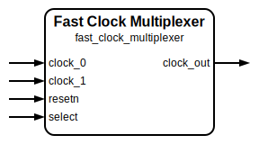

# Fast Clock Multiplexer

|         |                                           |
| ------- | ----------------------------------------- |
| Module  | Fast Clock Multiplexer                    |
| Project | OmniCores-BuildingBlocks                  |
| Author  | Louis Duret-Robert - louisduret@gmail.com |
| Website | louis-dr.github.io                        |
| License | MIT License - https://mit-license.org/    |

## Overview

Multiplexes between two input clocks, `clock_0` and `clock_1`, based on the `select` signal, with a glitch-free transition on the output clock `clock_out`. It has slightly faster switching time than the normal clock multiplexer as it uses faster synchronizers that work on both edges.

Fast to slow switching :

Slow to fast switching :

The formula for the average switching time between the edge of the `select` to the first rising edge of the new frequency on the `clock_out` port noted $T_{switch\_avg}$, and for the average downtime being the duration for which `clock_out` is low between the last pulse at the old frequency and the first pulse at the new frequency noted $T_{downtime\_avg}$ are given below. They both depend on $STAGES$ the number of stages of the synchronizers, and $T_{from}$ and $T_{to}$ the periods of the old and new clocks. The formula are also given with the frequencies $f_{from}$ and $f_{to}$.

$$T_{switch\_avg} = (STAGES/2 - 0.25) \times T_{from} + (STAGES/2 + 0.25) \times T_{to} = \frac{STAGES/2 - 0.25}{f_{from}} + \frac{STAGES/2 + 0.25}{f_{to}} $$

$$T_{downtime\_avg} = (STAGES/2 + 0.25) \times T_{to} = \frac{STAGES/2 + 0.25}{f_{to}} $$

## Parameters

| Name     | Type    | Allowed Values | Default | Description                                                                                                                                                                   |
| -------- | ------- | -------------- | ------- | ----------------------------------------------------------------------------------------------------------------------------------------------------------------------------- |
| `STAGES` | integer | `≥1`           | `2`     | Number of synchronization stages for the internal enable logic. If both clocks are synchronous and the `select` signal is synchronous to them, then it can be set to `1`. |

## Ports

| Name        | Direction | Width | Clock        | Reset    | Reset value | Description                                                                                    |
| ----------- | --------- | ----- | ------------ | -------- | ----------- | ---------------------------------------------------------------------------------------------- |
| `clock_0`   | input     | 1     | self         |          |             | Input clock 0.                                                                                 |
| `clock_1`   | input     | 1     | self         |          |             | Input clock 1.                                                                                 |
| `resetn`    | input     | 1     | asynchronous | self     | `0`         | Asynchronous active-low reset for the internal synchronizers.                                  |
| `select`    | input     | 1     | asynchronous |          |             | Select which clock drives `clock_out`. `0`: selects `clock_0`. `1`: selects `clock_1`. |
| `clock_out` | output    | 1     | derived      | `resetn` | `0`         | Glitch-free multiplexed output clock.                                                          |

## Operation

The multiplexer uses a cross-coupled enable scheme to ensure glitch-free switching. When the `select` is low, it enables `clock_0` to drive `clock_out`. When the `select` is high, it enables `clock_1` to drive `clock_out`.

The enable signals for both clocks, `enable_clock_0` and `enable_clock_1`, are synchronized to the inversion of their respective clocks. This ensures that the clocks are not enabled or disabled during their high pulse. The synchronizer uses both rising and falling edges, which makes the switching time shorter but at the cost of some risk of instability.

The enable signals are driven by the correct value of `select` (`0` for `enable_clock_0` and `1` for `enable_clock_1`), but only when the synchronized enable signal of the other clock is low. This ensures that both clocks cannot be enabled at once.

Those two mecanisms ensure the glitch-free operation of the multiplexer. The clocks are gated by their enable signal using a simple AND gate, and are then ORed together to get `clock_out`.

## Paths

| From      | To          | Type          | Comment                            |
| --------- | ----------- | ------------- | ---------------------------------- |
| `clock_0` | `clock_out` | combinational | Active path when `select` is low.  |
| `clock_1` | `clock_out` | combinational | Active path when `select` is high. |
| `select`  | `clock_out` | sequential    | Through synchronizers.             |

## Complexity

The module instantiates two `fast_synchronizer` modules with `STAGES` number of flip-flops each, and uses a few standard or clock gates (AND, OR, NOT).

## Verification

The clock divider is verified using a SystemVerilog testbench with multiple DUTs with different parameters, and a single common check sequence. It uses a helper macro to measure the frequency of the output clock.

| Number | Check                    | Description                                                                                               |
| ------ | ------------------------ | --------------------------------------------------------------------------------------------------------- |
| 1      | Switching back and forth | Toggle the `select` input and check the frequency of the `output_clock`.                                  |
| 2      | Glitch-free output clock | Toggle the `select` randomly and check that the output pulses duration correspond to either input clocks. |

The folowing table lists the parameter values verified by the testbench.

| `STAGES` |           |
| -------- | --------- |
| 2        | (default) |

The folowing table lists the clock frequencies verified by the testbench.

| `clock_0` | `clock_1` | Ratio |
| --------- | --------- | ----- |
| 10MHz     | 3.1831MHz | 1/π   |

## Constraints

Two `generated_clock` should be created on the output pin of the OR gate driving `clock_out`, corresponding to the two input clocks. They should be defined as logically exclusive.

The constraints of the `fast_synchronizer` should be applied to both instances internal to the multiplexer (see documentation of the `fast_synchronizer` module).

Special gates (AND, OR, NOT) made for clock paths can be used for better results if they are available in the technology node.

## Deliverables

| Type              | File                        | Description                                         |
| ----------------- | --------------------------- | --------------------------------------------------- |
| Design            | `clock_multiplexer.v`       | Verilog design.                                     |
| Testbench         | `clock_multiplexer_tb.sv`   | SystemVerilog verification testbench.               |
| Waveform script   | `clock_multiplexer_tb.gtkw` | Script to load the waveforms in GTKWave.            |
| Symbol descriptor | `clock_multiplexer.sss`     | Symbol descriptor for SiliconSuite-SymbolGenerator. |
| Symbol image      | `clock_multiplexer.svg`     | Generated vector image of the symbol.               |
| Datasheet         | `clock_multiplexer.md`      | Markdown documentation datasheet.                   |

## Dependencies

| Module              | Path                                                        | Comment                                 |
| ------------------- | ----------------------------------------------------------- | --------------------------------------- |
| `fast_synchronizer` | `omnicores-buildingblocks/sources/timing/fast_synchronizer` | Used for enable signal synchronization. |

## Related modules

| Module                                                                     | Path                                                       | Comment                                      |
| -------------------------------------------------------------------------- | ---------------------------------------------------------- | -------------------------------------------- |
| [`clock_multiplexer`](../fast_clock_multiplexer/fast_clock_multiplexer.md) | `omnicores-buildingblocks/sources/clock/clock_multiplexer` | Variant with slightly slower switching time. |
| [`clock_gater`](../clock_gater/clock_gater.md)                             | `omnicores-buildingblocks/sources/clock/clock_gater`       | Clock gater behavioral model.                |
| [`clock_divider`](../clock_divider/clock_divider.md)                       | `omnicores-buildingblocks/sources/clock/clock_divider`     | Static clock divider.                        |
