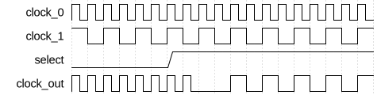
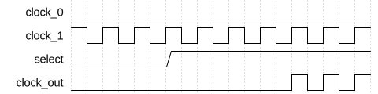

# Non-Stop Clock Multiplexer

|         |                                                                                  |
| ------- | -------------------------------------------------------------------------------- |
| Module  | Non-Stop Clock Multiplexer                                                       |
| Project | [OmniCores-BuildingBlocks](https://github.com/Louis-DR/OmniCores-BuildingBlocks) |
| Author  | Louis Duret-Robert - [louisduret@gmail.com](mailto:louisduret@gmail.com)         |
| Website | [louis-dr.github.io](https://louis-dr.github.io)                                 |
| License | MIT License - [mit-license.org](https://mit-license.org)                         |

## Overview


Multiplexes between two input clocks, `clock_0` and `clock_1`, based on the `select` signal, with a glitch-free transition on the output clock `clock_out`. Compared to the standard clock multiplexer, this variant is able to switch even when one of the clocks is not running. A non-running clock should be low.

Fast to slow switching :



Slow to fast switching :


Stopped to clock switching :



Clock to stop switching :


When both clocks are running, the formula for the average switching time between the edge of the `select` to the first rising edge of the new frequency on the `clock_out` port noted $T_{switch\ avg}$, and for the average downtime being the duration for which `clock_out` is low between the last pulse at the old frequency and the first pulse at the new frequency noted $T_{downtime\ avg}$ are given below. They both depend on $STAGES$ the number of stages of the synchronizers, and $T_{from}$ and $T_{to}$ the periods of the old and new clocks. The formula are also given with the frequencies $f_{from}$ and $f_{to}$. They are the same as for the `fast_clock_multiplexer`.

$$T_{switch\ avg} = (STAGES/2 - 0.25) \times T_{from} + (STAGES/2 + 0.25) \times T_{to} = \frac{STAGES/2 - 0.25}{f_{from}} + \frac{STAGES/2 + 0.25}{f_{to}} $$

$$T_{downtime\ avg} = (STAGES/2 + 0.25) \times T_{to} = \frac{STAGES/2 + 0.25}{f_{to}} $$

When one of the clocks is stopped, the formula for the average start time between the edge of the `select` to the first rising edge of the running clock on the `clock_out` port noted $T_{start\ avg}$, and for the average stop time between the edge of the `select` to the last rising edge of the running clock on the `clock_out` port noted $T_{stop\ avg}$ are given below.

$$T_{start\ avg} = (STAGES \times 3/2 - 0.5) \times T_{on} = \frac{STAGES \times 3/2 - 0.5}{f_{on}} $$

$$T_{stop\ avg} = \frac{T_{on}}{2} = \frac{1}{2 \times f_{on}} $$

## Parameters

| Name     | Type    | Allowed Values | Default | Description                                                                                                                                                                   |
| -------- | ------- | -------------- | ------- | ----------------------------------------------------------------------------------------------------------------------------------------------------------------------------- |
| `STAGES` | integer | `≥1`           | `2`     | Number of synchronization stages for the internal enable logic.<br/>If both clocks are synchronous and the `select` signal is synchronous to them, then it can be set to `1`. |

## Ports

| Name        | Direction | Width | Clock        | Reset                     | Reset value | Description                                                                                    |
| ----------- | --------- | ----- | ------------ | ------------------------- | ----------- | ---------------------------------------------------------------------------------------------- |
| `clock_0`   | input     | 1     | self         |                           |             | Input clock 0.                                                                                 |
| `clock_1`   | input     | 1     | self         |                           |             | Input clock 1.                                                                                 |
| `resetn_0`  | input     | 1     | asynchronous | self                      | `0`         | Asynchronous active-low reset for the internal logic for `clock_0`.                            |
| `resetn_1`  | input     | 1     | asynchronous | self                      | `0`         | Asynchronous active-low reset for the internal logic for `clock_1`.                            |
| `select`    | input     | 1     | asynchronous |                           |             | Select which clock drives `clock_out`.<br/>`0`: selects `clock_0`.<br/>`1`: selects `clock_1`. |
| `clock_out` | output    | 1     | derived      | `resetn_0` and `resetn_1` | `0`         | Glitch-free multiplexed output clock.                                                          |

## Operation

This clock multiplexer is made of a core clock multiplexer with extra logic to allow switching when either of the clocks is stopped.

The operation of the core clock multiplexer is explained in the datasheet of the `fast_clock_multiplexer` module.

To enable switching when either of the clocks is stopped, a pair of timers is used. Each timer drives a clock disable signal - `disable_clock_0_synchronized` and `disable_clock_1_synchronized` - that enable logic of is respective clock in the core clock multiplexer. Those timers are implemented using standard synchronizers. Those synchronizers are reset by the high level of the clock they are responsible for disabling, clocked by the other clock, and driven by the select polarity of the other clock.

If both clocks are running, then the timers are constantly reset, the clock disable signals stay low, and the whole multiplexer acts as a standard clock multiplexer. If one clock is stopped, then its disable timer is not reset, and when the select signal is toggled to the other clock, the disable signal will be driven, which will reset the enable signal, and finally allow switching to the running clock.

## Paths

| From      | To          | Type          | Comment                            |
| --------- | ----------- | ------------- | ---------------------------------- |
| `clock_0` | `clock_out` | combinational | Active path when `select` is low.  |
| `clock_1` | `clock_out` | combinational | Active path when `select` is high. |
| `select`  | `clock_out` | sequential    | Through synchronizers.             |

## Complexity

The module instantiates two `synchronizer` and two `fast_synchronizer` modules with `STAGES` number of flip-flops each, and uses a few standard or clock gates (AND, OR, NOT).

## Verification

The clock divider is verified using a SystemVerilog testbench with four check sequences. It uses a helper macro to measure the frequency of the output clock.

| Number | Check                           | Description                                                                                               |
| ------ | ------------------------------- | --------------------------------------------------------------------------------------------------------- |
| 1      | Switching back and forth        | Toggle the `select` input and check the frequency of the `output_clock`.                                  |
| 2      | Switching with clock 0 inactive | Toggle the `select` input with clock 0 stopped and check the frequency of the `output_clock`.             |
| 3      | Switching with clock 1 inactive | Toggle the `select` input with clock 1 stopped and check the frequency of the `output_clock`.             |
| 4      | Glitch-free output clock        | Toggle the `select` randomly and check that the output pulses duration correspond to either input clocks. |

The following table lists the parameter values verified by the testbench.

| `STAGES` |           |
| -------- | --------- |
| 2        | (default) |

The following table lists the clock frequencies verified by the testbench.

| `clock_0` | `clock_1`   | Ratio |
| --------- | ----------- | ----- |
| 10MHz     | 314.1593MHz | π     |

## Constraints

The constraints file `nonstop_clock_multiplexer.sdc` contains the procedure `::omnicores::buildingblocks::timing::nonstop_clock_multiplexer::apply_constraints_to_instance`. It takes as parameter the hierarchical path to the instance of the clock multiplexer and applies constraints to it.

```tcl
set nonstop_clock_multiplexer_path "path/to/nonstop_clock_multiplexer"

::omnicores::buildingblocks::timing::nonstop_clock_multiplexer::apply_constraints_to_instance $nonstop_clock_multiplexer_path
```

The procedure calls the constraints procedures for the core clock multiplexer and for the two fast synchronizers.

To call the procedure automatically on all instances of the clock multiplexer, use the common procedure `::omnicores::common::apply_constraints_to_all_module_instances` with the module name `nonstop_clock_multiplexer` and the constraints procedure `::omnicores::buildingblocks::timing::nonstop_clock_multiplexer::apply_constraints_to_instance`. It will search the design for all instances of the module and call the constraints procedure on each.

```tcl
::omnicores::common::apply_constraints_to_all_module_instances "nonstop_clock_multiplexer" "::omnicores::buildingblocks::timing::nonstop_clock_multiplexer::apply_constraints_to_instance"
```

**Important:** the constraints procedure should be called after all clocks on the input pins have been declared. If the input clocks are defined by other OmniCores procedures, they should be called in order of the clock tree. The procedure will print a warning if no clocks are defined on an input clock pin, but it cannot detect if other clocks are added after the procedure is called. This is especially important when applying the constraints automatically on all instances as the order cannot be controlled.

Special gates (AND, OR, NOT) made for clock paths can be used for better results if they are available in the technology node.

## Deliverables

| Type                | File                                                                                                       | Description                                                      |
| ------------------- | ---------------------------------------------------------------------------------------------------------- | ---------------------------------------------------------------- |
| Design              | [`nonstop_clock_multiplexer.v`](nonstop_clock_multiplexer.v)                                               | Verilog design.                                                  |
| Testbench           | [`nonstop_clock_multiplexer.testbench.sv`](nonstop_clock_multiplexer.testbench.sv)                         | SystemVerilog verification testbench.                            |
| Waveform script     | [`nonstop_clock_multiplexer.testbench.gtkw`](nonstop_clock_multiplexer.testbench.gtkw)                     | Script to load the waveforms in GTKWave.                         |
| Constraint script   | [`nonstop_clock_multiplexer.sdc`](nonstop_clock_multiplexer.sdc)                                           | Tickle SDC constraint script for synthesis.                      |
| Symbol descriptor   | [`nonstop_clock_multiplexer.symbol.sss`](nonstop_clock_multiplexer.symbol.sss)                             | Symbol descriptor for SiliconSuite-SymbolGenerator.              |
| Symbol image        | [`nonstop_clock_multiplexer.symbol.svg`](nonstop_clock_multiplexer.symbol.svg)                             | Generated vector image of the symbol.                            |
| Symbol shape        | [`nonstop_clock_multiplexer.symbol.drawio`](nonstop_clock_multiplexer.symbol.drawio)                       | Generated DrawIO shape of the symbol.                            |
| Waveform descriptor | [`nonstop_clock_multiplexer_fast2slow.wavedrom.json`](nonstop_clock_multiplexer_fast2slow.wavedrom.json)   | Waveform descriptor for Wavedrom of the fast-to-slow switching.  |
| Waveform descriptor | [`nonstop_clock_multiplexer_slow2fast.wavedrom.json`](nonstop_clock_multiplexer_slow2fast.wavedrom.json)   | Waveform descriptor for Wavedrom of the slow-to-fast switching.  |
| Waveform descriptor | [`nonstop_clock_multiplexer_stop2clock.wavedrom.json`](nonstop_clock_multiplexer_stop2clock.wavedrom.json) | Waveform descriptor for Wavedrom of the stop-to-clock switching. |
| Waveform descriptor | [`nonstop_clock_multiplexer_clock2stop.wavedrom.json`](nonstop_clock_multiplexer_clock2stop.wavedrom.json) | Waveform descriptor for Wavedrom of the clock-to-stop switching. |
| Waveform image      | [`nonstop_clock_multiplexer_fast2slow.wavedrom.svg`](nonstop_clock_multiplexer_fast2slow.wavedrom.svg)     | Generated image of the waveform of the fast-to-slow switching.   |
| Waveform image      | [`nonstop_clock_multiplexer_slow2fast.wavedrom.svg`](nonstop_clock_multiplexer_slow2fast.wavedrom.svg)     | Generated image of the waveform of the slow-to-fast switching.   |
| Waveform image      | [`nonstop_clock_multiplexer_stop2clock.wavedrom.svg`](nonstop_clock_multiplexer_stop2clock.wavedrom.svg)   | Generated image of the waveform of the stop-to-clock switching.  |
| Waveform image      | [`nonstop_clock_multiplexer_clock2stop.wavedrom.svg`](nonstop_clock_multiplexer_clock2stop.wavedrom.svg)   | Generated image of the waveform of the clock-to-stop switching.  |
| Datasheet           | [`nonstop_clock_multiplexer.md`](nonstop_clock_multiplexer.md)                                             | Markdown documentation datasheet.                                |

## Dependencies

| Module                   | Path                                                            | Comment                                  |
| ------------------------ | --------------------------------------------------------------- | ---------------------------------------- |
| `fast_clock_multiplexer` | `omnicores-buildingblocks/sources/clock/fast_clock_multiplexer` | Core clock multiplexer.                  |
| `synchronizer`           | `omnicores-buildingblocks/sources/timing/synchronizer`          | Used for disable signal synchronization. |
| `fast_synchronizer`      | `omnicores-buildingblocks/sources/timing/fast_synchronizer`     | Used for enable signal synchronization.  |

## Related modules

| Module                                                                                   | Path                                                               | Comment                                                                        |
| ---------------------------------------------------------------------------------------- | ------------------------------------------------------------------ | ------------------------------------------------------------------------------ |
| [`clock_multiplexer`](../clock_multiplexer/clock_multiplexer.md)                         | `omnicores-buildingblocks/sources/clock/clock_multiplexer`         | Standard clock multiplexer that doesn't switch if either clock is stopped.     |
| [`fast_clock_multiplexer`](../fast_clock_multiplexer/fast_clock_multiplexer.md)          | `omnicores-buildingblocks/sources/clock/fast_clock_multiplexer`    | Variant of the standard clock multiplexer with slightly faster switching time. |
| [`switchover_clock_selector`](../switchover_clock_selector/switchover_clock_selector.md) | `omnicores-buildingblocks/sources/clock/switchover_clock_selector` | Selector that switches to a second clock onces it starts.                      |
| [`priority_clock_selector`](../priority_clock_selector/priority_clock_selector.md)       | `omnicores-buildingblocks/sources/clock/priority_clock_selector`   | Selector that switches to a priority clock automatically.                      |
| [`clock_gater`](../clock_gater/clock_gater.md)                                           | `omnicores-buildingblocks/sources/clock/clock_gater`               | Clock gater behavioral model.                                                  |

## References

- [S. Zeidler, O. Schrape, A. Breitenreiter, and M. Krstić, “A Glitch-free Clock Multiplexer for Non-Continuously Running Clocks”, 23rd Euromicro Conference on Digital System Design, 2020.](https://doi.org/10.1109/DSD51259.2020.00013)
