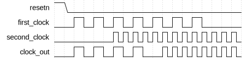

# Switchover Clock Selector

|         |                                                                                  |
| ------- | -------------------------------------------------------------------------------- |
| Module  | Switchover Clock Selector                                                        |
| Project | [OmniCores-BuildingBlocks](https://github.com/Louis-DR/OmniCores-BuildingBlocks) |
| Author  | Louis Duret-Robert - [louisduret@gmail.com](mailto:louisduret@gmail.com)         |
| Website | [louis-dr.github.io](https://louis-dr.github.io)                                 |
| License | MIT License - [mit-license.org](https://mit-license.org)                         |

## Overview

Clock switchover mechanism that starts on the first clock, then switches to the second clock once it is running. It doesn't switch back to the first clock even if the second clock stops running. However, it can be reset to restart the sequence with the first clock.

This module is useful for automatic startup sequences for a system that starts with a slow clock like the crystal clock or a board clock, and then must switch to a fast clock.

## Parameters

| Name     | Type    | Allowed Values | Default | Description                                              |
| -------- | ------- | -------------- | ------- | -------------------------------------------------------- |
| `STAGES` | integer | `≥1`           | `2`     | Number of synchronization stages for the internal logic. |

## Ports

| Name           | Direction | Width | Clock        | Reset    | Reset value | Description                           |
| -------------- | --------- | ----- | ------------ | -------- | ----------- | ------------------------------------- |
| `first_clock`  | input     | 1     | self         |          |             | Input first clock signal.             |
| `second_clock` | input     | 1     | self         |          |             | Input second clock signal.            |
| `resetn`       | input     | 1     | asynchronous | self     | `0`         | Asynchronous active-low reset signal. |
| `clock_out`    | output    | 1     | derived      | `resetn` | `0`         | Output clock signal.                  |

## Operation

When the switchover selector is reset, an internal register `second_clock_started` is reset low, which causes the `first_clock` to be enabled. On the first rising edge of the `second_clock`, this register is set high. It is then synchronized to the falling edges of the `first_clock`, which produces the `disable_first_clock` signal which gates the `first_clock`. Then this signal is synchronized back to the falling edges of the `second_clock` which produces the `enable_second_clock` signal which enables the `second_clock` on the `clock_out` output.

This mechanism ensures that no two clock are driving the output clock at once, and the use of the falling edges for the synchronization ensures no clock is gated during its high pulse which would generate a glitch.

## Paths

| From           | To          | Type          | Comment |
| -------------- | ----------- | ------------- | ------- |
| `first_clock`  | `clock_out` | combinational |         |
| `second_clock` | `clock_out` | combinational |         |

## Verification

The switchover clock selector is verified using a SystemVerilog testbench with four check sequences, and a passive check for glitches. It uses a helper macro to measure the frequency of the output clock.

The following table lists the checks performed by the testbench.

| Number | Check              | Description                     |
| ------ | ------------------ | ------------------------------- |
| 1      | No clock running   | Start with no clock running.    |
| 2      | Start first clock  | Start the first clock only.     |
| 3      | Start second clock | Start the second clock as well. |
| 4      | Stop first clock   | Stop the first clock only.      |

The following table lists the parameter values verified by the testbench.

| `STAGES` |           |
| -------- | --------- |
| 2        | (default) |

## Deliverables

| Type                | File                                                                                   | Description                                         |
| ------------------- | -------------------------------------------------------------------------------------- | --------------------------------------------------- |
| Design              | [`switchover_clock_selector.v`](switchover_clock_selector.v)                           | Verilog design.                                     |
| Testbench           | [`switchover_clock_selector.testbench.sv`](switchover_clock_selector.testbench.sv)     | SystemVerilog verification testbench.               |
| Waveform script     | [`switchover_clock_selector.testbench.gtkw`](switchover_clock_selector.testbench.gtkw) | Script to load the waveforms in GTKWave.            |
| Symbol descriptor   | [`switchover_clock_selector.symbol.sss`](switchover_clock_selector.symbol.sss)         | Symbol descriptor for SiliconSuite-SymbolGenerator. |
| Symbol image        | [`switchover_clock_selector.symbol.svg`](switchover_clock_selector.symbol.svg)         | Generated vector image of the symbol.               |
| Waveform descriptor | [`switchover_clock_selector.wavedrom.json`](switchover_clock_selector.wavedrom.json)   | Waveform descriptor for Wavedrom.                   |
| Waveform image      | [`switchover_clock_selector.wavedrom.svg`](switchover_clock_selector.wavedrom.svg)     | Generated image of the waveform.                    |
| Datasheet           | [`switchover_clock_selector.md`](switchover_clock_selector.md)                         | Markdown documentation datasheet.                   |

## Dependencies

| Module         | Path                                                   | Comment                                 |
| -------------- | ------------------------------------------------------ | --------------------------------------- |
| `synchronizer` | `omnicores-buildingblocks/sources/timing/synchronizer` | Used for enable signal synchronization. |

## Related modules

| Module                                                                             | Path                                                             | Comment                                                   |
| ---------------------------------------------------------------------------------- | ---------------------------------------------------------------- | --------------------------------------------------------- |
| [`priority_clock_selector`](../priority_clock_selector/priority_clock_selector.md) | `omnicores-buildingblocks/sources/clock/priority_clock_selector` | Selector that switches to a priority clock automatically. |
| [`clock_gater`](../clock_gater/clock_gater.md)                                     | `omnicores-buildingblocks/sources/clock/clock_gater`             | Clock gater behavioral model.                             |
| [`clock_multiplexer`](../clock_multiplexer/clock_multiplexer.md)                   | `omnicores-buildingblocks/sources/clock/clock_multiplexer`       | Multiplexer to select between clocks.                     |
