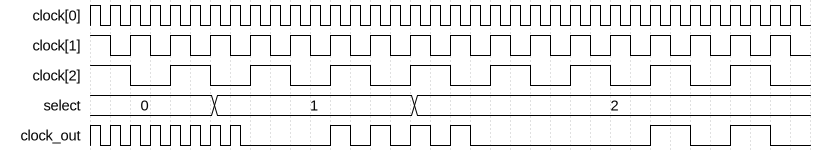
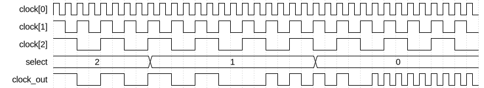

# Wide Clock Multiplexer

|         |                                                                                  |
| ------- | -------------------------------------------------------------------------------- |
| Module  | Wide Clock Multiplexer                                                           |
| Project | [OmniCores-BuildingBlocks](https://github.com/Louis-DR/OmniCores-BuildingBlocks) |
| Author  | Louis Duret-Robert - [louisduret@gmail.com](mailto:louisduret@gmail.com)         |
| Website | [louis-dr.github.io](https://louis-dr.github.io)                                 |
| License | MIT License - [mit-license.org](https://mit-license.org)                         |

## Overview


Multiplexes between multiple input clocks based on the `select` signal, while ensuring glitch-free transitions on the output clock `clock_out`. The number of input clocks is configurable through the `CLOCKS` parameter.

Fast to slow switching :



Slow to fast switching :



The formula for the average switching time between the edge of the `select` to the first rising edge of the new frequency on the `clock_out` port noted $T_{switch\ avg}$, and for the average downtime being the duration for which `clock_out` is low between the last pulse at the old frequency and the first pulse at the new frequency noted $T_{downtime\ avg}$ are given below. They both depend on $STAGES$ the number of stages of the synchronizers, and $T_{from}$ and $T_{to}$ the periods of the old and new clocks. The formula are also given with the frequencies $f_{from}$ and $f_{to}$.

$$T_{switch\ avg} = (STAGES - 0.5) \times T_{from} + STAGES \times T_{to} = \frac{STAGES - 0.5}{f_{from}} + \frac{STAGES}{f_{to}} $$

$$T_{downtime\ avg} = STAGES \times T_{to} = \frac{STAGES}{f_{to}} $$

## Parameters

| Name     | Type    | Allowed Values | Default | Description                                                                                                                                                                  |
| -------- | ------- | -------------- | ------- | ---------------------------------------------------------------------------------------------------------------------------------------------------------------------------- |
| `STAGES` | integer | `≥1`           | `2`     | Number of synchronization stages for the internal enable logic.<br/>If all clocks are synchronous and the `select` signal is synchronous to them, then it can be set to `1`. |
| `CLOCKS` | integer | `≥2`           | `3`     | Number of input clocks to multiplex between.                                                                                                                                 |

## Ports

| Name        | Direction | Width            | Clock        | Reset     | Reset value | Description                                                                                       |
| ----------- | --------- | ---------------- | ------------ | --------- | ----------- | ------------------------------------------------------------------------------------------------- |
| `clocks`    | input     | `CLOCKS`         | self         |           |             | Array of input clocks to multiplex between.                                                       |
| `resetns`   | input     | `CLOCKS`         | asynchronous | self      | `0`         | Array of asynchronous active-low resets for the internal synchronizers, one for each input clock. |
| `select`    | input     | `$clog2(CLOCKS)` | asynchronous |           |             | Select which clock drives `clock_out`. The value should be in the range `[0, CLOCKS-1]`.          |
| `clock_out` | output    | 1                | derived      | `resetns` | `0`         | Glitch-free multiplexed output clock.                                                             |

## Operation

The multiplexer uses a cross-coupled enable scheme to ensure glitch-free switching. The `select` signal determines which clock from the `clocks` array drives `clock_out`.

The enable signals for all clocks are synchronized to the inversion of their respective clocks. This ensures that the clocks are not enabled or disabled during their high pulse.

Each enable signal is driven high when the `select` signal matches the clock's index, but only when the synchronized enable signals of all other clocks are low. This ensures that only one clock can be enabled at a time.

These mechanisms ensure the glitch-free operation of the multiplexer. The clocks are gated by their respective enable signals using AND gates, and are then ORed together to get `clock_out`.

## Paths

| From        | To          | Type          | Comment                               |
| ----------- | ----------- | ------------- | ------------------------------------- |
| `clocks[i]` | `clock_out` | combinational | Active path when `select` equals `i`. |
| `select`    | `clock_out` | sequential    | Through synchronizers.                |

## Complexity

The module instantiates `CLOCKS` `synchronizer` modules with `STAGES` number of flip-flops each, and uses a few standard or clock gates (AND, OR, NOT).

## Verification

The clock multiplexer is verified using a SystemVerilog testbench with two check sequences. It uses a helper macro to measure the frequency of the output clock.

| Number | Check                    | Description                                                                                                   |
| ------ | ------------------------ | ------------------------------------------------------------------------------------------------------------- |
| 1      | Switching back and forth | Cycle through all `select` values and check the frequency of the `output_clock`.                              |
| 2      | Glitch-free output clock | Randomly change the `select` and check that the output pulses duration correspond to any of the input clocks. |

The following table lists the parameter values verified by the testbench.

| `STAGES` | `CLOCKS` |           |
| -------- | -------- | --------- |
| 2        | 3        | (default) |

The testbench generates input clocks with frequencies uniformly distributed between a lower and upper period, allowing verification of the multiplexer's operation across a range of frequency ratios.

## Constraints

The constraints file `wide_clock_multiplexer.sdc` contains the procedure `::omnicores::buildingblocks::timing::wide_clock_multiplexer::apply_constraints_to_instance`. It takes as parameter the hierarchical path to the instance of the clock multiplexer and applies constraints to it.

```tcl
set wide_clock_multiplexer_path "path/to/wide_clock_multiplexer"

::omnicores::buildingblocks::timing::wide_clock_multiplexer::apply_constraints_to_instance $wide_clock_multiplexer_path
```

The procedure fetches all the clocks defined on the input clock pins, and creates a generated clock on the output clock pin for each of them. The generated clocks are considered logically exclusive using a clock group. The procedure then calls the constraints procedure for all synchronizers.

To call the procedure automatically on all instances of the clock multiplexer, use the common procedure `::omnicores::common::apply_constraints_to_all_module_instances` with the module name `wide_clock_multiplexer` and the constraints procedure `::omnicores::buildingblocks::timing::wide_clock_multiplexer::apply_constraints_to_instance`. It will search the design for all instances of the module and call the constraints procedure on each.

```tcl
::omnicores::common::apply_constraints_to_all_module_instances "wide_clock_multiplexer" "::omnicores::buildingblocks::timing::wide_clock_multiplexer::apply_constraints_to_instance"
```

**Important:** the constraints procedure should be called after all clocks on the input pins have been declared. If the input clocks are defined by other OmniCores procedures, they should be called in order of the clock tree. The procedure will print a warning if no clocks are defined on an input clock pin, but it cannot detect if other clocks are added after the procedure is called. This is especially important when applying the constraints automatically on all instances as the order cannot be controlled.

Special gates (AND, OR, NOT) made for clock paths can be used for better results if they are available in the technology node.

## Deliverables

| Type                | File                                                                                               | Description                                                     |
| ------------------- | -------------------------------------------------------------------------------------------------- | --------------------------------------------------------------- |
| Design              | [`wide_clock_multiplexer.v`](wide_clock_multiplexer.v)                                             | Verilog design.                                                 |
| Testbench           | [`wide_clock_multiplexer.testbench.sv`](wide_clock_multiplexer.testbench.sv)                       | SystemVerilog verification testbench.                           |
| Waveform script     | [`wide_clock_multiplexer.testbench.gtkw`](wide_clock_multiplexer.testbench.gtkw)                   | Script to load the waveforms in GTKWave.                        |
| Constraint script   | [`wide_clock_multiplexer.sdc`](wide_clock_multiplexer.sdc)                                         | Tickle SDC constraint script for synthesis.                     |
| Symbol descriptor   | [`wide_clock_multiplexer.symbol.sss`](wide_clock_multiplexer.symbol.sss)                           | Symbol descriptor for SiliconSuite-SymbolGenerator.             |
| Symbol image        | [`wide_clock_multiplexer.symbol.svg`](wide_clock_multiplexer.symbol.svg)                           | Generated vector image of the symbol.                           |
| Symbol shape        | [`wide_clock_multiplexer.symbol.drawio`](wide_clock_multiplexer.symbol.drawio)                     | Generated DrawIO shape of the symbol.                           |
| Waveform descriptor | [`wide_clock_multiplexer_fast2slow.wavedrom.json`](wide_clock_multiplexer_fast2slow.wavedrom.json) | Waveform descriptor for Wavedrom of the fast-to-slow switching. |
| Waveform descriptor | [`wide_clock_multiplexer_slow2fast.wavedrom.json`](wide_clock_multiplexer_slow2fast.wavedrom.json) | Waveform descriptor for Wavedrom of the slow-to-fast switching. |
| Waveform image      | [`wide_clock_multiplexer_fast2slow.wavedrom.svg`](wide_clock_multiplexer_fast2slow.wavedrom.svg)   | Generated image of the waveform of the fast-to-slow switching.  |
| Waveform image      | [`wide_clock_multiplexer_slow2fast.wavedrom.svg`](wide_clock_multiplexer_slow2fast.wavedrom.svg)   | Generated image of the waveform of the slow-to-fast switching.  |
| Datasheet           | [`wide_clock_multiplexer.md`](wide_clock_multiplexer.md)                                           | Markdown documentation datasheet.                               |

## Dependencies

| Module         | Path                                                   | Comment                                 |
| -------------- | ------------------------------------------------------ | --------------------------------------- |
| `synchronizer` | `omnicores-buildingblocks/sources/timing/synchronizer` | Used for enable signal synchronization. |

## Related modules

| Module                                                                                   | Path                                                               | Comment                                                        |
| ---------------------------------------------------------------------------------------- | ------------------------------------------------------------------ | -------------------------------------------------------------- |
| [`clock_multiplexer`](../clock_multiplexer/clock_multiplexer.md)                         | `omnicores-buildingblocks/sources/clock/clock_multiplexer`         | Variant with only two input clocks.                            |
| [`fast_clock_multiplexer`](../fast_clock_multiplexer/fast_clock_multiplexer.md)          | `omnicores-buildingblocks/sources/clock/fast_clock_multiplexer`    | Variant with two clocks and slightly faster switching time.    |
| [`nonstop_clock_multiplexer`](../nonstop_clock_multiplexer/nonstop_clock_multiplexer.md) | `omnicores-buildingblocks/sources/clock/nonstop_clock_multiplexer` | Variant with two clocks working when one clock is not running. |
| [`switchover_clock_selector`](../switchover_clock_selector/switchover_clock_selector.md) | `omnicores-buildingblocks/sources/clock/switchover_clock_selector` | Selector that switches to a second clock onces it starts.      |
| [`priority_clock_selector`](../priority_clock_selector/priority_clock_selector.md)       | `omnicores-buildingblocks/sources/clock/priority_clock_selector`   | Selector that switches to a priority clock automatically.      |
| [`clock_gater`](../clock_gater/clock_gater.md)                                           | `omnicores-buildingblocks/sources/clock/clock_gater`               | Clock gater behavioral model.                                  |
