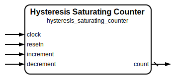

# Hysteresis Saturating Counter

|         |                                                                                  |
| ------- | -------------------------------------------------------------------------------- |
| Module  | Hysteresis Saturating Counter                                                    |
| Project | [OmniCores-BuildingBlocks](https://github.com/Louis-DR/OmniCores-BuildingBlocks) |
| Author  | Louis Duret-Robert - [louisduret@gmail.com](mailto:louisduret@gmail.com)         |
| Website | [louis-dr.github.io](https://louis-dr.github.io)                                 |
| License | MIT License - [mit-license.org](https://mit-license.org)                         |

## Overview

Synchronous counter that increments and decrements within a configurable range with hysteresis behavior. Unlike a regular saturating counter, this variant exhibits non-linear transitions at specific threshold points, creating a hysteresis loop effect. The counter jumps by a configurable coercivity amount when crossing the middle transition points, making it suitable for applications requiring noise immunity, debouncing, or state machines with hysteresis characteristics.

The counter supports non-power-of-two range. Trying to increment and decrement within the same cycle is ignored and the count doesn't change.

## Parameters

| Name          | Type    | Allowed Values | Default | Description                                                                          |
| ------------- | ------- | -------------- | ------- | ------------------------------------------------------------------------------------ |
| `RANGE`       | integer | `≥4`           | `4`     | Counter range. Counter counts from `0` to `RANGE-1`.                                 |
| `RANGE_LOG2`  | integer | `≥2`           | `2`     | Bit width of the counter. Automatically calculated as `log₂(RANGE)`.                 |
| `RESET_VALUE` | integer | `0 to RANGE-1` | `0`     | Initial counter value after reset. Must be within the valid range `[0, RANGE-1]`.    |
| `COERCIVITY`  | integer | `≥1`           | `1`     | Jump width of the hysteresis loop. Determines the magnitude of the transition jumps. |

## Ports

| Name        | Direction | Width        | Clock        | Reset    | Reset value   | Description                                                          |
| ----------- | --------- | ------------ | ------------ | -------- | ------------- | -------------------------------------------------------------------- |
| `clock`     | input     | 1            | self         |          |               | Clock signal.                                                        |
| `resetn`    | input     | 1            | asynchronous | self     | active-low    | Asynchronous active-low reset.                                       |
| `increment` | input     | 1            | `clock`      |          |               | Increment control signal. `0`: idle. `1`: increment counter. |
| `decrement` | input     | 1            | `clock`      |          |               | Decrement control signal. `0`: idle. `1`: decrement counter. |
| `count`     | output    | `RANGE_LOG2` | `clock`      | `resetn` | `RESET_VALUE` | Current counter value.                                               |

## Operation

The hysteresis saturating counter maintains a count value within the range `[0, RANGE-1]` while exhibiting hysteresis behavior at specific transition points. On each rising edge of the clock, the counter responds to the increment and decrement control signals with special jump behavior at the middle thresholds.

For **increment operation**, when `increment` is asserted and the counter is not at its maximum value (`RANGE-1`), the counter normally increases by 1. However, when the counter reaches the lower hysteresis threshold (`RANGE/2-1`), it jumps to the upper threshold plus coercivity (`RANGE/2+COERCIVITY`) instead of incrementing by 1. If the counter is already at the maximum value, asserting `increment` has no effect.

For **decrement operation**, when `decrement` is asserted and the counter is not at its minimum value (`0`), the counter normally decreases by 1. However, when the counter reaches the upper hysteresis threshold (`RANGE/2`), it jumps to the lower threshold minus coercivity (`RANGE/2-1-COERCIVITY`) instead of decrementing by 1. If the counter is already at the minimum value, asserting `decrement` has no effect.

The **hysteresis behavior** creates a loop where the counter exhibits different transition points when incrementing versus decrementing, providing noise immunity and preventing oscillation around the middle values. The coercivity parameter determines the width of the hysteresis gap. If both `increment` and `decrement` are asserted simultaneously, the counter value is not changed.

The counter is reset to `RESET_VALUE` when `resetn` is asserted (active-low). The reset operation is asynchronous and takes precedence over all other operations.

## Paths

| From        | To      | Type       | Comment                                                   |
| ----------- | ------- | ---------- | --------------------------------------------------------- |
| `increment` | `count` | sequential | Increment control path through internal counter register. |
| `decrement` | `count` | sequential | Decrement control path through internal counter register. |

## Complexity

| Delay                | Gates           | Comment |
| -------------------- | --------------- | ------- |
| `O(log₂ log₂ RANGE)` | `O(log₂ RANGE)` |         |

The module requires `RANGE_LOG2` flip-flops for the counter register, plus combinational logic for hysteresis threshold detection and jump calculations. The critical path includes the counter comparison logic, jump calculations, and the increment/decrement arithmetic with conditional jump behavior.

## Verification

The hysteresis saturating counter is verified using a SystemVerilog testbench with eight check sequences that validate the hysteresis behavior and boundary conditions.

The following table lists the checks performed by the testbench.

| Number | Check                        | Description                                                                                               |
| ------ | ---------------------------- | --------------------------------------------------------------------------------------------------------- |
| 1      | Reset value                  | Verifies that the counter initializes to the specified `RESET_VALUE` after reset.                         |
| 2      | Increment without hysteresis | Tests normal incrementing from minimum to the lower hysteresis threshold.                                 |
| 3      | Hysteresis jump up           | Verifies the upward hysteresis jump when crossing the lower threshold during increment.                   |
| 4      | Continue increment to max    | Tests continuing increment from the upper threshold to maximum value.                                     |
| 5      | Decrement without hysteresis | Tests normal decrementing from maximum to the upper hysteresis threshold.                                 |
| 6      | Hysteresis jump down         | Verifies the downward hysteresis jump when crossing the upper threshold during decrement.                 |
| 7      | Continue decrement to min    | Tests continuing decrement from the lower threshold to minimum value.                                     |
| 8      | Random                       | Performs random increment and decrement operations and verifies counter behavior against expected values. |

The following table lists the parameter values verified by the testbench.

| `RANGE` | `RESET_VALUE` | `COERCIVITY` |           |
| ------- | ------------- | ------------ | --------- |
| 4       | 0             | 1            | (default) |

## Constraints

There are no specific synthesis or implementation constraints for this block.

## Deliverables

| Type              | File                                                                                           | Description                                         |
| ----------------- | ---------------------------------------------------------------------------------------------- | --------------------------------------------------- |
| Design            | [`hysteresis_saturating_counter.v`](hysteresis_saturating_counter.v)                           | Verilog design.                                     |
| Testbench         | [`hysteresis_saturating_counter.testbench.sv`](hysteresis_saturating_counter.testbench.sv)     | SystemVerilog verification testbench.               |
| Waveform script   | [`hysteresis_saturating_counter.testbench.gtkw`](hysteresis_saturating_counter.testbench.gtkw) | Script to load the waveforms in GTKWave.            |
| Symbol descriptor | [`hysteresis_saturating_counter.symbol.sss`](hysteresis_saturating_counter.symbol.sss)         | Symbol descriptor for SiliconSuite-SymbolGenerator. |
| Symbol image      | [`hysteresis_saturating_counter.symbol.svg`](hysteresis_saturating_counter.symbol.svg)         | Generated vector image of the symbol.               |
| Datasheet         | [`hysteresis_saturating_counter.md`](hysteresis_saturating_counter.md)                         | Markdown documentation datasheet.                   |

## Dependencies

| Module     | Path                                      | Comment                                         |
| ---------- | ----------------------------------------- | ----------------------------------------------- |
| `clog2.vh` | `omnicores-buildingblocks/sources/common` | Macro for calculating log₂ of parameter values. |

## Related modules

| Module                                                                                                        | Path                                                                        | Comment                                                 |
| ------------------------------------------------------------------------------------------------------------- | --------------------------------------------------------------------------- | ------------------------------------------------------- |
| [`saturating_counter`](../saturating_counter/saturating_counter.md)                                           | `omnicores-buildingblocks/sources/counter/saturating_counter`               | Basic saturating counter without hysteresis behavior.   |
| [`probabilistic_saturating_counter`](../probabilistic_saturating_counter/probabilistic_saturating_counter.md) | `omnicores-buildingblocks/sources/counter/probabilistic_saturating_counter` | Saturating counter variant with probabilistic behavior. |
| [`wrapping_counter`](../wrapping_counter/wrapping_counter.md)                                                 | `omnicores-buildingblocks/sources/counter/wrapping_counter`                 | Counter variant with wrapping behavior.                 |