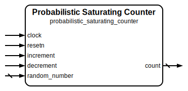

# Probabilistic Saturating Counter

|         |                                                                                  |
| ------- | -------------------------------------------------------------------------------- |
| Module  | Probabilistic Saturating Counter                                                 |
| Project | [OmniCores-BuildingBlocks](https://github.com/Louis-DR/OmniCores-BuildingBlocks) |
| Author  | Louis Duret-Robert - [louisduret@gmail.com](mailto:louisduret@gmail.com)         |
| Website | [louis-dr.github.io](https://louis-dr.github.io)                                 |
| License | MIT License - [mit-license.org](https://mit-license.org)                         |

## Overview

Synchronous counter that increments and decrements within a configurable range with probabilistic saturation behavior. Unlike a regular saturating counter, this variant only transitions to saturated values (minimum or maximum) with a configurable probability when at the boundary transition points. This probabilistic behavior simulates a wider counter while maintaining the same bit width, making it suitable for applications requiring large counters at low area costs such as branch prediction systems, cache replacement policies, or adaptive algorithms with probabilistic characteristics.

The counter supports non-power-of-two range. Trying to increment and decrement within the same cycle is ignored and the count doesn't change.

## Parameters

| Name                     | Type    | Allowed Values | Default | Description                                                                       |
| ------------------------ | ------- | -------------- | ------- | --------------------------------------------------------------------------------- |
| `RANGE`                  | integer | `≥2`           | `4`     | Counter range. Counter counts from `0` to `RANGE-1`.                              |
| `RANGE_LOG2`             | integer | `≥1`           | `2`     | Bit width of the counter. Automatically calculated as `log₂(RANGE)`.              |
| `RESET_VALUE`            | integer | `0 to RANGE-1` | `0`     | Initial counter value after reset. Must be within the valid range `[0, RANGE-1]`. |
| `RANDOM_NUMBER_WIDTH`    | integer | `≥1`           | `8`     | Bit width of the random number input used for probability calculations.           |
| `SATURATION_PROBABILITY` | real    | `0.0 to 1.0`   | `0.25`  | Probability of transitioning to saturated values when at boundary points.         |

## Ports

| Name            | Direction | Width                 | Clock        | Reset    | Reset value   | Description                                                          |
| --------------- | --------- | --------------------- | ------------ | -------- | ------------- | -------------------------------------------------------------------- |
| `clock`         | input     | 1                     | self         |          |               | Clock signal.                                                        |
| `resetn`        | input     | 1                     | asynchronous | self     | active-low    | Asynchronous active-low reset.                                       |
| `increment`     | input     | 1                     | `clock`      |          |               | Increment control signal. `0`: idle. `1`: increment counter. |
| `decrement`     | input     | 1                     | `clock`      |          |               | Decrement control signal. `0`: idle. `1`: decrement counter. |
| `random_number` | input     | `RANDOM_NUMBER_WIDTH` | `clock`      |          |               | Random number input for probability calculations.                    |
| `count`         | output    | `RANGE_LOG2`          | `clock`      | `resetn` | `RESET_VALUE` | Current counter value.                                               |

## Operation

The probabilistic saturating counter maintains a count value within the range `[0, RANGE-1]` while exhibiting probabilistic behavior at the boundary transition points. On each rising edge of the clock, the counter responds to the increment and decrement control signals with probabilistic saturation near the boundaries.

For **increment operation**, when `increment` is asserted and the counter is not at its maximum value (`RANGE-1`), the counter normally increases by 1. However, when the counter is at the pre-maximum value (`RANGE-2`), the transition to the maximum value only occurs with the configured probability. The probability is determined by comparing the `random_number` input against the `SATURATION_PROBABILITY` threshold. If the counter is already at the maximum value, asserting `increment` has no effect.

For **decrement operation**, when `decrement` is asserted and the counter is not at its minimum value (`0`), the counter normally decreases by 1. However, when the counter is at the post-minimum value (`1`), the transition to the minimum value only occurs with the configured probability using the same random number comparison mechanism. If the counter is already at the minimum value, asserting `decrement` has no effect.

The **random saturation** (either for the maximum or minimum value) is determined using the `random_number` input and the `SATURATION_PROBABILITY` parameter using the formula `random_number < SATURATION_PROBABILITY × 2 ^ RANDOM_NUMBER_WIDTH`. For instance, if `SATURATION_PROBABILITY=0.25` (25%) and `RANDOM_NUMBER_WIDTH=8`, then the saturation is possible only if `random_number < 0.25 × 2⁸ = 64`. Therefore, setting `random_number` to zero guarantees saturation, and `random_number` to all ones guarantees that saturation is impossible. If the formula `SATURATION_PROBABILITY × 2 ^ RANDOM_NUMBER_WIDTH` doesn't evaluate to an integer, then the effective probability isn't exact.

The probabilistic behavior simulates a wider counter by making saturation events less frequent than they would be in a standard saturating counter. This creates statistical behavior that can be useful for modeling systems where saturation should occur gradually rather than deterministically. If both `increment` and `decrement` are asserted simultaneously, the counter value is not changed.

The counter is reset to `RESET_VALUE` when `resetn` is asserted (active-low). The reset operation is asynchronous and takes precedence over all other operations.

## Paths

| From            | To      | Type       | Comment                                                   |
| --------------- | ------- | ---------- | --------------------------------------------------------- |
| `increment`     | `count` | sequential | Increment control path through internal counter register. |
| `decrement`     | `count` | sequential | Decrement control path through internal counter register. |
| `random_number` | `count` | sequential | Random number path through probability calculation logic. |

## Complexity

| Delay                | Gates           | Comment |
| -------------------- | --------------- | ------- |
| `O(log₂ log₂ RANGE)` | `O(log₂ RANGE)` |         |

The module requires `RANGE_LOG2` flip-flops for the counter register, plus combinational logic for boundary detection, probability calculations, and random number comparison. The critical path includes the counter comparison logic, probability threshold calculation, and the increment/decrement arithmetic with conditional probabilistic behavior.

## Verification

The probabilistic saturating counter is verified using a SystemVerilog testbench with six check sequences that validate the probabilistic behavior and boundary conditions.

The following table lists the checks performed by the testbench.

| Number | Check                              | Description                                                                                               |
| ------ | ---------------------------------- | --------------------------------------------------------------------------------------------------------- |
| 1      | Reset value                        | Verifies that the counter initializes to the specified `RESET_VALUE` after reset.                         |
| 2      | Increment and force saturation     | Tests incrementing to maximum with forced saturation (random number set zero).                            |
| 3      | Decrement and force saturation     | Tests decrementing to minimum with forced saturation (random number set zero).                            |
| 4      | Measure max saturation probability | Measures the actual probability of transitioning from max-1 to max and compares with expected value.      |
| 5      | Measure min saturation probability | Measures the actual probability of transitioning from min+1 to min and compares with expected value.      |
| 6      | Random                             | Performs random increment and decrement operations and verifies counter behavior against expected values. |

The following table lists the parameter values verified by the testbench.

| `RANGE` | `RESET_VALUE` | `RANDOM_NUMBER_WIDTH` | `SATURATION_PROBABILITY` |           |
| ------- | ------------- | --------------------- | ------------------------ | --------- |
| 4       | 0             | 8                     | 0.25                     | (default) |

## Constraints

There are no specific synthesis or implementation constraints for this block.

## Deliverables

| Type              | File                                                                                                 | Description                                         |
| ----------------- | ---------------------------------------------------------------------------------------------------- | --------------------------------------------------- |
| Design            | [`probabilistic_saturating_counter.v`](probabilistic_saturating_counter.v)                           | Verilog design.                                     |
| Testbench         | [`probabilistic_saturating_counter.testbench.sv`](probabilistic_saturating_counter.testbench.sv)     | SystemVerilog verification testbench.               |
| Waveform script   | [`probabilistic_saturating_counter.testbench.gtkw`](probabilistic_saturating_counter.testbench.gtkw) | Script to load the waveforms in GTKWave.            |
| Symbol descriptor | [`probabilistic_saturating_counter.symbol.sss`](probabilistic_saturating_counter.symbol.sss)         | Symbol descriptor for SiliconSuite-SymbolGenerator. |
| Symbol image      | [`probabilistic_saturating_counter.symbol.svg`](probabilistic_saturating_counter.symbol.svg)         | Generated vector image of the symbol.               |
| Symbol shape      | [`probabilistic_saturating_counter.symbol.drawio`](probabilistic_saturating_counter.symbol.drawio)   | Generated DrawIO shape of the symbol.               |
| Datasheet         | [`probabilistic_saturating_counter.md`](probabilistic_saturating_counter.md)                         | Markdown documentation datasheet.                   |

## Dependencies

| Module     | Path                                      | Comment                                         |
| ---------- | ----------------------------------------- | ----------------------------------------------- |
| `clog2.vh` | `omnicores-buildingblocks/sources/common` | Macro for calculating log₂ of parameter values. |

## Related modules

| Module                                                                                               | Path                                                                     | Comment                                                  |
| ---------------------------------------------------------------------------------------------------- | ------------------------------------------------------------------------ | -------------------------------------------------------- |
| [`saturating_counter`](../saturating_counter/saturating_counter.md)                                  | `omnicores-buildingblocks/sources/counter/saturating_counter`            | Basic saturating counter without probabilistic behavior. |
| [`hysteresis_saturating_counter`](../hysteresis_saturating_counter/hysteresis_saturating_counter.md) | `omnicores-buildingblocks/sources/counter/hysteresis_saturating_counter` | Saturating counter variant with hysteresis behavior.     |
| [`wrapping_counter`](../wrapping_counter/wrapping_counter.md)                                        | `omnicores-buildingblocks/sources/counter/wrapping_counter`              | Counter variant with wrapping behavior.                  |
