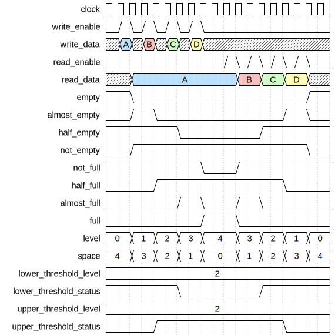
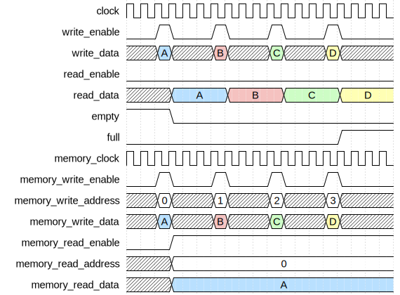
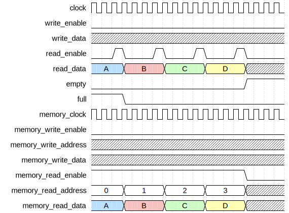
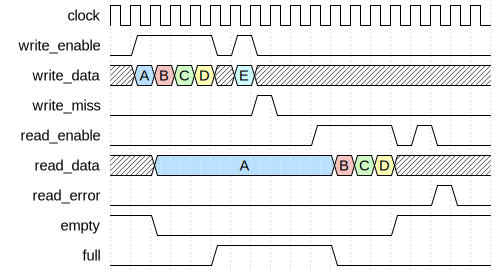
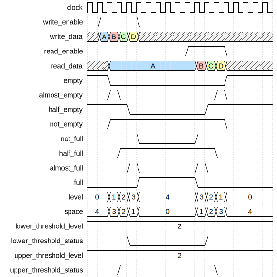
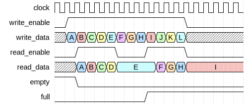

# Advanced FIFO Controller

|         |                                                                                  |
| ------- | -------------------------------------------------------------------------------- |
| Module  | Advanced FIFO Controller                                                         |
| Project | [OmniCores-BuildingBlocks](https://github.com/Louis-DR/OmniCores-BuildingBlocks) |
| Author  | Louis Duret-Robert - [louisduret@gmail.com](mailto:louisduret@gmail.com)         |
| Website | [louis-dr.github.io](https://louis-dr.github.io)                                 |
| License | MIT License - [mit-license.org](https://mit-license.org)                         |

## Overview

Controller for synchronous First-In First-Out queue with advanced features including protection mechanisms, error reporting, extended status flags, level monitoring, and dynamic thresholds. The controller manages the logic of the access-enable user interface, controls the memory interface, and computes the status flags. It is designed to be integrated with a simple dual-port RAM for data storage.

## Usage

The `resetn` can be asserted asynchronously, but must be deasserted synchronously to `clock`, or when `clock` is not running. The queue can be used one cycle after the reset is deasserted. The reset is not propagated to the memory interface and the storage module and its content may or may not be reset.

Both the write (push) and the read (pop) interfaces use an enable signal for flow control, and they are both synchronous to the `clock`.

The `empty`, `full`, and the other status outputs report the filling status of the queue. The `almost_empty` and `almost_full` outputs are asserted when the queue has only one valid entry and one free entry respectively. The `half_empty` and `half_full` outputs are asserted when up to half of the queue's entries are free and valid respectively (they are exclusive for odd depths, and are both asserted for even depths when the queue is exactly half full and half empty). The `not_empty` and `not_full` outputs are the inverted versions of `empty` and `full`.

The `level` and `space` outputs indicate the number of valid entried and free slots in the queue respectively. Their sum is equal to the depth of the queue.

Two dynamically configurable thresholds are provided. The `lower_threshold_status` is asserted when the queue level is less than or equal to `lower_threshold_level`. The `upper_threshold_status` is asserted when the queue level is greater than or equal to `upper_threshold_level`.

When `write_enable` is high at the rising edge of the `clock`, the value of `write_data` is written to the storage in the same cycle by asserting `memory_write_enable`, forwarding the data on `memory_write_data`, and setting the correct address on `memory_write_address`. On the next cycle, the controller is ready to read the data that was just written if the queue contains only one entry, and/or to write another entry at the tail of the queue.

The `read_data` always corresponds to the value at the head of the queue when it is not empty, as `memory_read_enable` is kept high as long as the queue is not empty. The data at the head of the queue can be read continuously without popping. Only when `read_enable` is high at the rising edge of the `clock` that the entry is popped from the queue. Then, on the next cycle, the data of the next entry is available for reading.

The controller does implement a safety mechanism against writing when full or reading when empty. A one cycle pulse is emitted on `write_miss` or `read_error` following a write-when-full or read-when-empty occurence respectively. The queue will not break in either cases as its internal state will not be affected: the write is ignored and the read returns invalid data. However, the integration must handle those cases such that the missed write data is not lost or lost in a way that doesn't break the the system, and the invalid read data is not breaking the system either.

The `write_enable` and `read_enable` can be maintained high for multiple cycles to perform back-to-back accesses.

When writing and reading at the same time, the head entry is read out while the `write_data` is stored at the tail. Occupancy remains unchanged. This is valid even when the queue is full: the read frees one slot and the write fills it in the same cycle.

The input `clock` of the user interfaces is forwarded on `memory_clock` to drive the simple dual-port RAM.

## Parameters

| Name         | Type    | Allowed Values | Default       | Description                                     |
| ------------ | ------- | -------------- | ------------- | ----------------------------------------------- |
| `WIDTH`      | integer | `≥1`           | `8`           | Bit width of the data vector.                   |
| `DEPTH`      | integer | `≥2`           | `4`           | Number of entries in the queue .                |
| `DEPTH_LOG2` | integer | `≥1`           | `log₂(DEPTH)` | Log base 2 of depth (automatically calculated). |

## Ports

| Name                     | Direction | Width          | Clock        | Reset    | Reset value | Description                                                                                                                      |
| ------------------------ | --------- | -------------- | ------------ | -------- | ----------- | -------------------------------------------------------------------------------------------------------------------------------- |
| `clock`                  | input     | 1              | self         |          |             | Clock signal.                                                                                                                    |
| `resetn`                 | input     | 1              | asynchronous | self     | active-low  | Asynchronous active-low reset.                                                                                                   |
| `flush`                  | input     | 1              | `clock`      |          |             | Flush control. • `0`: idle. • `1`: empty FIFO by advancing read to write pointer.                                        |
| `empty`                  | output    | 1              | `clock`      | `resetn` | `1`         | Queue empty status. • `0`: queue contains data. • `1`: queue is empty.                                                   |
| `almost_empty`           | output    | 1              | `clock`      | `resetn` | `0`         | Queue almost empty status. • `0`: queue is empty or has more than one entry. • `1`: queue has exactly one entry.         |
| `half_empty`             | output    | 1              | `clock`      | `resetn` | `1`         | Queue half empty status. • `0`: queue half full. • `1`: queue half empty.                                                |
| `not_empty`              | output    | 1              | `clock`      | `resetn` | `0`         | Queue not empty status. • `0`: queue is empty. • `1`: queue contains data.                                               |
| `not_full`               | output    | 1              | `clock`      | `resetn` | `1`         | Queue not full status. • `0`: queue is full. • `1`: queue has free space.                                                |
| `half_full`              | output    | 1              | `clock`      | `resetn` | `0`         | Queue half full status. • `0`: queue half empty. • `1`: queue half full.                                                 |
| `almost_full`            | output    | 1              | `clock`      | `resetn` | `0`         | Queue almost full status. • `0`: queue is full or has more than one free space. • `1`: queue has exactly one free space. |
| `full`                   | output    | 1              | `clock`      | `resetn` | `0`         | Queue full status. • `0`: queue has free space. • `1`: queue is full.                                                    |
| `write_miss`             | output    | 1              | `clock`      | `resetn` | `0`         | Write protection pulse notification. • `0`: no error. • `1`: write attempted when full.                                  |
| `read_error`             | output    | 1              | `clock`      | `resetn` | `0`         | Read protection pulse notification. • `0`: no error. • `1`: read attempted when empty.                                   |
| `write_enable`           | input     | 1              | `clock`      |          |             | Write enable signal. • `0`: idle. • `1`: write (push) to queue.                                                          |
| `write_data`             | input     | `WIDTH`        | `clock`      |          |             | Data to be written to the queue.                                                                                                 |
| `read_enable`            | input     | 1              | `clock`      |          |             | Read enable signal. • `0`: idle. • `1`: read (pop) from queue.                                                           |
| `read_data`              | output    | `WIDTH`        | `clock`      | `resetn` | `0`         | Data read from the queue head.                                                                                                   |
| `level`                  | output    | `DEPTH_LOG2+1` | `clock`      | `resetn` | `0`         | Current number of entries in the queue.                                                                                          |
| `space`                  | output    | `DEPTH_LOG2+1` | `clock`      | `resetn` | `DEPTH`     | Current number of free slots in the queue.                                                                                       |
| `lower_threshold_level`  | input     | `DEPTH_LOG2+1` | `clock`      |          |             | Lower threshold level for comparison.                                                                                            |
| `lower_threshold_status` | output    | 1              | `clock`      | `resetn` | `1`         | Lower threshold status. • `0`: level > threshold. • `1`: level ≤ threshold.                                              |
| `upper_threshold_level`  | input     | `DEPTH_LOG2+1` | `clock`      |          |             | Upper threshold level for comparison.                                                                                            |
| `upper_threshold_status` | output    | 1              | `clock`      | `resetn` | `0`         | Upper threshold status. • `0`: level < threshold. • `1`: level ≥ threshold.                                              |
| `memory_write_enable`    | output    | 1              | `clock`      |          |             | Memory write enable signal.                                                                                                      |
| `memory_write_address`   | output    | `DEPTH_LOG2`   | `clock`      |          |             | Memory write address.                                                                                                            |
| `memory_write_data`      | output    | `WIDTH`        | `clock`      |          |             | Memory write data.                                                                                                               |
| `memory_read_enable`     | output    | 1              | `clock`      |          |             | Memory read enable signal.                                                                                                       |
| `memory_read_address`    | output    | `DEPTH_LOG2`   | `clock`      |          |             | Memory read address.                                                                                                             |
| `memory_read_data`       | input     | `WIDTH`        | `clock`      |          |             | Memory read data.                                                                                                                |

## Operation

The controller maintains independent write and read pointers, each composed of an index and a lap bit for unambiguous level calculation. The pointers are implemented with instances of the `advanced_wrapping_counter` modyle. They are zero out of reset. They are used for memory addressing and level calculation.

The internal `can_write` wire indicates that the queue is not full (or full but a read is also occuring), and not flushing. When a write is requested (`write_enable` is asserted) and it is allowed (`can_write` is asserted), then the internal wire `do_write` is asserted and a write occurs: the `memory_write_address` is set to the write pointer stripped of its lap bit, `memory_write_data` forwards the value from `write_data`, and `memory_write_enable` is asserted to signal a write transaction to the memory. At the rising edge of `clock`, the write pointer is incremented.

If a write is requested (`write_enable` is asserted) but it isn't allowed (`can_write` is deasserted), then the write is ignored - the write port of the memory interface stays idle and the write pointer is unchanged - but the `write_miss` output is asserted for one cycle.

Whenever the queue is not empty, meaning there is at least one entry in the queue, the controller continuously reads from the memory by asserting `memory_read_enable`, setting `memory_read_address` to the read pointer stripped of its lap bit, and the `memory_read_data` is forwarded on the `read_data` output. The internal `can_read` wire indicates that the queue is not empty and not flushing. When a read is requested (`read_enable` is asserted) and it is allowed (`can_read` is asserted), then the internal wire `do_write` is asserted and a read occurs at the rising edge: at the rising edge of the `clock`, the read pointer is incremented.

If a read is requested (`read_enable` is asserted) but it isn't allowed (`can_read` is deasserted), then the read is ignored - the read port of the memory interface stays idle, the read data is invalid, and the read pointer is unchanged - but the `read_error` output is asserted for one cycle.

The simple status flags are directly calculated based on the read and write pointers with their lap bits and are combinational outputs. The queue is full (`full` output asserted) when the pointers are the same but the lap bits are different. The queue is empty (`empty` output asserted) when the pointers are the same and the lap bits are equal. The inverted outputs `not_full` and `not_empty` are derived from them.

The `level` output is computed by subtracting the read pointer from the write pointer. For power-of-two depths, the binary subtraction with the lap bit works efficiently, but for non-power-of-two depths, an offset of `DEPTH` must be added if the lap bits are equal to get a positive result. The `space` output is derived from the `level` output.

The advanced status flags `almost_empty`, `half_empty`, `almost_full`, and `half_full`, as well as the dynamic threshold flags `lower_threshold_status` and `upper_threshold_status` are all derived from the `level` and `space` outputs with the corresponding static or dynamic comparisons.

The queue supports power-of-two and non-power-of-two even or odd depths, and the width of the stack pointer will correspond to the upper power-of-two range. The logic will be slightly faster and more efficient for power-of-two depths as it can rely on the natural wrapping when the binary counter overflows.

When the `flush` input is asserted, the read pointer is realigned to the write pointer at the rising edge of the `clock`. This effectively empties the queue. When the `flush` input is asserted, `write_enable` and `read_enable` must stay deasserted. If a write or read is requested anyway, it will trigger a `write_miss` or `read_error` respectively. Note that this implementation of the flush feature is inefficient and will be replaced.

## Paths

| From                    | To                       | Type          | Comment                                      |
| ----------------------- | ------------------------ | ------------- | -------------------------------------------- |
| `write_data`            | `memory_write_data`      | combinational | Direct pass-through.                         |
| `write_enable`          | `memory_write_enable`    | combinational | Gated by full flag.                          |
| `write_enable`          | `memory_write_address`   | combinational | Address from write pointer.                  |
| `write_enable`          | `write_miss`             | sequential    | Error flag generation.                       |
| `write_enable`          | status/level flags       | sequential    | Control path through internal write pointer. |
| `read_enable`           | `memory_read_enable`     | combinational | Gated by empty flag.                         |
| `read_enable`           | `memory_read_address`    | combinational | Address from read pointer.                   |
| `read_enable`           | `read_error`             | sequential    | Error flag generation.                       |
| `read_enable`           | status/level flags       | sequential    | Control path through internal read pointer.  |
| `flush`                 | status/level flags       | sequential    | Control path through internal pointers.      |
| `lower_threshold_level` | `lower_threshold_status` | combinational | Direct comparison with current level.        |
| `upper_threshold_level` | `upper_threshold_status` | combinational | Direct comparison with current level.        |
| `memory_read_data`      | `read_data`              | combinational | Direct pass-through.                         |

## Complexity

| Delay           | Gates           | Comment |
| --------------- | --------------- | ------- |
| `O(log₂ DEPTH)` | `O(log₂ DEPTH)` |         |

In this table, the delay refers to the timing critical path, which determines the maximal operating frequency.

The controller requires `2×(log₂DEPTH+1)` flip-flops for the read and write pointers with wrap bits, plus additional state for error flags.

Under tight timing constraints, the critical path delay might achieve `O(log₂ log₂ DEPTH)` complexity instead of `O(log₂ DEPTH)`, while sacrificing some area. This depends on how the synthesizer implements and optimizes the pointer incrementation, pointer comparison, level calculation, and threshold comparisons.

## Verification

The controller does not have a standalone testbench as its functionality is fully exercised and verified through the testbenches of the modules that integrate it.

## Constraints

There are no specific synthesis or implementation constraints for this block.

## Deliverables

| Type              | File                                                                               | Description                                         |
| ----------------- | ---------------------------------------------------------------------------------- | --------------------------------------------------- |
| Design            | [`advanced_fifo_controller.v`](advanced_fifo_controller.v)                         | Verilog design.                                     |
| Symbol descriptor | [`advanced_fifo_controller.symbol.sss`](advanced_fifo_controller.symbol.sss)       | Symbol descriptor for SiliconSuite-SymbolGenerator. |
| Symbol image      | [`advanced_fifo_controller.symbol.svg`](advanced_fifo_controller.symbol.svg)       | Generated vector image of the symbol.               |
| Symbol shape      | [`advanced_fifo_controller.symbol.drawio`](advanced_fifo_controller.symbol.drawio) | Generated DrawIO shape of the symbol.               |
| Datasheet         | [`advanced_fifo_controller.md`](advanced_fifo_controller.md)                       | Markdown documentation datasheet.                   |

## Dependencies

This module depends on the following modules:

| Module                      | Path                                                                 | Comment                 |
| --------------------------- | -------------------------------------------------------------------- | ----------------------- |
| `advanced_wrapping_counter` | `omnicores-buildingblocks/sources/counter/advanced_wrapping_counter` | For pointer management. |

## Related modules

| Module                                                                                                            | Path                                                                           | Comment                                                          |
| ----------------------------------------------------------------------------------------------------------------- | ------------------------------------------------------------------------------ | ---------------------------------------------------------------- |
| [`advanced_fifo`](../../access_enable/advanced_fifo/advanced_fifo.md)                                             | `omnicores-buildingblocks/sources/data/access_enable/advanced_fifo`            | Access-enable wrapper integrating this controller with RAM.      |
| [`fifo_controller`](../fifo/fifo_controller.md)                                                                   | `omnicores-buildingblocks/sources/data/controllers/fifo`                       | Basic FIFO controller without advanced features or protection.   |
| [`asynchronous_advanced_fifo_controller`](../asynchronous_advanced_fifo/asynchronous_advanced_fifo_controller.md) | `omnicores-buildingblocks/sources/data/controllers/asynchronous_advanced_fifo` | Advanced asynchronous FIFO controller for clock domain crossing. |
