# Asynchronous Advanced FIFO Controller

|         |                                                                                  |
| ------- | -------------------------------------------------------------------------------- |
| Module  | Asynchronous Advanced FIFO Controller                                            |
| Project | [OmniCores-BuildingBlocks](https://github.com/Louis-DR/OmniCores-BuildingBlocks) |
| Author  | Louis Duret-Robert - [louisduret@gmail.com](mailto:louisduret@gmail.com)         |
| Website | [louis-dr.github.io](https://louis-dr.github.io)                                 |
| License | MIT License - [mit-license.org](https://mit-license.org)                         |

## Overview

Controller for asynchronous First-In First-Out queue with advanced features including protection mechanisms, error reporting, extended status flags, level monitoring, and dynamic thresholds. The controller manages the logic of the access-enable user interface, controls the memory interface, computes the status flags, and ensures correct clock domain crossing. It is designed to be integrated with an asynchronous simple dual-port RAM for data storage.

## Usage

The controller has two clock domains: the write domain on `write_clock` and the the read domain on `read_clock`. The clock can be synchronous or asynchronous, and have any phase shift and frequency ratio.

The clock domains have their own reset - `write_resetn` and `read_resetn` - which can be asserted asynchronously, but must be deasserted synchronously to their respective clocks, or when the clocks are not running. The queue can be used `STAGES+1` clock cycles after both resets are deasserted to allows the propagation accross clock domains. The resets are not propagated to the memory interface and the storage module and its content may or may not be reset.

Both the write (push) and the read (pop) interfaces use an enable signal for flow control, `write_enable` and `read_enable`, and they are synchronous to their respective clocks.

In each clock domain, the `*_empty`, `*_full`, and the other status outputs report the filling status of the queue. The `*_almost_empty` and `*_almost_full` outputs are asserted when the queue has only one valid entry and one free entry respectively. The `*_half_empty` and `*_half_full` outputs are asserted when up to half of the queue's entries are free and valid respectively (they are exclusive for odd depths, and are both asserted for even depths when the queue is exactly half full and half empty). The `*_not_empty` and `*_not_full` outputs are the inverted versions of `*_empty` and `*_full`.

In each clock domain, the `*_level` and `*_space` outputs indicate the number of valid entried and free slots in the queue respectively. Their sum is equal to the depth of the queue.

Two dynamically configurable thresholds are provided in each clock domain. The `*_lower_threshold_status` is asserted when the queue level is less than or equal to `*_lower_threshold_level`. The `*_upper_threshold_status` is asserted when the queue level is greater than or equal to `*_upper_threshold_level`.

Fast write slow read:

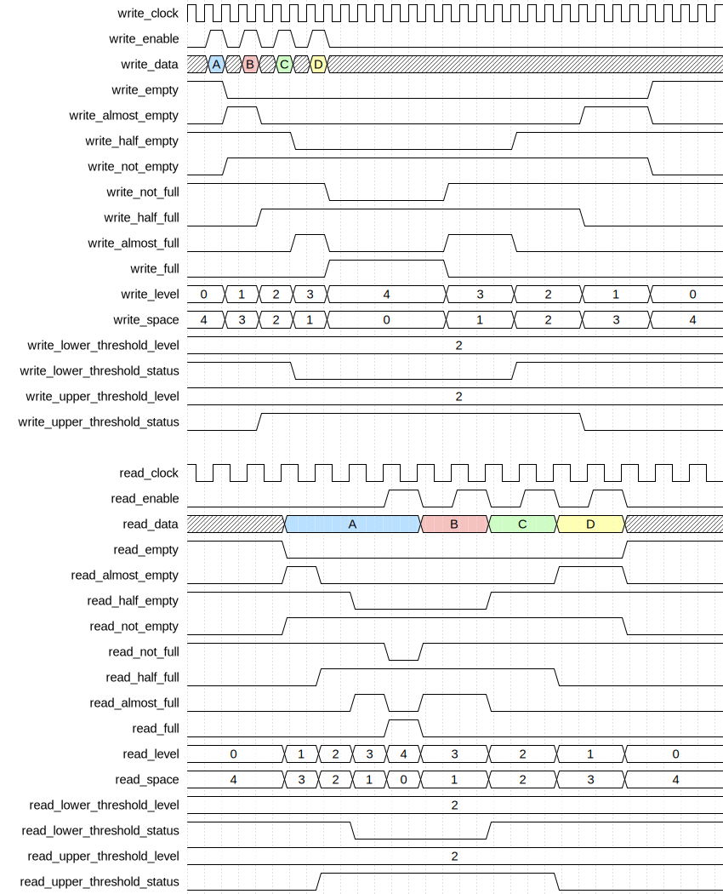

Same frequency different phase:

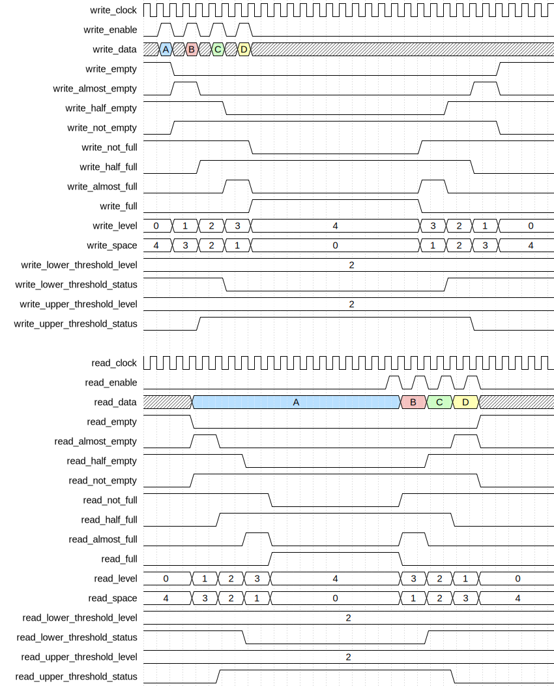

Slow write fast read:

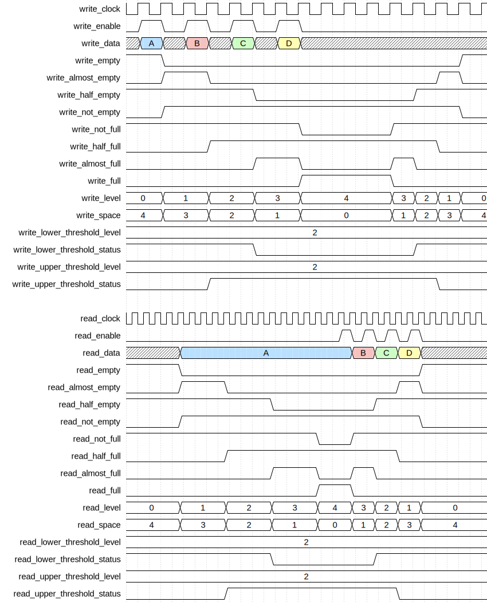

When `write_enable` is high at the rising edge of the `write_clock`, the value of `write_data` is written to the storage in the same cycle by asserting `memory_write_enable`, forwarding the data on `memory_write_data`, and setting the correct address on `memory_write_address`. On the next cycle, the controller is ready to read the data that was just written if the queue contains only one entry, and/or to write another entry at the tail of the queue.

The `read_data` always corresponds to the value at the head of the queue when it is not empty, as `memory_read_enable` is kept high as long as the queue is not empty. The data at the head of the queue can be read continuously without popping. Only when `read_enable` is high at the rising edge of the `read_clock` that the entry is popped from the queue. Then, on the next cycle, the data of the next entry is available for reading.

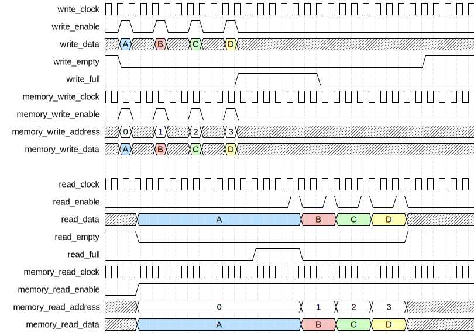

The controller does implement a safety mechanism against writing when full or reading when empty. A one cycle pulse is emitted on `write_miss` or `read_error` following a write-when-full or read-when-empty occurence respectively. The queue will not break in either cases as its internal state will not be affected: the write is ignored and the read returns invalid data. However, the integration must handle those cases such that the missed write data is not lost or lost in a way that doesn't break the the system, and the invalid read data is not breaking the system either.

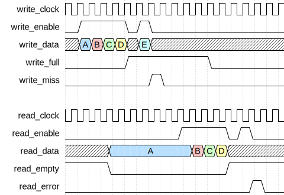

The `write_enable` and `read_enable` can be maintained high for multiple cycles to perform back-to-back accesses.

Fast write slow read:

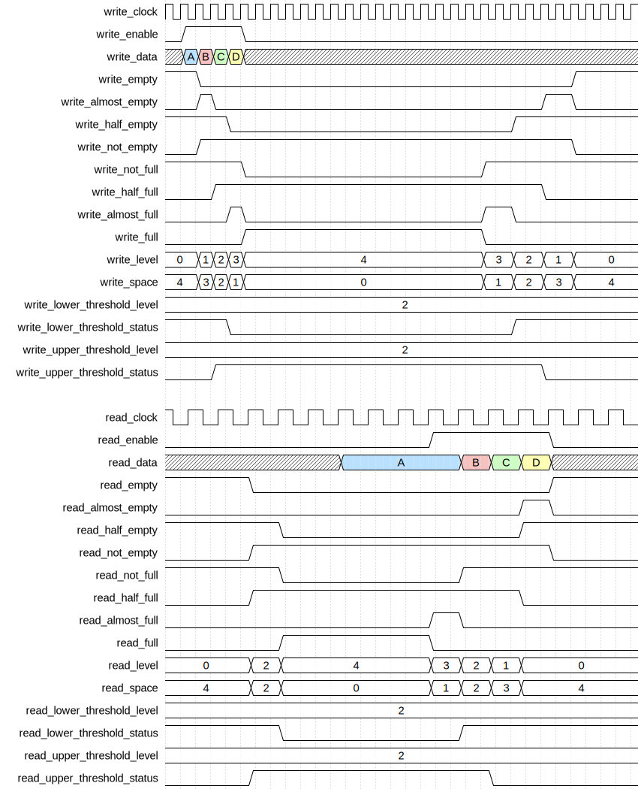

Same frequency different phase:

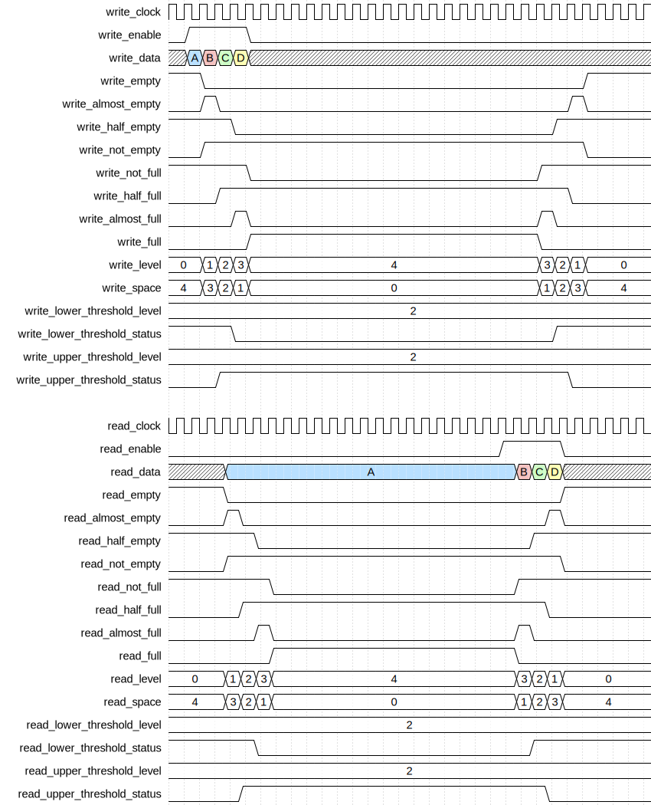

Slow write fast read:

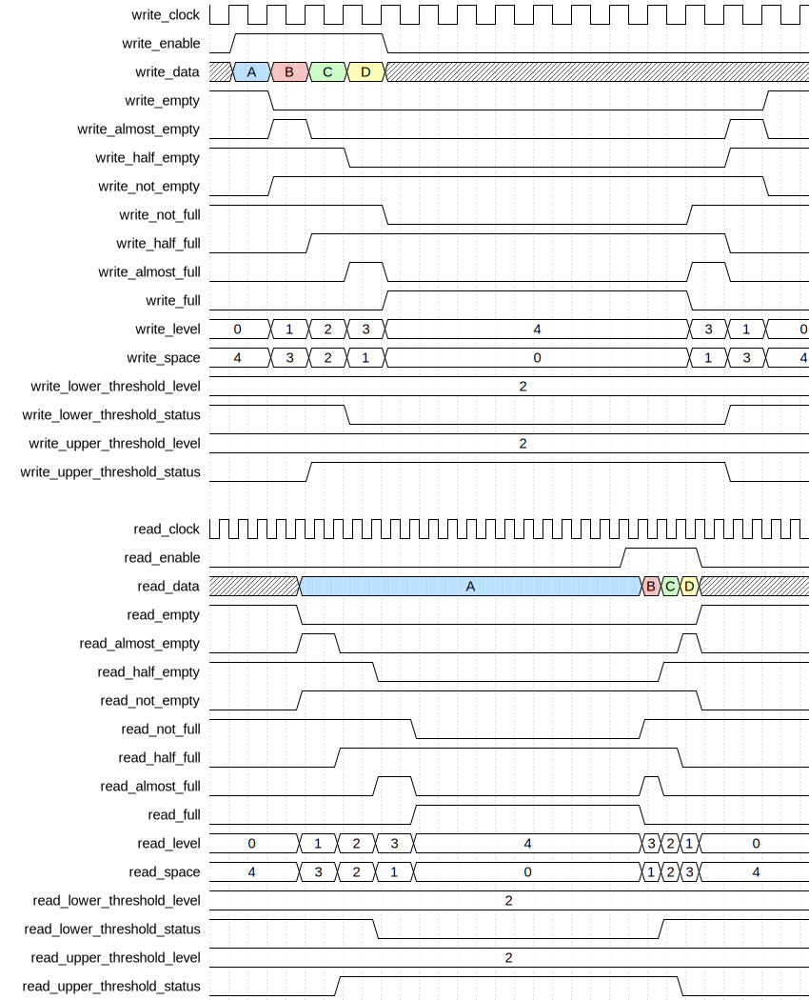

It is possible to write to and read from the queue at the same time as long as the occupancy of the queue within the two clock domains allows it. Depending on the ratio of the clock frequencies and the number of synchronization stages (`STAGES`), writing and reading continuously can result in oscillations of full and empty states.

Fast write slow read:

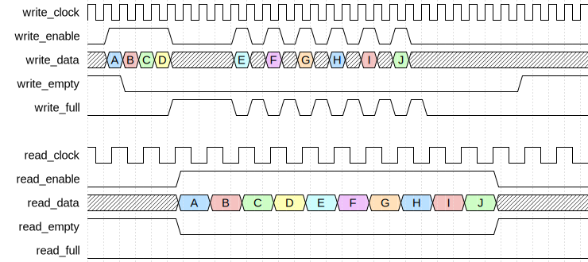

Same frequency different phase:

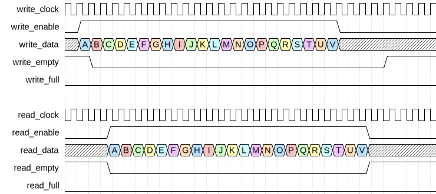

Slow write fast read:

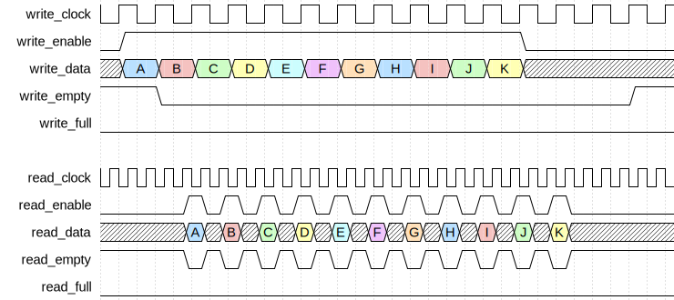

The inputs `write_clock` and `read_clock` of the user interfaces are forwarded on `memory_write_clock` and `memory_read_clock` to drive the simple dual-port RAM.

## Parameters

| Name           | Type    | Allowed Values | Default       | Description                                         |
| -------------- | ------- | -------------- | ------------- | --------------------------------------------------- |
| `WIDTH`        | integer | `≥1`           | `8`           | Bit width of the data vector.                       |
| `DEPTH`        | integer | `≥2` even      | `4`           | Number of entries in the queue.                     |
| `DEPTH_LOG2`   | integer | `≥1`           | `log₂(DEPTH)` | Log base 2 of depth (automatically calculated).     |
| `STAGES_WRITE` | integer | `≥2`           | `2`           | Number of synchronizer stages for write domain CDC. |
| `STAGES_READ`  | integer | `≥2`           | `2`           | Number of synchronizer stages for read domain CDC.  |

## Ports

| Name                           | Direction | Width          | Clock                | Reset          | Reset value | Description                                                                                                                                   |
| ------------------------------ | --------- | -------------- | -------------------- | -------------- | ----------- | --------------------------------------------------------------------------------------------------------------------------------------------- |
| `write_clock`                  | input     | 1              | self                 |                |             | Write clock signal.                                                                                                                           |
| `write_resetn`                 | input     | 1              | asynchronous         | self           | active-low  | Asynchronous active-low reset for write domain.                                                                                               |
| `write_flush`                  | input     | 1              | `write_clock`        |                |             | Flush control from write domain. • `0`: idle. • `1`: empty FIFO.                                                                      |
| `write_enable`                 | input     | 1              | `write_clock`        |                |             | Write enable signal. • `0`: idle. • `1`: write (push) to queue.                                                                       |
| `write_data`                   | input     | `WIDTH`        | `write_clock`        |                |             | Data to be written to the queue.                                                                                                              |
| `write_empty`                  | output    | 1              | `write_clock`        | `write_resetn` | `1`         | Write domain queue empty status. • `0`: queue contains data. • `1`: queue is empty.                                                   |
| `write_almost_empty`           | output    | 1              | `write_clock`        | `write_resetn` | `0`         | Write domain queue almost empty status. • `0`: queue is empty or has more than one entry. • `1`: queue has exactly one entry.         |
| `write_half_empty`             | output    | 1              | `write_clock`        | `write_resetn` | `0`         | Write domain queue half empty status. • `0`: queue half full. • `1`: queue half empty.                                                |
| `write_not_empty`              | output    | 1              | `write_clock`        | `write_resetn` | `0`         | Write domain queue not empty status. • `0`: queue is empty. • `1`: queue contains data.                                               |
| `write_not_full`               | output    | 1              | `write_clock`        | `write_resetn` | `1`         | Write domain queue not full status. • `0`: queue is full. • `1`: queue has free space.                                                |
| `write_half_full`              | output    | 1              | `write_clock`        | `write_resetn` | `0`         | Write domain queue half full status. • `0`: queue half empty. • `1`: queue half full.                                                 |
| `write_almost_full`            | output    | 1              | `write_clock`        | `write_resetn` | `0`         | Write domain queue almost full status. • `0`: queue is full or has more than one free space. • `1`: queue has exactly one free space. |
| `write_full`                   | output    | 1              | `write_clock`        | `write_resetn` | `0`         | Write domain queue full status. • `0`: queue has free space. • `1`: queue is full.                                                    |
| `write_miss`                   | output    | 1              | `write_clock`        | `write_resetn` | `0`         | Write protection pulse notification. • `0`: no error. • `1`: write attempted when full.                                               |
| `write_level`                  | output    | `DEPTH_LOG2+1` | `write_clock`        | `write_resetn` | `0`         | Write domain current number of entries in the queue.                                                                                          |
| `write_space`                  | output    | `DEPTH_LOG2+1` | `write_clock`        | `write_resetn` | `0`         | Write domain number of free entries.                                                                                                          |
| `write_lower_threshold_level`  | input     | `DEPTH_LOG2+1` | `write_clock`        |                |             | Write domain lower threshold level for comparison.                                                                                            |
| `write_lower_threshold_status` | output    | 1              | `write_clock`        | `write_resetn` | `1`         | Write domain lower threshold status. • `0`: level > threshold. • `1`: level ≤ threshold.                                              |
| `write_upper_threshold_level`  | input     | `DEPTH_LOG2+1` | `write_clock`        |                |             | Write domain upper threshold level for comparison.                                                                                            |
| `write_upper_threshold_status` | output    | 1              | `write_clock`        | `write_resetn` | `0`         | Write domain upper threshold status. • `0`: level < threshold. • `1`: level ≥ threshold.                                              |
| `read_clock`                   | input     | 1              | self                 |                |             | Read clock signal.                                                                                                                            |
| `read_resetn`                  | input     | 1              | asynchronous         | self           | active-low  | Asynchronous active-low reset for read domain.                                                                                                |
| `read_flush`                   | input     | 1              | `read_clock`         |                |             | Flush control from read domain. • `0`: idle. • `1`: empty FIFO.                                                                       |
| `read_enable`                  | input     | 1              | `read_clock`         |                |             | Read enable signal. • `0`: idle. • `1`: read (pop) from queue.                                                                        |
| `read_data`                    | output    | `WIDTH`        | `read_clock`         | `read_resetn`  | `0`         | Data read from the queue head.                                                                                                                |
| `read_empty`                   | output    | 1              | `read_clock`         | `read_resetn`  | `1`         | Read domain queue empty status. • `0`: queue contains data. • `1`: queue is empty.                                                    |
| `read_almost_empty`            | output    | 1              | `read_clock`         | `read_resetn`  | `0`         | Read domain queue almost empty status. • `0`: queue is empty or has more than one entry. • `1`: queue has exactly one entry.          |
| `read_half_empty`              | output    | 1              | `read_clock`         | `read_resetn`  | `0`         | Read domain queue half empty status. • `0`: queue half full. • `1`: queue half empty.                                                 |
| `read_not_empty`               | output    | 1              | `read_clock`         | `read_resetn`  | `0`         | Read domain queue not empty status. • `0`: queue is empty. • `1`: queue contains data.                                                |
| `read_not_full`                | output    | 1              | `read_clock`         | `read_resetn`  | `1`         | Read domain queue not full status. • `0`: queue is full. • `1`: queue has free space.                                                 |
| `read_half_full`               | output    | 1              | `read_clock`         | `read_resetn`  | `0`         | Read domain queue half full status. • `0`: queue half empty. • `1`: queue half full.                                                  |
| `read_almost_full`             | output    | 1              | `read_clock`         | `read_resetn`  | `0`         | Read domain queue almost full status. • `0`: queue is full or has more than one free space. • `1`: queue has exactly one free space.  |
| `read_full`                    | output    | 1              | `read_clock`         | `read_resetn`  | `0`         | Read domain queue full status. • `0`: queue has free space. • `1`: queue is full.                                                     |
| `read_error`                   | output    | 1              | `read_clock`         | `read_resetn`  | `0`         | Read protection pulse notification. • `0`: no error. • `1`: read attempted when empty.                                                |
| `read_level`                   | output    | `DEPTH_LOG2+1` | `read_clock`         | `read_resetn`  | `0`         | Read domain current number of entries in the queue.                                                                                           |
| `read_space`                   | output    | `DEPTH_LOG2+1` | `read_clock`         | `read_resetn`  | `0`         | Read domain number of free entries.                                                                                                           |
| `read_lower_threshold_level`   | input     | `DEPTH_LOG2+1` | `read_clock`         |                |             | Read domain lower threshold level for comparison.                                                                                             |
| `read_lower_threshold_status`  | output    | 1              | `read_clock`         | `read_resetn`  | `1`         | Read domain lower threshold status. • `0`: level > threshold. • `1`: level ≤ threshold.                                               |
| `read_upper_threshold_level`   | input     | `DEPTH_LOG2+1` | `read_clock`         |                |             | Read domain upper threshold level for comparison.                                                                                             |
| `read_upper_threshold_status`  | output    | 1              | `read_clock`         | `read_resetn`  | `0`         | Read domain upper threshold status. • `0`: level < threshold. • `1`: level ≥ threshold.                                               |
| `memory_write_clock`           | output    | 1              | self                 |                |             | Write clock for asynchronous dual-port memory.                                                                                                |
| `memory_write_enable`          | output    | 1              | `memory_write_clock` | `write_resetn` | `0`         | Memory write enable signal.                                                                                                                   |
| `memory_write_address`         | output    | `DEPTH_LOG2`   | `memory_write_clock` | `write_resetn` | `0`         | Memory write address.                                                                                                                         |
| `memory_write_data`            | output    | `WIDTH`        | `memory_write_clock` | `write_resetn` | `0`         | Memory write data.                                                                                                                            |
| `memory_read_clock`            | output    | 1              | self                 |                |             | Read clock for asynchronous dual-port memory.                                                                                                 |
| `memory_read_enable`           | output    | 1              | `memory_read_clock`  | `read_resetn`  | `0`         | Memory read enable signal.                                                                                                                    |
| `memory_read_address`          | output    | `DEPTH_LOG2`   | `memory_read_clock`  | `read_resetn`  | `0`         | Memory read address.                                                                                                                          |
| `memory_read_data`             | input     | `WIDTH`        | `memory_read_clock`  |                |             | Memory read data.                                                                                                                             |

## Operation

The controller maintains separate read and write pointers in their respective clock domains, implements Gray-code conversion and synchronization using `gray_wrapping_counter` for CDC-safe pointer transfer, calculates all status flags, levels, and thresholds in both domains, implements protection mechanisms, and generates error notifications. The controller doesn't store any data, only control state.

For **write operation** (in write clock domain), when `write_enable` is asserted, the controller checks if the queue is full. If not full and not flushing, it generates `memory_write_enable`, provides the write address from the write pointer, and forwards `write_data` to `memory_write_data`. The write pointer counter advances and automatically converts to Gray code. If full, the write is ignored and `write_miss` pulses for one clock cycle.

For **read operation** (in read clock domain), when `read_enable` is asserted, the controller checks if the queue is empty. If not empty, `memory_read_enable` is generated, the read address is provided from the read pointer, and the read pointer counter advances with automatic Gray code conversion. If empty, the read is ignored and `read_error` pulses for one clock cycle.

The **status flags and levels** are calculated independently in each domain:
- **Write domain**: Level calculated from write pointer and synchronized read pointer. All status flags derived from this level.
- **Read domain**: Level calculated from read pointer and synchronized write pointer. All status flags derived from this level.

The levels in each domain may differ temporarily due to CDC synchronization latency, which is inherent to asynchronous FIFO operation.

The **flushing** can be initiated from either domain:
- **Write flush**: Synchronizes to read domain and forces read pointer to match write pointer.
- **Read flush**: Synchronizes to write domain and forces read pointer to match write pointer.

The **clock domain crossing** uses Gray-code counters (`gray_wrapping_counter`) that maintain both binary and Gray-coded representations. The Gray-coded pointers are synchronized using multi-stage synchronizers (`vector_synchronizer`) before being converted back to binary in the opposite domain for level calculation.

The **memory interface** provides separate write and read channels in their respective clock domains with independent clocks, enable, address, and data signals for asynchronous dual-port RAM. The controller forwards the write and read clocks (`memory_write_clock` and `memory_read_clock`) to the memory to clearly indicate the asynchronous nature of the interface. The write port operates in the write clock domain, and the read port operates in the read clock domain. The interface expects combinational reads from the asynchronous RAM.

## Paths

Similar to asynchronous_fifo_controller but with additional paths for protection logic, level calculation, and threshold comparisons in both domains. CDC paths exist between write and read pointers through Gray-code synchronizers.

## Complexity

| Delay           | Gates           | Comment |
| --------------- | --------------- | ------- |
| `O(log₂ DEPTH)` | `O(log₂ DEPTH)` |         |

In this table, the delay refers to the timing critical path, which determines the maximal operating frequency.

The controller requires substantial flip-flop resources for:
- Gray-wrapping counters in each domain
- CDC synchronizers for pointer transfer between domains
- Flush synchronizers between domains
- Error flag registers

The critical path includes pointer comparison, level calculation, threshold comparison, and status flag generation. The CDC synchronizers add latency but not combinational delay within each domain.

## Verification

The controller does not have a standalone testbench as its functionality is fully exercised and verified through the testbenches of the modules that integrate it.

## Constraints

The module requires proper timing constraints for clock domain crossing:
- Define asynchronous clock groups between `write_clock` and `read_clock`
- Set maximum delay constraints on the Gray-coded pointer paths between domains
- Set maximum delay constraints on flush synchronizer paths
- Ensure synchronizer stages are properly constrained to allow metastability resolution

## Deliverables

| Type              | File                                                                                                         | Description                                         |
| ----------------- | ------------------------------------------------------------------------------------------------------------ | --------------------------------------------------- |
| Design            | [`asynchronous_advanced_fifo_controller.v`](asynchronous_advanced_fifo_controller.v)                         | Verilog design.                                     |
| Symbol descriptor | [`asynchronous_advanced_fifo_controller.symbol.sss`](asynchronous_advanced_fifo_controller.symbol.sss)       | Symbol descriptor for SiliconSuite-SymbolGenerator. |
| Symbol image      | [`asynchronous_advanced_fifo_controller.symbol.svg`](asynchronous_advanced_fifo_controller.symbol.svg)       | Generated vector image of the symbol.               |
| Symbol shape      | [`asynchronous_advanced_fifo_controller.symbol.drawio`](asynchronous_advanced_fifo_controller.symbol.drawio) | Generated DrawIO shape of the symbol.               |
| Datasheet         | [`asynchronous_advanced_fifo_controller.md`](asynchronous_advanced_fifo_controller.md)                       | Markdown documentation datasheet.                   |

## Dependencies

This module depends on the following modules:

| Module                  | Path                                                             | Comment                                             |
| ----------------------- | ---------------------------------------------------------------- | --------------------------------------------------- |
| `gray_wrapping_counter` | `omnicores-buildingblocks/sources/counter/gray_wrapping_counter` | For CDC-safe pointer management with Gray encoding. |
| `binary_to_gray`        | `omnicores-buildingblocks/sources/encoding/gray`                 | For converting values to Gray code.                 |
| `gray_to_binary`        | `omnicores-buildingblocks/sources/encoding/gray`                 | For converting values from Gray code.               |
| `vector_synchronizer`   | `omnicores-buildingblocks/sources/timing/vector_synchronizer`    | For CDC-safe pointer and signal synchronization.    |

## Related modules

| Module                                                                                                       | Path                                                                             | Comment                                                           |
| ------------------------------------------------------------------------------------------------------------ | -------------------------------------------------------------------------------- | ----------------------------------------------------------------- |
| [`asynchronous_advanced_fifo`](../../access_enable/asynchronous_advanced_fifo/asynchronous_advanced_fifo.md) | `omnicores-buildingblocks/sources/data/access_enable/asynchronous_advanced_fifo` | Access-enable wrapper integrating this controller with async RAM. |
| [`advanced_fifo_controller`](../advanced_fifo/advanced_fifo_controller.md)                                   | `omnicores-buildingblocks/sources/data/controllers/advanced_fifo`                | Synchronous advanced FIFO controller for single clock domain.     |
| [`asynchronous_fifo_controller`](../asynchronous_fifo/asynchronous_fifo_controller.md)                       | `omnicores-buildingblocks/sources/data/controllers/asynchronous_fifo`            | Basic asynchronous FIFO without advanced features.                |
