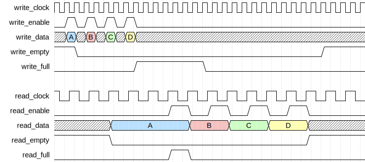
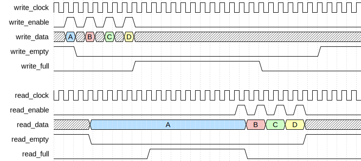
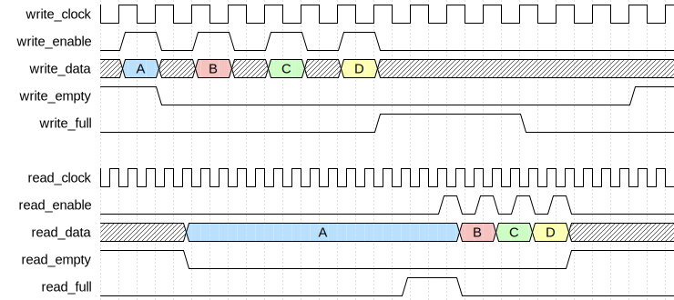
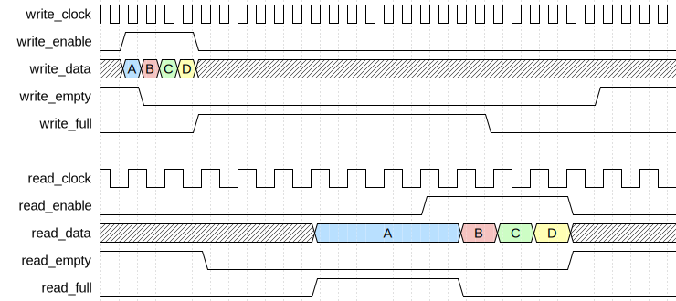
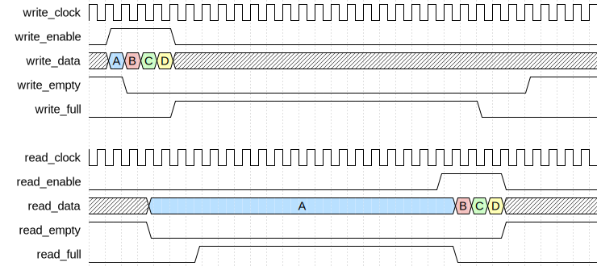

# Asynchronous FIFO Controller

|         |                                                                                  |
| ------- | -------------------------------------------------------------------------------- |
| Module  | Asynchronous FIFO Controller                                                     |
| Project | [OmniCores-BuildingBlocks](https://github.com/Louis-DR/OmniCores-BuildingBlocks) |
| Author  | Louis Duret-Robert - [louisduret@gmail.com](mailto:louisduret@gmail.com)         |
| Website | [louis-dr.github.io](https://louis-dr.github.io)                                 |
| License | MIT License - [mit-license.org](https://mit-license.org)                         |

## Overview

Controller for asynchronous First-In First-Out queue. The controller manages the logic of the access-enable user interface, controls the memory interface, computes the status flags, and ensures correct clock domain crossing. It is designed to be integrated with an asynchronous simple dual-port RAM for data storage.

## Usage

The controller has two clock domains: the write domain on `write_clock` and the the read domain on `read_clock`. The clock can be synchronous or asynchronous, and have any phase shift and frequency ratio.

The clock domains have their own reset - `write_resetn` and `read_resetn` - which can be asserted asynchronously, but must be deasserted synchronously to their respective clocks, or when the clocks are not running. The queue can be used `STAGES+1` clock cycles after both resets are deasserted to allows the propagation accross clock domains. The resets are not propagated to the memory interface and the storage module and its content may or may not be reset.

Both the write (push) and the read (pop) interfaces use an enable signal for flow control, `write_enable` and `read_enable`, and they are synchronous to their respective clocks. The `write_full` and `read_empty` outputs report the filling status of the queue in the corresponding domains.

Fast write slow read:

Same frequency different phase:

Slow write fast read:

When `write_enable` is high at the rising edge of the `write_clock`, the value of `write_data` is written to the storage in the same cycle by asserting `memory_write_enable`, forwarding the data on `memory_write_data`, and setting the correct address on `memory_write_address`. The controller can write another entry to the queue on the next cycle of the `write_clock`, and to read the data that was just written after `STAGES` cycles of the `read_clock`.

The `read_data` always corresponds to the value at the head of the queue when it is not empty in the read clock domain, as `memory_read_enable` is kept high as long as the queue is not empty. The data at the head of the queue can be read continuously without popping. Only when `read_enable` is high at the rising edge of the `read_clock` that the entry is popped from the queue. Then, on the next `read_clock` cycle, the data of the next entry is available for reading.

The controller doesn't implement a safety mechanism against writing when full or reading when empty, so the integration must use the status flags and the enable signals carefully.

The `write_enable` and `read_enable` can be maintained high for multiple cycles to perform back-to-back accesses.

Fast write slow read:

Same frequency different phase:

Slow write fast read:

It is possible to write to and read from the queue at the same time as long as the occupancy of the queue within the two clock domains allows it. Depending on the ratio of the clock frequencies and the number of synchronization stages (`STAGES`), writing and reading continuously can result in oscillations of full and empty states.

Fast write slow read:

Same frequency different phase:

Slow write fast read:

The inputs `write_clock` and `read_clock` of the user interfaces are forwarded on `memory_write_clock` and `memory_read_clock` to drive the simple dual-port RAM.

## Parameters

| Name         | Type    | Allowed Values    | Default       | Description                                         |
| ------------ | ------- | ----------------- | ------------- | --------------------------------------------------- |
| `WIDTH`      | integer | `≥1`              | `8`           | Bit width of the data vector.                       |
| `DEPTH`      | integer | `≥2` power-of-two | `4`           | Number of entries in the queue. Must be power of 2. |
| `STAGES`     | integer | `≥2`              | `2`           | Number of synchronizer stages for CDC.              |
| `DEPTH_LOG2` | integer | `≥1`              | `log₂(DEPTH)` | Log base 2 of depth (automatically calculated).     |

## Ports

| Name                   | Direction | Width        | Clock                | Reset          | Reset value | Description                                                                    |
| ---------------------- | --------- | ------------ | -------------------- | -------------- | ----------- | ------------------------------------------------------------------------------ |
| `write_clock`          | input     | 1            | self                 |                |             | Write clock signal.                                                            |
| `write_resetn`         | input     | 1            | asynchronous         | self           | active-low  | Asynchronous active-low reset for write domain.                                |
| `write_enable`         | input     | 1            | `write_clock`        |                |             | Write enable signal. • `0`: idle. • `1`: write (push) to queue.        |
| `write_data`           | input     | `WIDTH`      | `write_clock`        |                |             | Data to be written to the queue.                                               |
| `write_full`           | output    | 1            | `write_clock`        | `write_resetn` | `0`         | Queue full status in write domain. • `0`: free space. • `1`: full.     |
| `read_clock`           | input     | 1            | self                 |                |             | Read clock signal.                                                             |
| `read_resetn`          | input     | 1            | asynchronous         | self           | active-low  | Asynchronous active-low reset for read domain.                                 |
| `read_enable`          | input     | 1            | `read_clock`         |                |             | Read enable signal. • `0`: idle. • `1`: read (pop) from queue.         |
| `read_data`            | output    | `WIDTH`      | `read_clock`         | `read_resetn`  | `0`         | Data read from the queue head.                                                 |
| `read_empty`           | output    | 1            | `read_clock`         | `read_resetn`  | `1`         | Queue empty status in read domain. • `0`: contains data. • `1`: empty. |
| `memory_write_clock`   | output    | 1            | self                 |                |             | Write clock for asynchronous dual-port memory.                                 |
| `memory_write_enable`  | output    | 1            | `memory_write_clock` | `write_resetn` | `0`         | Memory write enable signal.                                                    |
| `memory_write_address` | output    | `DEPTH_LOG2` | `memory_write_clock` | `write_resetn` | `0`         | Memory write address.                                                          |
| `memory_write_data`    | output    | `WIDTH`      | `memory_write_clock` | `write_resetn` | `0`         | Memory write data.                                                             |
| `memory_read_clock`    | output    | 1            | self                 |                |             | Read clock for asynchronous dual-port memory.                                  |
| `memory_read_enable`   | output    | 1            | `memory_read_clock`  | `read_resetn`  | `0`         | Memory read enable signal.                                                     |
| `memory_read_address`  | output    | `DEPTH_LOG2` | `memory_read_clock`  | `read_resetn`  | `0`         | Memory read address.                                                           |
| `memory_read_data`     | input     | `WIDTH`      | `memory_read_clock`  |                |             | Memory read data.                                                              |

## Operation

The controller maintains independent write and read pointers in their respective clock domains, each composed of an index and a lap bit for unambiguous full and empty detection. The pointers are zero out of reset. They are used for memory addressing.

The write and read pointers are synchronized from their respective clock domain to the other, such that both domains have both pointer values to compute the full/empty flags. As the synchronization takes some cycles, there is a delay for an update of a pointer to propagate to the other domain. The flags are therefore naturally conservative.

Both a standard binary and Gray-coded value is stored for each pointer and updated at the same time when incrementing or decrementing. The standard value is used to address the memory. They Gray-coded value is the one synchronized accross domains and used for full/empty flag computation. Synchronization of the pointers is performed by standard multi-stage synchronizers.

During write operation, when `write_enable` is high, the `memory_write_address` is set to the write pointer stripped of its lap bit, `memory_write_data` forwards the value from `write_data`, and `memory_write_enable` is asserted to signal a write transaction to the memory. At the rising edge of `write_clock`, the write pointer is incremented.

There is no safety mechanism against writing when full. The write pointer will be incremented over the read pointer, overwriting the head data and corrupting the full and empty flags, breaking the queue and requirering a reset.

Whenever the queue is not empty, meaning there is at least one entry in the queue as seen in the read clock domain, the controller continuously reads from the memory by asserting `memory_read_enable`, setting `memory_read_address` to the read pointer stripped of its lap bit, and the `memory_read_data` is forwarded on the `read_data` output. When `read_enable` is high at the rising edge of the `read_clock`, the read pointer is incremented.

There is no safety mechanism against reading when empty. The read pointer will be incremented over the write pointer, reading invalid data and corrupting the full and empty flags, breaking the queue and requirering a reset.

The status flags are calculated based on the read and write pointers with their lap bits and are combinational outputs. The queue is full when the Gray-coded pointers only differ by their two most significant bits in the write clock domain. The queue is empty when the Gray-coded pointers are equal in the read clock domain.

The queue supports power-of-two depth only, as it relies on the automatic wrapping of the pointers when they overflow.

## Paths

| From               | To                     | Type          | Comment                                    |
| ------------------ | ---------------------- | ------------- | ------------------------------------------ |
| `write_data`       | `memory_write_data`    | combinational | Direct pass-through (write domain).        |
| `write_enable`     | `memory_write_enable`  | combinational | Direct pass-through (write domain).        |
| `write_enable`     | `memory_write_address` | combinational | Address from write pointer (write domain). |
| `write_enable`     | `write_full`           | sequential    | Control path through write pointer (CDC).  |
| `read_enable`      | `memory_read_enable`   | combinational | Direct pass-through (read domain).         |
| `read_enable`      | `memory_read_address`  | combinational | Address from read pointer (read domain).   |
| `read_enable`      | `read_empty`           | sequential    | Control path through read pointer (CDC).   |
| `memory_read_data` | `read_data`            | combinational | Direct pass-through (read domain).         |

## Complexity

| Delay           | Gates           | Comment |
| --------------- | --------------- | ------- |
| `O(log₂ DEPTH)` | `O(log₂ DEPTH)` |         |

In this table, the delay refers to the timing critical path, which determines the maximal operating frequency.

The controller requires `2×(log₂DEPTH+1)` flip-flops for the binary pointers, `2×(log₂DEPTH+1)` flip-flops for Gray-coded pointers, plus `2×STAGES×(log₂DEPTH+1)` flip-flops for the CDC synchronizers in each domain.

The critical path includes pointer incrementation, binary-to-Gray conversion, and Gray-code comparison for status flags. The CDC synchronizers add latency but not combinational delay within each domain.

## Verification

The controller does not have a standalone testbench as its functionality is fully exercised and verified through the testbenches of the modules that integrate it.

## Constraints

The module requires proper timing constraints for clock domain crossing:
- Define asynchronous clock groups between `write_clock` and `read_clock`
- Set maximum delay constraints on the Gray-coded pointer paths between domains
- Ensure synchronizer stages are properly constrained to allow metastability resolution

## Deliverables

| Type              | File                                                                                       | Description                                         |
| ----------------- | ------------------------------------------------------------------------------------------ | --------------------------------------------------- |
| Design            | [`asynchronous_fifo_controller.v`](asynchronous_fifo_controller.v)                         | Verilog design.                                     |
| Symbol descriptor | [`asynchronous_fifo_controller.symbol.sss`](asynchronous_fifo_controller.symbol.sss)       | Symbol descriptor for SiliconSuite-SymbolGenerator. |
| Symbol image      | [`asynchronous_fifo_controller.symbol.svg`](asynchronous_fifo_controller.symbol.svg)       | Generated vector image of the symbol.               |
| Symbol shape      | [`asynchronous_fifo_controller.symbol.drawio`](asynchronous_fifo_controller.symbol.drawio) | Generated DrawIO shape of the symbol.               |
| Datasheet         | [`asynchronous_fifo_controller.md`](asynchronous_fifo_controller.md)                       | Markdown documentation datasheet.                   |

## Dependencies

This module depends on the following modules:

| Module                | Path                                                          | Comment                                 |
| --------------------- | ------------------------------------------------------------- | --------------------------------------- |
| `binary_to_gray`      | `omnicores-buildingblocks/sources/encoding/gray`              | For converting pointers to Gray code.   |
| `gray_to_binary`      | `omnicores-buildingblocks/sources/encoding/gray`              | For converting pointers from Gray code. |
| `vector_synchronizer` | `omnicores-buildingblocks/sources/timing/vector_synchronizer` | For CDC-safe pointer synchronization.   |

## Related modules

| Module                                                                                                            | Path                                                                           | Comment                                                           |
| ----------------------------------------------------------------------------------------------------------------- | ------------------------------------------------------------------------------ | ----------------------------------------------------------------- |
| [`asynchronous_fifo`](../../access_enable/asynchronous_fifo/asynchronous_fifo.md)                                 | `omnicores-buildingblocks/sources/data/access_enable/asynchronous_fifo`        | Access-enable wrapper integrating this controller with async RAM. |
| [`fifo_controller`](../fifo/fifo_controller.md)                                                                   | `omnicores-buildingblocks/sources/data/controllers/fifo`                       | Synchronous FIFO controller for single clock domain.              |
| [`asynchronous_advanced_fifo_controller`](../asynchronous_advanced_fifo/asynchronous_advanced_fifo_controller.md) | `omnicores-buildingblocks/sources/data/controllers/asynchronous_advanced_fifo` | Advanced asynchronous FIFO with additional features.              |
