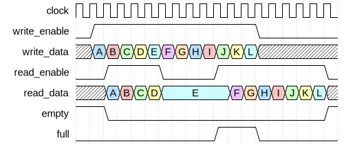

# FIFO Controller

|         |                                                                                  |
| ------- | -------------------------------------------------------------------------------- |
| Module  | FIFO Controller                                                                  |
| Project | [OmniCores-BuildingBlocks](https://github.com/Louis-DR/OmniCores-BuildingBlocks) |
| Author  | Louis Duret-Robert - [louisduret@gmail.com](mailto:louisduret@gmail.com)         |
| Website | [louis-dr.github.io](https://louis-dr.github.io)                                 |
| License | MIT License - [mit-license.org](https://mit-license.org)                         |

## Overview

Controller for synchronous First-In First-Out queue. The controller manages the logic of the access-enable user interface, controls the memory interface, and computes the status flags. It is designed to be integrated with a simple dual-port RAM for data storage.

## Usage

The `resetn` can be asserted asynchronously, but must be deasserted synchronously to `clock`, or when `clock` is not running. The queue can be used one cycle after the reset is deasserted. The reset is not propagated to the memory interface and the storage module and its content may or may not be reset.

Both the write (push) and the read (pop) interfaces use an enable signal for flow control, and they are both synchronous to the `clock`. The `empty` and `full` outputs report the filling status of the queue.

When `write_enable` is high at the rising edge of the `clock`, the value of `write_data` is written to the storage in the same cycle by asserting `memory_write_enable`, forwarding the data on `memory_write_data`, and setting the correct address on `memory_write_address`. On the next cycle, the controller is ready to read the data that was just written if the queue contains only one entry, and/or to write another entry at the tail of the queue.

The `read_data` always corresponds to the value at the head of the queue when it is not empty, as `memory_read_enable` is kept high as long as the queue is not empty. The data at the head of the queue can be read continuously without popping. Only when `read_enable` is high at the rising edge of the `clock` that the entry is popped from the queue. Then, on the next cycle, the data of the next entry is available for reading.

The controller doesn't implement a safety mechanism against writing when full or reading when empty, so the integration must use the status flags and the enable signals carefully.

The `write_enable` and `read_enable` can be maintained high for multiple cycles to perform back-to-back accesses.

When writing and reading at the same time, the head entry is read out while the `write_data` is stored at the tail. Occupancy remains unchanged. This is valid even when the queue is full: the read frees one slot and the write fills it in the same cycle.

The input `clock` of the user interfaces is forwarded on `memory_clock` to drive the simple dual-port RAM.

## Parameters

| Name         | Type    | Allowed Values    | Default       | Description                                     |
| ------------ | ------- | ----------------- | ------------- | ----------------------------------------------- |
| `WIDTH`      | integer | `≥1`              | `8`           | Bit width of the data vector.                   |
| `DEPTH`      | integer | `≥2` power-of-two | `4`           | Number of entries in the queue.                 |
| `DEPTH_LOG2` | integer | `≥1`              | `log₂(DEPTH)` | Log base 2 of depth (automatically calculated). |

## Ports

| Name                   | Direction | Width        | Clock        | Reset    | Reset value | Description                                                                    |
| ---------------------- | --------- | ------------ | ------------ | -------- | ----------- | ------------------------------------------------------------------------------ |
| `clock`                | input     | 1            | self         |          |             | Clock signal.                                                                  |
| `resetn`               | input     | 1            | asynchronous | self     | active-low  | Asynchronous active-low reset.                                                 |
| `full`                 | output    | 1            | `clock`      | `resetn` | `0`         | Queue full status. • `0`: queue has free space. • `1`: queue is full.  |
| `empty`                | output    | 1            | `clock`      | `resetn` | `1`         | Queue empty status. • `0`: queue contains data. • `1`: queue is empty. |
| `write_enable`         | input     | 1            | `clock`      |          |             | Write enable signal. • `0`: idle. • `1`: write (push) to queue.        |
| `write_data`           | input     | `WIDTH`      | `clock`      |          |             | Data to be written to the queue.                                               |
| `read_enable`          | input     | 1            | `clock`      |          |             | Read enable signal. • `0`: idle. • `1`: read (pop) from queue.         |
| `read_data`            | output    | `WIDTH`      | `clock`      | `resetn` | `0`         | Data read from the queue head.                                                 |
| `memory_clock`         | output    | 1            |              |          |             | Clock for synchronous RAM.                                                     |
| `memory_write_enable`  | output    | 1            | `clock`      |          |             | Memory write enable signal.                                                    |
| `memory_write_address` | output    | `DEPTH_LOG2` | `clock`      |          |             | Memory write address.                                                          |
| `memory_write_data`    | output    | `WIDTH`      | `clock`      |          |             | Memory write data.                                                             |
| `memory_read_enable`   | output    | 1            | `clock`      |          |             | Memory read enable signal.                                                     |
| `memory_read_address`  | output    | `DEPTH_LOG2` | `clock`      |          |             | Memory read address.                                                           |
| `memory_read_data`     | input     | `WIDTH`      | `clock`      |          |             | Memory read data.                                                              |

## Operation

The controller maintains independent write and read pointers, each composed of an index and a lap bit for unambiguous full and empty detection. The pointers are zero out of reset. They are used for memory addressing.

During write operation, when `write_enable` is high, the `memory_write_address` is set to the write pointer stripped of its lap bit, `memory_write_data` forwards the value from `write_data`, and `memory_write_enable` is asserted to signal a write transaction to the memory. At the rising edge of `clock`, the write pointer is incremented.

There is no safety mechanism against writing when full. The write pointer will be incremented over the read pointer, overwriting the head data and corrupting the full and empty flags, breaking the queue and requirering a reset.

Whenever the queue is not empty, meaning there is at least one entry in the queue, the controller continuously reads from the memory by asserting `memory_read_enable`, setting `memory_read_address` to the read pointer stripped of its lap bit, and the `memory_read_data` is forwarded on the `read_data` output. When `read_enable` is high at the rising edge of the `clock`, the read pointer is incremented.

There is no safety mechanism against reading when empty. The read pointer will be incremented over the write pointer, reading invalid data and corrupting the full and empty flags, breaking the queue and requirering a reset.

The status flags are calculated based on the read and write pointers with their lap bits and are combinational outputs. The queue is full when the pointers are the same but the lap bits are different. The queue is empty when the pointers are the same and the lap bits are equal.

The queue supports power-of-two depth only, as it relies on the automatic wrapping of the pointers when they overflow.

## Paths

| From               | To                     | Type          | Comment                                      |
| ------------------ | ---------------------- | ------------- | -------------------------------------------- |
| `write_data`       | `memory_write_data`    | combinational | Direct pass-through.                         |
| `write_enable`     | `memory_write_enable`  | combinational | Direct pass-through.                         |
| `write_enable`     | `memory_write_address` | combinational | Address from write pointer.                  |
| `write_enable`     | `full`                 | sequential    | Control path through internal write pointer. |
| `write_enable`     | `empty`                | sequential    | Control path through internal write pointer. |
| `read_enable`      | `memory_read_enable`   | combinational | Direct pass-through.                         |
| `read_enable`      | `memory_read_address`  | combinational | Address from read pointer.                   |
| `read_enable`      | `full`                 | sequential    | Control path through internal read pointer.  |
| `read_enable`      | `empty`                | sequential    | Control path through internal read pointer.  |
| `memory_read_data` | `read_data`            | combinational | Direct pass-through.                         |

## Complexity

| Delay           | Gates           | Comment |
| --------------- | --------------- | ------- |
| `O(log₂ DEPTH)` | `O(log₂ DEPTH)` |         |

In this table, the delay refers to the timing critical path, which determines the maximal operating frequency.

The controller requires `2×(log₂DEPTH+1)` flip-flops for the read and write pointers with lap bits.

Under tight timing constraints, the critical path delay might achieve `O(log₂ log₂ DEPTH)` complexity instead of `O(log₂ DEPTH)`, while sacrificing some area. This depends on how the synthesizer implements and optimizes the pointer incrementation during read and write operation, and the pointer comparison for the full and empty flags.

## Verification

The controller does not have a standalone testbench as its functionality is fully exercised and verified through the testbenches of the modules that integrate it.

## Constraints

There are no specific synthesis or implementation constraints for this block.

## Deliverables

| Type              | File                                                             | Description                                         |
| ----------------- | ---------------------------------------------------------------- | --------------------------------------------------- |
| Design            | [`fifo_controller.v`](fifo_controller.v)                         | Verilog design.                                     |
| Symbol descriptor | [`fifo_controller.symbol.sss`](fifo_controller.symbol.sss)       | Symbol descriptor for SiliconSuite-SymbolGenerator. |
| Symbol image      | [`fifo_controller.symbol.svg`](fifo_controller.symbol.svg)       | Generated vector image of the symbol.               |
| Symbol shape      | [`fifo_controller.symbol.drawio`](fifo_controller.symbol.drawio) | Generated DrawIO shape of the symbol.               |
| Datasheet         | [`fifo_controller.md`](fifo_controller.md)                       | Markdown documentation datasheet.                   |

## Dependencies

This module has no external module dependencies.

## Related modules

| Module                                                                                 | Path                                                                  | Comment                                                        |
| -------------------------------------------------------------------------------------- | --------------------------------------------------------------------- | -------------------------------------------------------------- |
| [`fifo`](../../access_enable/fifo/fifo.md)                                             | `omnicores-buildingblocks/sources/data/access_enable/fifo`            | Access-enable wrapper integrating this controller with RAM.    |
| [`advanced_fifo_controller`](../advanced_fifo/advanced_fifo_controller.md)             | `omnicores-buildingblocks/sources/data/controllers/advanced_fifo`     | Controller with additional features and protection mechanisms. |
| [`lifo_controller`](../lifo/lifo_controller.md)                                        | `omnicores-buildingblocks/sources/data/controllers/lifo`              | Last-In First-Out controller with similar architecture.        |
| [`asynchronous_fifo_controller`](../asynchronous_fifo/asynchronous_fifo_controller.md) | `omnicores-buildingblocks/sources/data/controllers/asynchronous_fifo` | Asynchronous FIFO controller for clock domain crossing.        |
