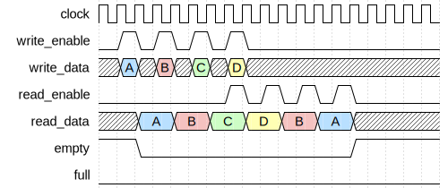

# LIFO Controller

|         |                                                                                  |
| ------- | -------------------------------------------------------------------------------- |
| Module  | LIFO Controller                                                                  |
| Project | [OmniCores-BuildingBlocks](https://github.com/Louis-DR/OmniCores-BuildingBlocks) |
| Author  | Louis Duret-Robert - [louisduret@gmail.com](mailto:louisduret@gmail.com)         |
| Website | [louis-dr.github.io](https://louis-dr.github.io)                                 |
| License | MIT License - [mit-license.org](https://mit-license.org)                         |

## Overview

Controller for synchronous Last-In First-Out stack. The controller manages the logic of the access-enable user interface, controls the memory interface, and computes the status flags. It is designed to be integrated with a simple dual-port RAM for data storage.

## Usage

The `resetn` can be asserted asynchronously, but must be deasserted synchronously to `clock`, or when `clock` is not running. The stack can be used one cycle after the reset is deasserted.

Both the write (push) and the read (pop) interfaces use an enable signal for flow control, and they are both synchronous to the `clock`. The `empty` and `full` outputs give information about the filling status of the stack.

When `write_enable` is high at the rising edge of the `clock`, the value of `write_data` is written to the storage in the same cycle by asserting `memory_write_enable`, forwarding the data on `memory_write_data`, and setting the correct address on `memory_write_address`. On the next cycle, the controller is ready to read the data that was just written, or write another entry on the stack.

The `read_data` always corresponds to the value at the top of the stack when it is not empty, as `memory_read_enable` is kept high as long as the stack is not empty. The data at the top of the stack can be read continuously. Only when `read_enable` is high at the rising edge of the `clock` that the entry is popped from the stack. Then, on the next cycle, the data of the next entry is available for reading or another entry can be written at the top of the stack.

The controller doesn't implement a safety mechanism against writing when full or reading when empty, so the integration must use the status flags and the enable signals carefully.

The `write_enable` and `read_enable` can be maintained high for mutliple cycles to perform back-to-back accesses.

When writing and reading at the same time, the data at the top of the stack is replaced. The data read corresponds to the old value, and the write data replaces it at the rising edge of the clock. Therefore, it is possible to write and read at the same time when the stack is full.

The input `clock` of the user interfaces is forwarded on `memory_clock` to drive the simple dual-port RAM.

## Parameters

| Name         | Type    | Allowed Values | Default       | Description                                     |
| ------------ | ------- | -------------- | ------------- | ----------------------------------------------- |
| `WIDTH`      | integer | `≥1`           | `8`           | Bit width of the data vector.                   |
| `DEPTH`      | integer | `≥2`           | `4`           | Number of entries in the stack.                 |
| `DEPTH_LOG2` | integer | `≥1`           | `log₂(DEPTH)` | Log base 2 of depth (automatically calculated). |

## Ports

| Name                  | Direction | Width        | Clock        | Reset    | Reset value | Description                                                                |
| --------------------- | --------- | ------------ | ------------ | -------- | ----------- | -------------------------------------------------------------------------- |
| `clock`               | input     | 1            | self         |          |             | Clock signal.                                                              |
| `resetn`              | input     | 1            | asynchronous | self     | active-low  | Asynchronous active-low reset.                                             |
| `full`                | output    | 1            | `clock`      | `resetn` | `0`         | Stack full status. `0`: stack has free space. `1`: stack is full.  |
| `empty`               | output    | 1            | `clock`      | `resetn` | `1`         | Stack empty status. `0`: stack contains data. `1`: stack is empty. |
| `write_enable`        | input     | 1            | `clock`      |          |             | Write enable signal. `0`: idle. `1`: write (push) to stack.        |
| `write_data`          | input     | `WIDTH`      | `clock`      |          |             | Data to be written to the stack.                                           |
| `read_enable`         | input     | 1            | `clock`      |          |             | Read enable signal. `0`: idle. `1`: read (pop) from stack.         |
| `read_data`            | output    | `WIDTH`      | `clock`      | `resetn` | `0`         | Data read from the stack top.                                              |
| `memory_clock`         | output    | 1            |              |          |             | Clock for synchronous RAM.                                                 |
| `memory_write_enable`  | output    | 1            | `clock`      |          |             | Memory write enable signal.                                                |
| `memory_write_address` | output    | `DEPTH_LOG2` | `clock`      |          |             | Memory write address.                                                      |
| `memory_write_data`    | output    | `WIDTH`      | `clock`      |          |             | Memory write data.                                                         |
| `memory_read_enable`   | output    | 1            | `clock`      |          |             | Memory read enable signal.                                                 |
| `memory_read_address`  | output    | `DEPTH_LOG2` | `clock`      |          |             | Memory read address.                                                       |
| `memory_read_data`     | input     | `WIDTH`      | `clock`      |          |             | Memory read data.                                                          |

## Operation

The controller maintains a single stack pointer that tracks the current top of the stack. The stack pointer is zero out of reset. It is used to address the memory.

During write operation, when `write_enable` is high and `read_enable` is low, the `memory_write_address` is set to the stack pointer, `memory_write_data` forwards the value from `write_data`, and `memory_write_enable` is asserted to signal a write transaction to the memory. At the rising edge of `clock`, the stack pointer is incremented.

There is no safety mechanism against writing when full. The stack pointer will be incremented beyond the valid range, potentially overwriting data and corrupting the full and empty flags, breaking the stack and requirering a reset.

Whenever the stack is not empty, meaning there is at least one entry in the stack, the controller continuously reads from the memory by asserting `memory_read_enable`, setting `memory_read_address` to the stack pointer minus one (to point to the last valid data), and the `memory_read_data` is forwarded on the `read_data` output. When `read_enable` is high at the rising edge of the `clock`, the stack pointer is decremented.

There is no safety mechanism against reading when empty. The stack pointer will be decremented below zero, causing undefined behavior and corrupting the full and empty flags, breaking the stack and requirering a reset.

When both `write_enable` and `read_enable` are high, meaning both writing and reading from the stack, the last data on the stack is still forwarded to `read_data`, but the `write_data` is written at the address of the stack pointer minus one on `memory_write_address` to replace the previous top entry.

The status flags are calculated based on the stack pointer value and are combinational outputs. The stack is full when the pointer equals the maximum depth. The stack is empty when the pointer equals zero.

The stack supports non-power-of-two even or odd depth, and the width of the stack pointer will correspond to the upper power-of-two range.

## Paths

| From               | To                    | Type          | Comment                                      |
| ------------------ | --------------------- | ------------- | -------------------------------------------- |
| `write_data`       | `memory_write_data`   | combinational | Direct pass-through.                         |
| `write_enable`     | `memory_enable`       | combinational | Direct pass-through (combined with read).    |
| `write_enable`     | `memory_write_enable` | combinational | Direct pass-through.                         |
| `write_enable`     | `memory_address`      | combinational | Address from stack pointer logic.            |
| `write_enable`     | `full`                | sequential    | Control path through internal stack pointer. |
| `write_enable`     | `empty`               | sequential    | Control path through internal stack pointer. |
| `read_enable`      | `memory_enable`       | combinational | Direct pass-through (combined with write).   |
| `read_enable`      | `memory_address`      | combinational | Address from stack pointer logic.            |
| `read_enable`      | `full`                | sequential    | Control path through internal stack pointer. |
| `read_enable`      | `empty`               | sequential    | Control path through internal stack pointer. |
| `memory_read_data` | `read_data`           | combinational | Direct pass-through.                         |

## Complexity

| Delay           | Gates           | Comment |
| --------------- | --------------- | ------- |
| `O(log₂ DEPTH)` | `O(log₂ DEPTH)` |         |

In this table, the delay refers to the timing critical path, which determines the maximal operating frequency.

The controller requires `log₂DEPTH+1` flip-flops for the stack pointer.

Under tight timing constraints, the critical path delay might achieve `O(log₂ log₂ DEPTH)` complexity instead of `O(log₂ DEPTH)`, while sacrificing some area. This depends on how the synthesizer implements and optimizes the pointer incrementation and decrementation during write and read operations, and the pointer comparison for the full and empty flags.

## Verification

The controller does not have a standalone testbench as its functionality is fully exercised and verified through the testbenches of the modules that integrate it.

## Constraints

There are no specific synthesis or implementation constraints for this block.

## Deliverables

| Type              | File                                                             | Description                                         |
| ----------------- | ---------------------------------------------------------------- | --------------------------------------------------- |
| Design            | [`lifo_controller.v`](lifo_controller.v)                         | Verilog design.                                     |
| Symbol descriptor | [`lifo_controller.symbol.sss`](lifo_controller.symbol.sss)       | Symbol descriptor for SiliconSuite-SymbolGenerator. |
| Symbol image      | [`lifo_controller.symbol.svg`](lifo_controller.symbol.svg)       | Generated vector image of the symbol.               |
| Symbol shape      | [`lifo_controller.symbol.drawio`](lifo_controller.symbol.drawio) | Generated DrawIO shape of the symbol.               |
| Datasheet         | [`lifo_controller.md`](lifo_controller.md)                       | Markdown documentation datasheet.                   |

## Dependencies

This module has no external module dependencies.

## Related modules

| Module                                                                                 | Path                                                                  | Comment                                                        |
| -------------------------------------------------------------------------------------- | --------------------------------------------------------------------- | -------------------------------------------------------------- |
| [`lifo`](../../access_enable/lifo/lifo.md)                                             | `omnicores-buildingblocks/sources/data/access_enable/lifo`            | Access-enable wrapper integrating this controller with RAM.    |
| [`fifo_controller`](../fifo/fifo_controller.md)                                        | `omnicores-buildingblocks/sources/data/controllers/fifo`              | First-In First-Out controller with similar architecture.       |
| [`advanced_fifo_controller`](../advanced_fifo/advanced_fifo_controller.md)             | `omnicores-buildingblocks/sources/data/controllers/advanced_fifo`     | Controller with additional features and protection mechanisms. |
| [`asynchronous_fifo_controller`](../asynchronous_fifo/asynchronous_fifo_controller.md) | `omnicores-buildingblocks/sources/data/controllers/asynchronous_fifo` | Asynchronous FIFO controller for clock domain crossing.        |
