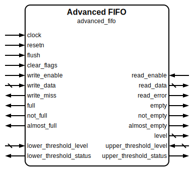

# Advanced FIFO

|         |                                                                                  |
| ------- | -------------------------------------------------------------------------------- |
| Module  | Advanced FIFO                                                                    |
| Project | [OmniCores-BuildingBlocks](https://github.com/Louis-DR/OmniCores-BuildingBlocks) |
| Author  | Louis Duret-Robert - [louisduret@gmail.com](mailto:louisduret@gmail.com)         |
| Website | [louis-dr.github.io](https://louis-dr.github.io)                                 |
| License | MIT License - [mit-license.org](https://mit-license.org)                         |

## Overview

Advanced synchronous First-In First-Out queue with enhanced features including protection mechanisms, error reporting, extended status flags, level monitoring, and dynamic thresholds.

The read data output continuously shows the value at the head of the queue when not empty, allowing instant data access without necessarily consuming the entry. The internal memory array is not reset, so it will contain invalid data in silicium and Xs that could propagate in simulation if the integration doesn't handle control flow correctly.

## Parameters

| Name         | Type    | Allowed Values | Default       | Description                                                 |
| ------------ | ------- | -------------- | ------------- | ----------------------------------------------------------- |
| `WIDTH`      | integer | `≥1`           | `8`           | Bit width of the data vector.                               |
| `DEPTH`      | integer | `≥2`           | `4`           | Number of entries in the queue. Non-power-of-two supported. |
| `DEPTH_LOG2` | integer | `≥1`           | `log₂(DEPTH)` | Log base 2 of depth (automatically calculated).             |

## Ports

| Name                     | Direction | Width          | Clock        | Reset    | Reset value | Description                                                                           |
| ------------------------ | --------- | -------------- | ------------ | -------- | ----------- | ------------------------------------------------------------------------------------- |
| `clock`                  | input     | 1              | self         |          |             | Clock signal.                                                                         |
| `resetn`                 | input     | 1              | asynchronous | self     | active-low  | Asynchronous active-low reset.                                                        |
| `flush`                  | input     | 1              | `clock`      |          |             | Flush control. `0`: idle. `1`: empty FIFO by advancing read to write pointer. |
| `clear_flags`            | input     | 1              | `clock`      |          |             | Clear error flags. `0`: idle. `1`: clear `write_miss` and `read_error`.       |
| `write_enable`           | input     | 1              | `clock`      |          |             | Write enable signal. `0`: idle. `1`: write (push) to queue.                   |
| `write_data`             | input     | `WIDTH`        | `clock`      |          |             | Data to be written to the queue.                                                      |
| `write_miss`             | output    | 1              | `clock`      | `resetn` | `0`         | Write protection flag. `0`: no error. `1`: write attempted when full.         |
| `read_enable`            | input     | 1              | `clock`      |          |             | Read enable signal. `0`: idle. `1`: read (pop) from queue.                    |
| `read_data`              | output    | `WIDTH`        | `clock`      | `resetn` | `0`         | Data read from the queue head.                                                        |
| `read_error`             | output    | 1              | `clock`      | `resetn` | `0`         | Read protection flag. `0`: no error. `1`: read attempted when empty.          |
| `empty`                  | output    | 1              | `clock`      | `resetn` | `1`         | Queue empty status. `0`: queue contains data. `1`: queue is empty.            |
| `not_empty`              | output    | 1              | `clock`      | `resetn` | `0`         | Inverted empty status. `0`: queue is empty. `1`: queue contains data.         |
| `almost_empty`           | output    | 1              | `clock`      | `resetn` | `0`         | Near empty status. `0`: more than one entry. `1`: exactly one entry.          |
| `full`                   | output    | 1              | `clock`      | `resetn` | `0`         | Queue full status. `0`: queue has free space. `1`: queue is full.             |
| `not_full`               | output    | 1              | `clock`      | `resetn` | `1`         | Inverted full status. `0`: queue is full. `1`: queue has free space.          |
| `almost_full`            | output    | 1              | `clock`      | `resetn` | `0`         | Near full status. `0`: more than one free slot. `1`: exactly one free slot.   |
| `level`                  | output    | `DEPTH_LOG2+1` | `clock`      | `resetn` | `0`         | Current number of entries in the queue.                                               |
| `lower_threshold_level`  | input     | `DEPTH_LOG2+1` | `clock`      |          |             | Lower threshold level for comparison.                                                 |
| `lower_threshold_status` | output    | 1              | `clock`      | `resetn` | `1`         | Lower threshold status. `0`: level > threshold. `1`: level ≤ threshold.       |
| `upper_threshold_level`  | input     | `DEPTH_LOG2+1` | `clock`      |          |             | Upper threshold level for comparison.                                                 |
| `upper_threshold_status` | output    | 1              | `clock`      | `resetn` | `0`         | Upper threshold status. `0`: level < threshold. `1`: level ≥ threshold.       |

## Operation

The FIFO maintains an internal memory array indexed by separate read and write pointers, each with an additional lap bit for correct level calculation, implemented with `advanced_wrapping_counter`.

For **write operation**, when `write_enable` is asserted, `write_data` is stored at the location pointed to by the write pointer, and the write pointer is incremented. Writing when full is ignored and the data is lost.

The write safety mechanism prevents writing when full. The write will be ignored, the pointers will not be updated, and the data will be lost. The `write_miss` flag will also be set. The FIFO can continue operating normally.

For **read operation**, the `read_data` output continuously provides the data at the read pointer location. When `read_enable` is asserted, only the read pointer is incremented to advance to the next entry.

The read safety mechanism prevents reading when empty. The `read_data` will be invalid and the pointers will not be updated. The `read_error` flag will also be set. The FIFO can continue operating normally.

If the queue is empty, data written can be read in the next cycle. When the queue is not empty nor full, it can be written to and read from at the same time with back-to-back transactions at full throughput.

The level, status, and threshold outputs are calculated based on the read and write pointers.

The `write_miss` and `read_error` flags are cleared when the `clear_flags` input is asserted.

Asserting the `flush` input empties the whole FIFO at the next rising edge of the clock by advancing the read pointer to the write pointer. During a flush cycle, read and write pointer increments are gated so no entry is consumed or written concurrently.

## Paths

| From                    | To                                                                                                                                   | Type          | Comment                                  |
| ----------------------- | ------------------------------------------------------------------------------------------------------------------------------------ | ------------- | ---------------------------------------- |
| `write_data`            | `read_data`                                                                                                                          | sequential    | Data path through internal memory array. |
| `write_enable`          | `read_data`                                                                                                                          | sequential    | Data path through internal memory array. |
| `write_enable`          | `write_miss`                                                                                                                         | sequential    | Control path for protection mechanism.   |
| `write_enable`          | `level`, `empty`, `not_empty`, `almost_empty`, `full`, `not_full`, `almost_full`, `lower_threshold_status`, `upper_threshold_status` | sequential    | Control path through internal pointers.  |
| `read_enable`           | `read_error`                                                                                                                         | sequential    | Control path for protection mechanism.   |
| `read_enable`           | `level`, `empty`, `not_empty`, `almost_empty`, `full`, `not_full`, `almost_full`, `lower_threshold_status`, `upper_threshold_status` | sequential    | Control path through internal pointers.  |
| `flush`                 | `level`, `empty`, `not_empty`, `almost_empty`, `full`, `not_full`, `almost_full`, `lower_threshold_status`, `upper_threshold_status` | sequential    | Control path through internal pointers.  |
| `lower_threshold_level` | `lower_threshold_status`                                                                                                             | combinational | Direct comparison with current level.    |
| `upper_threshold_level` | `upper_threshold_status`                                                                                                             | combinational | Direct comparison with current level.    |
| `clear_flags`           | `write_miss`, `read_error`                                                                                                           | sequential    | Control path for flags.                  |

## Complexity

| Delay           | Gates            | Comment |
| --------------- | ---------------- | ------- |
| `O(log₂ DEPTH)` | `O(WIDTH×DEPTH)` |         |

The module requires `WIDTH×DEPTH` flip-flops for the memory array, `2×(log₂DEPTH+1)` flip-flops for pointers, and additional flip-flops for error flags and protection logic.

## Verification

The advanced FIFO is verified using a SystemVerilog testbench with comprehensive check sequences that validate all enhanced features.

The following table lists the checks performed by the testbench.

| Number | Check                  | Description                                                                                             |
| ------ | ---------------------- | ------------------------------------------------------------------------------------------------------- |
| 1      | Writing to full        | Fills the FIFO completely and verifies the flags.                                                       |
| 2      | Write miss             | Write when full and check the write protection mechanism.                                               |
| 3      | Reading to empty       | Empties the FIFO completely and verifies data integrity and the flags.                                  |
| 4      | Read error             | Read when empty and check the read protection mechanism.                                                |
| 5      | Flushing               | Verifies flush functionality.                                                                           |
| 6      | Back-to-back transfers | Performs simultaneous read and write operations to verify full throughput capability without data loss. |
| 7      | Random stimulus        | Performs random write and read operations and verifies data integrity against a reference queue model.  |

The following table lists the parameter values verified by the testbench.

| `WIDTH` | `DEPTH` |           |
| ------- | ------- | --------- |
| 8       | 4       | (default) |

## Constraints

There are no specific synthesis or implementation constraints for this block.

## Deliverables

| Type              | File                                                           | Description                                         |
| ----------------- | -------------------------------------------------------------- | --------------------------------------------------- |
| Design            | [`advanced_fifo.v`](advanced_fifo.v)                           | Verilog design.                                     |
| Testbench         | [`advanced_fifo.testbench.sv`](advanced_fifo.testbench.sv)     | SystemVerilog verification testbench.               |
| Waveform script   | [`advanced_fifo.testbench.gtkw`](advanced_fifo.testbench.gtkw) | Script to load the waveforms in GTKWave.            |
| Symbol descriptor | [`advanced_fifo.symbol.sss`](advanced_fifo.symbol.sss)         | Symbol descriptor for SiliconSuite-SymbolGenerator. |
| Symbol image      | [`advanced_fifo.symbol.svg`](advanced_fifo.symbol.svg)         | Generated vector image of the symbol.               |
| Symbol shape      | [`advanced_fifo.symbol.drawio`](advanced_fifo.symbol.drawio)   | Generated DrawIO shape of the symbol.               |
| Datasheet         | [`advanced_fifo.md`](advanced_fifo.md)                         | Markdown documentation datasheet.                   |

## Dependencies

- Module: `advanced_wrapping_counter` — `sources/counter/advanced_wrapping_counter/advanced_wrapping_counter.v`
- Include: `clog2.vh`

## Related modules

| Module                                                                                      | Path                                                                                 | Comment                                                         |
| ------------------------------------------------------------------------------------------- | ------------------------------------------------------------------------------------ | --------------------------------------------------------------- |
| [`valid_ready_advanced_fifo`](../../valid_ready/advanced_fifo/valid_ready_advanced_fifo.md) | `omnicores-buildingblocks/sources/data/valid_ready/advanced_fifo`                    | Variant of this module with valid-ready handshake flow control. |
| [`fifo`](../fifo/fifo.md)                                                                   | `omnicores-buildingblocks/sources/data/read_write_enable/fifo`                       | Basic FIFO without advanced features or protection.             |
| [`asynchronous_fifo`](../asynchronous_fifo/asynchronous_fifo.md)                            | `omnicores-buildingblocks/sources/data/read_write_enable/asynchronous_fifo`          | Basic asynchronous FIFO for clock domain crossing.              |
| [`asynchronous_advanced_fifo`](../asynchronous_advanced_fifo/asynchronous_advanced_fifo.md) | `omnicores-buildingblocks/sources/data/read_write_enable/asynchronous_advanced_fifo` | Advanced asynchronous FIFO for crossing clock domains.          |
