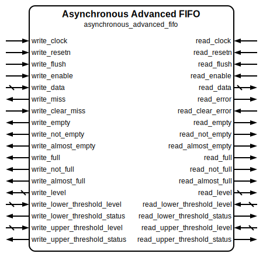

# Asynchronous Advanced FIFO

|         |                                                                                  |
| ------- | -------------------------------------------------------------------------------- |
| Module  | Asynchronous Advanced FIFO                                                       |
| Project | [OmniCores-BuildingBlocks](https://github.com/Louis-DR/OmniCores-BuildingBlocks) |
| Author  | Louis Duret-Robert - [louisduret@gmail.com](mailto:louisduret@gmail.com)         |
| Website | [louis-dr.github.io](https://louis-dr.github.io)                                 |
| License | MIT License - [mit-license.org](https://mit-license.org)                         |

## Overview

Advanced asynchronous First-In First-Out queue that combines clock domain crossing capabilities with comprehensive monitoring and protection features. The FIFO operates with separate write and read clock domains while providing enhanced status information, error reporting, level monitoring, and dynamic thresholds in both domains.

The read data output continuously shows the value at the head of the queue when not empty, allowing instant data access without necessarily consuming the entry. The internal memory array is not reset, so it will contain invalid data in silicium and Xs that could propagate in simulation if the integration doesn't handle control flow correctly.

## Parameters

| Name           | Type    | Allowed Values | Default       | Description                                     |
| -------------- | ------- | -------------- | ------------- | ----------------------------------------------- |
| `WIDTH`        | integer | `≥1`           | `8`           | Bit width of the data vector.                   |
| `DEPTH`        | integer | `≥2`           | `4`           | Number of entries in the queue.                 |
| `DEPTH_LOG2`   | integer | `≥1`           | `log₂(DEPTH)` | Log base 2 of depth (automatically calculated). |
| `STAGES_WRITE` | integer | `≥1`           | `2`           | Number of synchronizer stages for write domain. |
| `STAGES_READ`  | integer | `≥1`           | `2`           | Number of synchronizer stages for read domain.  |

## Ports

| Name                           | Direction | Width          | Clock         | Reset          | Reset value | Description                                                                                 |
| ------------------------------ | --------- | -------------- | ------------- | -------------- | ----------- | ------------------------------------------------------------------------------------------- |
| `write_clock`                  | input     | 1              | self          |                |             | Write domain clock signal.                                                                  |
| `write_resetn`                 | input     | 1              | asynchronous  | self           | active-low  | Write domain asynchronous active-low reset.                                                 |
| `write_flush`                  | input     | 1              | `write_clock` |                |             | Write domain flush control. `0`: normal operation. `1`: sync write pointer to read. |
| `write_enable`                 | input     | 1              | `write_clock` |                |             | Write enable signal. `0`: idle. `1`: write (push) to queue.                         |
| `write_data`                   | input     | `WIDTH`        | `write_clock` |                |             | Data to be written to the queue.                                                            |
| `write_miss`                   | output    | 1              | `write_clock` | `write_resetn` | `0`         | Write protection flag. `0`: no error. `1`: write attempted when full.               |
| `write_clear_miss`             | input     | 1              | `write_clock` |                |             | Clear write miss flag. `0`: normal operation. `1`: clear `write_miss`.              |
| `write_empty`                  | output    | 1              | `write_clock` | `write_resetn` | `1`         | Write domain empty status. `0`: queue contains data. `1`: queue is empty.           |
| `write_not_empty`              | output    | 1              | `write_clock` | `write_resetn` | `0`         | Write domain inverted empty status.                                                         |
| `write_almost_empty`           | output    | 1              | `write_clock` | `write_resetn` | `0`         | Write domain near empty status. `1`: exactly 1 entry.                                   |
| `write_full`                   | output    | 1              | `write_clock` | `write_resetn` | `0`         | Write domain full status. `0`: queue has free space. `1`: queue is full.            |
| `write_not_full`               | output    | 1              | `write_clock` | `write_resetn` | `1`         | Write domain inverted full status. `0`: queue is full. `1`: queue has free space.   |
| `write_almost_full`            | output    | 1              | `write_clock` | `write_resetn` | `0`         | Write domain near full status. `1`: exactly DEPTH-1 entries.                            |
| `write_level`                  | output    | `DEPTH_LOG2+1` | `write_clock` | `write_resetn` | `0`         | Write domain current number of entries in the queue.                                        |
| `write_lower_threshold_level`  | input     | `DEPTH_LOG2+1` | `write_clock` |                |             | Write domain lower threshold level for comparison.                                          |
| `write_lower_threshold_status` | output    | 1              | `write_clock` | `write_resetn` | `1`         | Write domain lower threshold status. `1`: level ≤ threshold.                            |
| `write_upper_threshold_level`  | input     | `DEPTH_LOG2+1` | `write_clock` |                |             | Write domain upper threshold level for comparison.                                          |
| `write_upper_threshold_status` | output    | 1              | `write_clock` | `write_resetn` | `0`         | Write domain upper threshold status. `1`: level ≥ threshold.                            |
| `read_clock`                   | input     | 1              | self          |                |             | Read domain clock signal.                                                                   |
| `read_resetn`                  | input     | 1              | asynchronous  | self           | active-low  | Read domain asynchronous active-low reset.                                                  |
| `read_flush`                   | input     | 1              | `read_clock`  |                |             | Read domain flush control. `0`: normal operation. `1`: sync read pointer to write.  |
| `read_enable`                  | input     | 1              | `read_clock`  |                |             | Read enable signal. `0`: idle. `1`: read (pop) from queue.                          |
| `read_data`                    | output    | `WIDTH`        | `read_clock`  | `read_resetn`  | `0`         | Data read from the queue head.                                                              |
| `read_error`                   | output    | 1              | `read_clock`  | `read_resetn`  | `0`         | Read protection flag. `0`: no error. `1`: read attempted when empty.                |
| `read_clear_error`             | input     | 1              | `read_clock`  |                |             | Clear read error flag. `0`: normal operation. `1`: clear `read_error`.              |
| `read_empty`                   | output    | 1              | `read_clock`  | `read_resetn`  | `1`         | Read domain empty status. `0`: queue contains data. `1`: queue is empty.            |
| `read_not_empty`               | output    | 1              | `read_clock`  | `read_resetn`  | `0`         | Read domain inverted empty status.                                                          |
| `read_almost_empty`            | output    | 1              | `read_clock`  | `read_resetn`  | `0`         | Read domain near empty status. `1`: exactly 1 entry.                                    |
| `read_full`                    | output    | 1              | `read_clock`  | `read_resetn`  | `0`         | Read domain full status. `0`: queue has free space. `1`: queue is full.             |
| `read_not_full`                | output    | 1              | `read_clock`  | `read_resetn`  | `1`         | Read domain inverted full status. `0`: queue is full. `1`: queue has free space.    |
| `read_almost_full`             | output    | 1              | `read_clock`  | `read_resetn`  | `0`         | Read domain near full status. `1`: exactly DEPTH-1 entries.                             |
| `read_level`                   | output    | `DEPTH_LOG2+1` | `read_clock`  | `read_resetn`  | `0`         | Read domain current number of entries in the queue.                                         |
| `read_lower_threshold_level`   | input     | `DEPTH_LOG2+1` | `read_clock`  |                |             | Read domain lower threshold level for comparison.                                           |
| `read_lower_threshold_status`  | output    | 1              | `read_clock`  | `read_resetn`  | `1`         | Read domain lower threshold status. `1`: level ≤ threshold.                             |
| `read_upper_threshold_level`   | input     | `DEPTH_LOG2+1` | `read_clock`  |                |             | Read domain upper threshold level for comparison.                                           |
| `read_upper_threshold_status`  | output    | 1              | `read_clock`  | `read_resetn`  | `0`         | Read domain upper threshold status. `1`: level ≥ threshold.                             |

## Operation

The asynchronous advanced FIFO maintains an internal memory array indexed by separate read and write pointers each operating in their respective clock domain. The pointer each have an additional wrap bit for correct correct level calculation. Data integrity and stability is ensured through careful synchronization using Grey-coding of the pointers.

The **write clock domain** contains a write pointer that indexes the shared memory array. When `write_enable` is asserted, `write_data` is stored at the write pointer location, and both the binary and Gray-coded write pointers are incremented. The Gray-coded write pointer is synchronized to the read domain for level calculations.

The write safety mechanism prevents writing when full. The write will be ignored, the pointers will not be updated, and the data will be lost. The `write_miss` flag will also be set. The FIFO can continue operating normally.

The **read clock domain** contains a read pointer that indexes the shared memory array. The `read_data` output continuously provides data from the read pointer location. When `read_enable` is asserted, both the binary and Gray-coded read pointers are incremented. The Gray-coded read pointer is synchronized to the write domain for level calculations.

The read safety mechanism prevents reading when empty. The `read_data` will be invalid and the pointers will not be updated. The `read_error` flag will also be set. The FIFO can continue operating normally.

**Clock domain crossing** is handled by synchronizing Gray-coded pointers between domains using multi-stage synchronizers. Gray coding ensures that only one bit changes at a time, preventing metastability issues during clock domain crossing.

The level, status, and threshold outputs are calculated based on the Grey-coded read and write pointers, with both domains having their own view of the FIFO based on their synchronized pointers.

The `write_miss` and `read_error` flags are cleared when the respective `write_clear_miss` and `read_clear_error` inputs are asserted.

The FIFO can be flushed from either domain by asserting the `write_flush` or `read_flush` inputs. Flushing from the write domain will move back the write pointer to the synchronized read pointer in the write domain, and flushing from the read domain will advance the read pointer to the synchronized write pointer in the read domain. If a read or write operation is performed too close to a flush operation, it might not see the synchronized state of the FIFO which could result in the FIFO reaching an unexpected broken state.

## Paths

| From                          | To                                                                                                                                                                                         | Type           | Comment                                                              |
| ----------------------------- | ------------------------------------------------------------------------------------------------------------------------------------------------------------------------------------------ | -------------- | -------------------------------------------------------------------- |
| `write_data`                  | `read_data`                                                                                                                                                                                | sequential     | Data path through shared memory array.                               |
| `write_enable`                | `read_data`                                                                                                                                                                                | sequential     | Data path through shared memory array.                               |
| `write_enable`                | `write_empty`, `write_not_empty`, `write_almost_empty`, `write_full`, `write_not_full`, `write_almost_full`, `write_level`, `write_lower_threshold_status`, `write_upper_threshold_status` | sequential     | Control path through write domain write pointer.                     |
| `write_flush`                 | `write_empty`, `write_not_empty`, `write_almost_empty`, `write_full`, `write_not_full`, `write_almost_full`, `write_level`, `write_lower_threshold_status`, `write_upper_threshold_status` | sequential     | Control path through write domain write pointer.                     |
| `write_enable`                | `read_empty`, `read_not_empty`, `read_almost_empty`, `read_full`, `read_not_full`, `read_almost_full`, `read_level`, `read_lower_threshold_status`, `read_upper_threshold_status`          | sequential CDC | Control path through read domain write pointer with synchronization. |
| `write_flush`                 | `read_empty`, `read_not_empty`, `read_almost_empty`, `read_full`, `read_not_full`, `read_almost_full`, `read_level`, `read_lower_threshold_status`, `read_upper_threshold_status`          | sequential CDC | Control path through read domain write pointer with synchronization. |
| `write_enable`                | `write_miss`                                                                                                                                                                               | sequential     | Control path for write protection mechanism.                         |
| `write_clear_miss`            | `write_miss`                                                                                                                                                                               | sequential     | Control path for write protection flag.                              |
| `read_enable`                 | `read_empty`, `read_not_empty`, `read_almost_empty`, `read_full`, `read_not_full`, `read_almost_full`, `read_level`, `read_lower_threshold_status`, `read_upper_threshold_status`          | sequential     | Control path through read domain read pointer.                       |
| `read_flush`                  | `read_empty`, `read_not_empty`, `read_almost_empty`, `read_full`, `read_not_full`, `read_almost_full`, `read_level`, `read_lower_threshold_status`, `read_upper_threshold_status`          | sequential     | Control path through read domain read pointer.                       |
| `read_enable`                 | `write_empty`, `write_not_empty`, `write_almost_empty`, `write_full`, `write_not_full`, `write_almost_full`, `write_level`, `write_lower_threshold_status`, `write_upper_threshold_status` | sequential CDC | Control path through write domain read pointer with synchronization. |
| `read_flush`                  | `write_empty`, `write_not_empty`, `write_almost_empty`, `write_full`, `write_not_full`, `write_almost_full`, `write_level`, `write_lower_threshold_status`, `write_upper_threshold_status` | sequential CDC | Control path through write domain read pointer with synchronization. |
| `read_enable`                 | `read_error`                                                                                                                                                                               | sequential     | Control path for read protection mechanism.                          |
| `read_clear_error`            | `read_error`                                                                                                                                                                               | sequential     | Control path for read protection flag.                               |
| `write_lower_threshold_level` | `write_lower_threshold_status`                                                                                                                                                             | combinational  | Direct comparison with write domain level.                           |
| `write_upper_threshold_level` | `write_upper_threshold_status`                                                                                                                                                             | combinational  | Direct comparison with write domain level.                           |
| `read_lower_threshold_level`  | `read_lower_threshold_status`                                                                                                                                                              | combinational  | Direct comparison with read domain level.                            |
| `read_upper_threshold_level`  | `read_upper_threshold_status`                                                                                                                                                              | combinational  | Direct comparison with read domain level.                            |

## Complexity

| Delay           | Gates            | Comment |
| --------------- | ---------------- | ------- |
| `O(log₂ DEPTH)` | `O(WIDTH×DEPTH)` |         |

In this table, the delay refers to the timing critical path, which determines the maximal operating frequency.

The module requires `WIDTH×DEPTH` flip-flops for the memory array, `4×(log₂DEPTH+1)` flip-flops for binary and Gray pointers in both domains, and `2×(log₂DEPTH+1)×(STAGES_WRITE+STAGES_READ)` flip-flops for the synchronizers, plus additional logic for advanced features.

## Verification

The FIFO is verified using a SystemVerilog testbench with twelve check sequences that validate the queue operations and data integrity.

The following table lists the checks performed by the testbench.

| Number | Check                                            | Description                                                                                    |
| ------ | ------------------------------------------------ | ---------------------------------------------------------------------------------------------- |
| 1      | Writing to full                                  | Fills the FIFO completely and verifies the flags.                                              |
| 2      | Write miss                                       | Write when full and check the write protection mechanism.                                      |
| 3      | Reading to empty                                 | Empties the FIFO completely and verifies data integrity and the flags.                         |
| 4      | Read error                                       | Read when empty and check the read protection mechanism.                                       |
| 5      | Flushing from write port                         | Verifies flush functionality from write domain.                                                |
| 6      | Flushing from read port                          | Verifies flush functionality from read domain.                                                 |
| 7      | Maximal throughput with same frequencies         | Performs read and write operations as fast as possible with both clocks at the same frequency. |
| 8      | Maximal throughput with fast write and slow read | Performs read and write operations as fast as possible with a faster write clock.              |
| 9      | Maximal throughput with slow write and fast read | Performs read and write operations as fast as possible with a faster read clock.               |
| 10     | Random stimulus with same frequencies            | Performs random read and write operations with both clocks at the same frequency.              |
| 11     | Random stimulus with fast write and slow read    | Performs random read and write operations with a faster write clock.                           |
| 12     | Random stimulus with slow write and fast read    | Performs random read and write operations with a faster read clock.                            |

The following table lists the parameter values verified by the testbench.

| `WIDTH` | `DEPTH` | `STAGES_WRITE` | `STAGES_READ` |           |
| ------- | ------- | -------------- | ------------- | --------- |
| 8       | 4       | 2              | 2             | (default) |

## Constraints

Clock domain crossing constraints should be applied to all Gray pointer synchronizers. The design assumes the FIFO depth is a power of 2 for optimal Gray code operation.

## Deliverables

| Type              | File                                                                                     | Description                                         |
| ----------------- | ---------------------------------------------------------------------------------------- | --------------------------------------------------- |
| Design            | [`asynchronous_advanced_fifo.v`](asynchronous_advanced_fifo.v)                           | Verilog design.                                     |
| Testbench         | [`asynchronous_advanced_fifo.testbench.sv`](asynchronous_advanced_fifo.testbench.sv)     | SystemVerilog verification testbench.               |
| Waveform script   | [`asynchronous_advanced_fifo.testbench.gtkw`](asynchronous_advanced_fifo.testbench.gtkw) | Script to load the waveforms in GTKWave.            |
| Symbol descriptor | [`asynchronous_advanced_fifo.symbol.sss`](asynchronous_advanced_fifo.symbol.sss)         | Symbol descriptor for SiliconSuite-SymbolGenerator. |
| Symbol image      | [`asynchronous_advanced_fifo.symbol.svg`](asynchronous_advanced_fifo.symbol.svg)         | Generated vector image of the symbol.               |
| Datasheet         | [`asynchronous_advanced_fifo.md`](asynchronous_advanced_fifo.md)                         | Markdown documentation datasheet.                   |

## Dependencies

| Module                                                                              | Path                                                          | Comment                                      |
| ----------------------------------------------------------------------------------- | ------------------------------------------------------------- | -------------------------------------------- |
| [`vector_synchronizer`](../../../timing/vector_synchronizer/vector_synchronizer.md) | `omnicores-buildingblocks/sources/timing/vector_synchronizer` | For Gray pointer clock domain crossing.      |
| [`binary_to_grey`](../../../encoding/grey/binary_to_grey.md)                        | `omnicores-buildingblocks/sources/encoding/grey`              | For converting binary pointers to Gray.      |
| [`grey_to_binary`](../../../encoding/grey/grey_to_binary.md)                        | `omnicores-buildingblocks/sources/encoding/grey`              | For converting Gray pointers back to binary. |

## Related modules

| Module                                                                                                                             | Path                                                                           | Comment                                                         |
| ---------------------------------------------------------------------------------------------------------------------------------- | ------------------------------------------------------------------------------ | --------------------------------------------------------------- |
| [`valid_ready_asynchronous_advanced_fifo`](../../valid_ready/asynchronous_advanced_fifo/valid_ready_asynchronous_advanced_fifo.md) | `omnicores-buildingblocks/sources/data/valid_ready/asynchronous_advanced_fifo` | Variant of this module with valid-ready handshake flow control. |
| [`fifo`](../fifo/fifo.md)                                                                                                          | `omnicores-buildingblocks/sources/data/read_write_enable/fifo`                 | Basic synchronous FIFO without advanced features.               |
| [`advanced_fifo`](../advanced_fifo/advanced_fifo.md)                                                                               | `omnicores-buildingblocks/sources/data/read_write_enable/advanced_fifo`        | Synchronous advanced FIFO without clock domain crossing.        |
| [`asynchronous_fifo`](../asynchronous_fifo/asynchronous_fifo.md)                                                                   | `omnicores-buildingblocks/sources/data/read_write_enable/asynchronous_fifo`    | Basic asynchronous FIFO without advanced features.              |
