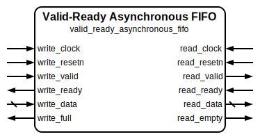

# Valid-Ready Asynchronous FIFO

|         |                                                                                  |
| ------- | -------------------------------------------------------------------------------- |
| Module  | Valid-Ready Asynchronous FIFO                                                    |
| Project | [OmniCores-BuildingBlocks](https://github.com/Louis-DR/OmniCores-BuildingBlocks) |
| Author  | Louis Duret-Robert - [louisduret@gmail.com](mailto:louisduret@gmail.com)         |
| Website | [louis-dr.github.io](https://louis-dr.github.io)                                 |
| License | MIT License - [mit-license.org](https://mit-license.org)                         |

## Overview

Asynchronous First-In First-Out queue for clock domain crossing with valid-ready handshake flow control. The FIFO operates with separate write and read clock domains while providing safe data transfer between them. The handshake protocol ensures that transfers only occur when both valid and ready signals are asserted, providing inherent backpressure and safety in each clock domain.

The design is structured as a modular architecture with valid-ready handshake logic wrapping a separate controller for pointer management, clock domain crossing, and control logic, and a generic asynchronous simple dual-port RAM for data storage. This allows easy replacement of the memory with technology-specific implementations during ASIC integration.

The read data output continuously shows the value at the head of the queue when not empty, allowing instant data access without necessarily consuming the entry. The internal memory array is not reset, so it will contain invalid data in silicium and Xs that could propagate in simulation if the integration doesn't handle control flow correctly.

## Parameters

| Name     | Type    | Allowed Values | Default | Description                                       |
| -------- | ------- | -------------- | ------- | ------------------------------------------------- |
| `WIDTH`  | integer | `≥1`           | `8`     | Bit width of the data vector.                     |
| `DEPTH`  | integer | `≥2`           | `4`     | Number of entries in the queue.                   |
| `STAGES` | integer | `≥1`           | `2`     | Number of synchronizer stages for clock crossing. |

## Ports

| Name           | Direction | Width   | Clock         | Reset          | Reset value | Description                                                                           |
| -------------- | --------- | ------- | ------------- | -------------- | ----------- | ------------------------------------------------------------------------------------- |
| `write_clock`  | input     | 1       | self          |                |             | Write domain clock signal.                                                            |
| `write_resetn` | input     | 1       | asynchronous  | self           | active-low  | Write domain asynchronous active-low reset.                                           |
| `write_data`   | input     | `WIDTH` | `write_clock` |                |             | Data to be written to the queue.                                                      |
| `write_valid`  | input     | 1       | `write_clock` |                |             | Write valid signal. • `0`: no write transaction. • `1`: write data is valid.  |
| `write_ready`  | output    | 1       | `write_clock` | `write_resetn` | `1`         | Write ready signal. • `0`: queue is full. • `1`: queue can accept write data. |
| `write_full`   | output    | 1       | `write_clock` | `write_resetn` | `0`         | Write domain full status. • `0`: queue has space. • `1`: queue is full.       |
| `read_clock`   | input     | 1       | self          |                |             | Read domain clock signal.                                                             |
| `read_resetn`  | input     | 1       | asynchronous  | self           | active-low  | Read domain asynchronous active-low reset.                                            |
| `read_data`    | output    | `WIDTH` | `read_clock`  | `read_resetn`  | `0`         | Data read from the queue head.                                                        |
| `read_valid`   | output    | 1       | `read_clock`  | `read_resetn`  | `0`         | Read valid signal. • `0`: no read data available. • `1`: read data is valid.  |
| `read_ready`   | input     | 1       | `read_clock`  |                |             | Read ready signal. • `0`: not ready to receive. • `1`: ready to receive data. |
| `read_empty`   | output    | 1       | `read_clock`  | `read_resetn`  | `1`         | Read domain empty status. • `0`: queue contains data. • `1`: queue is empty.  |

## Operation

The valid-ready asynchronous FIFO consists of three main components: handshake logic that implements the valid-ready protocol in each clock domain, a controller that manages pointers and clock domain crossing, and an asynchronous simple dual-port RAM for data storage.

The **handshake logic** derives enable signals from the valid-ready protocol in each clock domain. A write enable is generated when both `write_valid` and `write_ready` are asserted in the write domain. A read enable is generated when both `read_valid` and `read_ready` are asserted in the read domain. The `write_ready` signal is driven by the inverse of the `write_full` flag, providing inherent backpressure when the queue is full. The `read_valid` signal is driven by the inverse of the `read_empty` flag, preventing reads from an empty queue.

The **controller** maintains separate read and write pointers in their respective clock domains, implements Gray-code conversion for safe clock domain crossing, synchronizes pointers between domains using multi-stage synchronizers, and calculates status flags. The controller doesn't store any data, only control state.

The **asynchronous simple dual-port RAM** provides independent read and write ports operating in different clock domains with combinational reads, allowing the data at the read address to appear immediately on the read data output.

For **write operation**, a write transfer occurs when both `write_valid` and `write_ready` are asserted (high) on the same `write_clock` rising edge. The controller directs the RAM to store `write_data` at the location pointed to by the write pointer, and the write pointer is incremented. The Gray-coded write pointer is synchronized to the read domain for safe clock domain crossing. When the queue is full, `write_ready` is deasserted, preventing write transfers and providing safety.

For **read operation**, the `read_data` output continuously provides the data at the read pointer location from the RAM. A read transfer occurs when both `read_valid` and `read_ready` are asserted (high) on the same `read_clock` rising edge. Only the read pointer is incremented to advance to the next entry. The Gray-coded read pointer is synchronized to the write domain. When the queue is empty, `read_valid` is deasserted, preventing read transfers and providing safety.

**Clock domain crossing** is handled by the controller synchronizing Gray-coded pointers between domains using multi-stage synchronizers. Gray coding ensures that only one bit changes at a time, preventing metastability issues during clock domain crossing.

The status outputs are calculated by the controller based on the local pointers and the synchronized pointers from the other domain. The `write_full` flag is calculated in the write domain, and the `read_empty` flag is calculated in the read domain.

## Paths

| From          | To            | Type           | Comment                                                              |
| ------------- | ------------- | -------------- | -------------------------------------------------------------------- |
| `write_data`  | `read_data`   | sequential     | Data path through shared memory array.                               |
| `write_valid` | `write_ready` | sequential     | Control path through write domain write pointer.                     |
| `write_valid` | `read_valid`  | sequential CDC | Control path through read domain write pointer with synchronization. |
| `read_ready`  | `read_valid`  | sequential     | Control path through read domain read pointer.                       |
| `read_ready`  | `write_ready` | sequential CDC | Control path through write domain read pointer with synchronization. |

## Complexity

| Delay           | Gates            | Comment |
| --------------- | ---------------- | ------- |
| `O(log₂ DEPTH)` | `O(WIDTH×DEPTH)` |         |

In this table, the delay refers to the timing critical path, which determines the maximal operating frequency.

The RAM requires `WIDTH×DEPTH` flip-flops for the memory array. The controller requires `4×(log₂DEPTH+1)` flip-flops for binary and Gray pointers in both domains, and `2×(log₂DEPTH+1)×STAGES` flip-flops for the synchronizers. The handshake wrapper adds minimal logic for the valid-ready protocol conversion.

## Verification

The valid-ready asynchronous FIFO is verified using a SystemVerilog testbench with comprehensive check sequences that validate clock domain crossing functionality and data integrity with a handshake protocol compliance in both domains.

The following table lists the checks performed by the testbench.

| Number | Check                                        | Description                                                                                    |
| ------ | -------------------------------------------- | ---------------------------------------------------------------------------------------------- |
| 1      | Writing to full                              | Fills the FIFO completely and verifies the flags in the write domain.                          |
| 2      | Reading to empty                             | Empties the FIFO completely and verifies data integrity and the flags in the read domain.      |
| 3      | Maximal throughput with same frequencies     | Performs read and write operations as fast as possible with both clocks at the same frequency. |
| 4      | Maximal throughput with fast write slow read | Performs read and write operations as fast as possible with a faster write clock.              |
| 5      | Maximal throughput with slow write fast read | Performs read and write operations as fast as possible with a faster read clock.               |
| 6      | Random stimulus with same frequencies        | Performs random read and write operations with both clocks at the same frequency.              |
| 7      | Random stimulus with fast write slow read    | Performs random read and write operations with a faster write clock.                           |
| 8      | Random stimulus with slow write fast read    | Performs random read and write operations with a faster read clock.                            |

The following table lists the parameter values verified by the testbench.

| `WIDTH` | `DEPTH` | `STAGES` |           |
| ------- | ------- | -------- | --------- |
| 8       | 4       | 2        | (default) |

## Constraints

Clock domain crossing constraints should be applied to all Gray pointer synchronizers. The design assumes the FIFO depth is a power of 2 for optimal Gray code operation.

## Deliverables

| Type              | File                                                                                           | Description                                         |
| ----------------- | ---------------------------------------------------------------------------------------------- | --------------------------------------------------- |
| Design            | [`valid_ready_asynchronous_fifo.v`](valid_ready_asynchronous_fifo.v)                           | Verilog design.                                     |
| Testbench         | [`valid_ready_asynchronous_fifo.testbench.sv`](valid_ready_asynchronous_fifo.testbench.sv)     | SystemVerilog verification testbench.               |
| Waveform script   | [`valid_ready_asynchronous_fifo.testbench.gtkw`](valid_ready_asynchronous_fifo.testbench.gtkw) | Script to load the waveforms in GTKWave.            |
| Symbol descriptor | [`valid_ready_asynchronous_fifo.symbol.sss`](valid_ready_asynchronous_fifo.symbol.sss)         | Symbol descriptor for SiliconSuite-SymbolGenerator. |
| Symbol image      | [`valid_ready_asynchronous_fifo.symbol.svg`](valid_ready_asynchronous_fifo.symbol.svg)         | Generated vector image of the symbol.               |
| Symbol shape      | [`valid_ready_asynchronous_fifo.symbol.drawio`](valid_ready_asynchronous_fifo.symbol.drawio)   | Generated DrawIO shape of the symbol.               |
| Datasheet         | [`valid_ready_asynchronous_fifo.md`](valid_ready_asynchronous_fifo.md)                         | Markdown documentation datasheet.                   |

## Dependencies

This module depends on the following modules:

| Module                              | Path                                                                        | Comment                                          |
| ----------------------------------- | --------------------------------------------------------------------------- | ------------------------------------------------ |
| `asynchronous_fifo_controller`      | `omnicores-buildingblocks/sources/data/controllers/asynchronous_fifo`       | Controller for pointer management and CDC logic. |
| `binary_to_gray`                    | `omnicores-buildingblocks/sources/encoding/gray`                            | For Gray-code conversion.                        |
| `vector_synchronizer`               | `omnicores-buildingblocks/sources/timing/vector_synchronizer`               | For synchronizing pointers across clock domains. |
| `asynchronous_simple_dual_port_ram` | `omnicores-buildingblocks/sources/memory/asynchronous_simple_dual_port_ram` | Dual-port RAM for data storage across domains.   |

## Related modules

| Module                                                                                                              | Path                                                                           | Comment                                              |
| ------------------------------------------------------------------------------------------------------------------- | ------------------------------------------------------------------------------ | ---------------------------------------------------- |
| [`asynchronous_fifo`](../../access_enable/asynchronous_fifo/asynchronous_fifo.md)                                   | `omnicores-buildingblocks/sources/data/access_enable/asynchronous_fifo`        | Base variant with read-write enable flow control.    |
| [`valid_ready_fifo`](../fifo/valid_ready_fifo.md)                                                                   | `omnicores-buildingblocks/sources/data/valid_ready/fifo`                       | Synchronous FIFO for single clock domain use.        |
| [`valid_ready_asynchronous_advanced_fifo`](../asynchronous_advanced_fifo/valid_ready_asynchronous_advanced_fifo.md) | `omnicores-buildingblocks/sources/data/valid_ready/asynchronous_advanced_fifo` | Asynchronous FIFO with advanced monitoring features. |
| [`valid_ready_simple_buffer`](../simple_buffer/valid_ready_simple_buffer.md)                                        | `omnicores-buildingblocks/sources/data/valid_ready/simple_buffer`              | Single-entry buffer for storage.                     |
| [`valid_ready_skid_buffer`](../skid_buffer/valid_ready_skid_buffer.md)                                              | `omnicores-buildingblocks/sources/data/valid_ready/skid_buffer`                | Two-entry buffer for simple bus pipelining.          |
