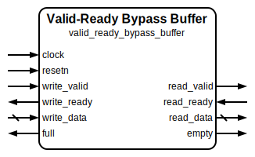

# Valid-Ready Bypass Buffer

|         |                                                                                  |
| ------- | -------------------------------------------------------------------------------- |
| Module  | Valid-Ready Bypass Buffer                                                        |
| Project | [OmniCores-BuildingBlocks](https://github.com/Louis-DR/OmniCores-BuildingBlocks) |
| Author  | Louis Duret-Robert - [louisduret@gmail.com](mailto:louisduret@gmail.com)         |
| Website | [louis-dr.github.io](https://louis-dr.github.io)                                 |
| License | MIT License - [mit-license.org](https://mit-license.org)                         |

## Overview

Single-entry data buffer that is bypassed when it is read and written to in the same cycle, with valid-ready handshake flow control. The buffer is aimed at relieving back-pressure in data flow systems while maintaining zero-latency pass-through capability. The handshake protocol ensures that transfers only occur when both valid and ready signals are asserted.

When both read and write operations occur simultaneously on an empty buffer, data flows directly from input to output via the bypass path. When only writing occurs, data is stored in the internal buffer for later retrieval. Unlike the read-write enable variant, the valid-ready handshake manages and protects flow control, eliminating the need for external enable logic.

## Parameters

| Name    | Type    | Allowed Values | Default | Description                   |
| ------- | ------- | -------------- | ------- | ----------------------------- |
| `WIDTH` | integer | `≥1`           | `8`     | Bit width of the data vector. |

## Ports

| Name          | Direction | Width   | Clock        | Reset    | Reset value | Description                                                                                                              |
| ------------- | --------- | ------- | ------------ | -------- | ----------- | ------------------------------------------------------------------------------------------------------------------------ |
| `clock`       | input     | 1       | self         |          |             | Clock signal.                                                                                                            |
| `resetn`      | input     | 1       | asynchronous | self     | `0`         | Asynchronous active-low reset.                                                                                           |
| `full`        | output    | 1       | `clock`      | `resetn` | `0`         | Buffer full status. • `0`: buffer is empty or being read. • `1`: buffer is full and not being read.              |
| `empty`       | output    | 1       | `clock`      | `resetn` | `1`         | Buffer empty status. • `0`: buffer contains data or being written. • `1`: buffer is empty and not being written. |
| `write_data`  | input     | `WIDTH` | `clock`      |          |             | Data to be written to the buffer.                                                                                        |
| `write_valid` | input     | 1       | `clock`      |          |             | Write valid signal. • `0`: no write transaction. • `1`: write data is valid.                                     |
| `write_ready` | output    | 1       | `clock`      | `resetn` | `1`         | Write ready signal. • `0`: buffer is full. • `1`: buffer can accept write data.                                  |
| `read_data`   | output    | `WIDTH` | `clock`      | `resetn` | `0`         | Data read from the buffer or bypass path.                                                                                |
| `read_valid`  | output    | 1       | `clock`      | `resetn` | `0`         | Read valid signal. • `0`: no read data available. • `1`: read data is valid.                                     |
| `read_ready`  | input     | 1       | `clock`      |          |             | Read ready signal. • `0`: not ready to receive. • `1`: ready to receive data.                                    |

## Operation

The valid-ready bypass buffer is a wrapper around the read-write enable bypass buffer that implements the valid-ready handshake protocol. It operates in two primary modes: bypass mode and storage mode.

For **write operation**, a write transfer occurs when both `write_valid` and `write_ready` are asserted (high) on the same clock rising edge. The `write_data` is then processed according to the current buffer state and read activity.

For **read operation**, a read transfer occurs when both `read_valid` and `read_ready` are asserted (high) on the same clock rising edge. The data is available on the `read_data` port and the buffer state is updated accordingly.

**Bypass mode** occurs when both write and read transfers happen simultaneously while the buffer is empty. In this case, `write_data` flows directly to `read_data` without being stored in the internal buffer. The buffer remains empty, and both `full` and `empty` flags reflect the dynamic state during the transfer.

**Storage mode** occurs when only writing is performed or when reading from a buffer that contains stored data. When writing without reading, data is stored in the internal buffer register. When reading stored data, the buffer is emptied.

## Paths

| From          | To              | Type          | Comment                                                                      |
| ------------- | --------------- | ------------- | ---------------------------------------------------------------------------- |
| `write_data`  | `read_data`     | combinational | Direct bypass path when buffer is empty and both enable signals are active.  |
| `write_data`  | `read_data`     | sequential    | Storage path through internal `buffer` register when there is back-pressure. |
| `write_valid` | `full`, `empty` | combinational | Dynamic status flag based on current buffer state and read operation.        |
| `write_valid` | `read_valid`    | combinational | Bypass mode creates combinational path.                                      |
| `read_ready`  | `full`, `empty` | combinational | Dynamic status flag based on current buffer state and read operation.        |
| `read_ready`  | `write_ready`   | combinational | Bypass mode creates combinational path.                                      |

## Complexity

| Delay  | Gates      | Comment |
| ------ | ---------- | ------- |
| `O(1)` | `O(WIDTH)` |         |

The module requires `WIDTH` flip-flops for the data buffer and one flip-flop for the buffer_valid state. The wrapper adds minimal logic for the valid-ready protocol conversion.

## Verification

The valid-ready bypass buffer is verified using a SystemVerilog testbench with six check sequences that validate both bypass and storage operations with a handshake protocol compliance.

The following table lists the checks performed by the testbench.

| Number | Check                             | Description                                                                                              |
| ------ | --------------------------------- | -------------------------------------------------------------------------------------------------------- |
| 1      | Bypass path                       | Verifies that simultaneous read/write on an empty buffer bypasses storage and provides direct data flow. |
| 2      | Writing to full                   | Verifies that writing to an empty buffer stores data correctly and sets status flags.                    |
| 3      | Reading to empty                  | Verifies that reading from a full buffer provides correct data and clears status flags.                  |
| 4      | Successive transfers              | Performs alternating write and read operations to verify proper data transfer and flag management.       |
| 5      | Continuous flow with buffer empty | Performs simultaneous write and read operations while the buffer is empty and check the data and flags.  |
| 6      | Continuous flow with buffer full  | Performs simultaneous write and read operations while the buffer is full and check the data and flags.   |

The following table lists the parameter values verified by the testbench.

| `WIDTH` |           |
| ------- | --------- |
| 8       | (default) |

## Constraints

There are no synthesis and implementation constraints for this block.

## Deliverables

| Type              | File                                                                                   | Description                                         |
| ----------------- | -------------------------------------------------------------------------------------- | --------------------------------------------------- |
| Design            | [`valid_ready_bypass_buffer.v`](valid_ready_bypass_buffer.v)                           | Verilog design.                                     |
| Testbench         | [`valid_ready_bypass_buffer.testbench.sv`](valid_ready_bypass_buffer.testbench.sv)     | SystemVerilog verification testbench.               |
| Waveform script   | [`valid_ready_bypass_buffer.testbench.gtkw`](valid_ready_bypass_buffer.testbench.gtkw) | Script to load the waveforms in GTKWave.            |
| Symbol descriptor | [`valid_ready_bypass_buffer.symbol.sss`](valid_ready_bypass_buffer.symbol.sss)         | Symbol descriptor for SiliconSuite-SymbolGenerator. |
| Symbol image      | [`valid_ready_bypass_buffer.symbol.svg`](valid_ready_bypass_buffer.symbol.svg)         | Generated vector image of the symbol.               |
| Symbol shape      | [`valid_ready_bypass_buffer.symbol.drawio`](valid_ready_bypass_buffer.symbol.drawio)   | Generated DrawIO shape of the symbol.               |
| Datasheet         | [`valid_ready_bypass_buffer.md`](valid_ready_bypass_buffer.md)                         | Markdown documentation datasheet.                   |

## Dependencies

This module depends on the following modules:

| Module                                                                | Path                                                                | Comment                           |
| --------------------------------------------------------------------- | ------------------------------------------------------------------- | --------------------------------- |
| [`bypass_buffer`](../../access_enable/bypass_buffer/bypass_buffer.md) | `omnicores-buildingblocks/sources/data/access_enable/bypass_buffer` | Underlying buffer implementation. |

## Related modules

| Module                                                                       | Path                                                                | Comment                                           |
| ---------------------------------------------------------------------------- | ------------------------------------------------------------------- | ------------------------------------------------- |
| [`bypass_buffer`](../../access_enable/bypass_buffer/bypass_buffer.md)        | `omnicores-buildingblocks/sources/data/access_enable/bypass_buffer` | Base variant with read-write enable flow control. |
| [`valid_ready_simple_buffer`](../simple_buffer/valid_ready_simple_buffer.md) | `omnicores-buildingblocks/sources/data/valid_ready/simple_buffer`   | Single-entry buffer for storage.                  |
| [`valid_ready_skid_buffer`](../skid_buffer/valid_ready_skid_buffer.md)       | `omnicores-buildingblocks/sources/data/valid_ready/skid_buffer`     | Two-entry buffer more suited to bus pipelining.   |
| [`valid_ready_fifo`](../fifo/valid_ready_fifo.md)                            | `omnicores-buildingblocks/sources/data/valid_ready/fifo`            | Multi-entry first-in-first-out queue.             |
