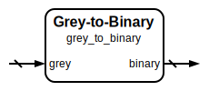

# Grey to Binary Decoder

|         |                                                                                  |
| ------- | -------------------------------------------------------------------------------- |
| Module  | Grey to Binary Decoder                                                           |
| Project | [OmniCores-BuildingBlocks](https://github.com/Louis-DR/OmniCores-BuildingBlocks) |
| Author  | Louis Duret-Robert - [louisduret@gmail.com](mailto:louisduret@gmail.com)         |
| Website | [louis-dr.github.io](https://louis-dr.github.io)                                 |
| License | MIT License - [mit-license.org](https://mit-license.org)                         |

## Overview



Converts Grey code (reflected binary code) back to standard binary representation. This decoder performs the inverse operation of the binary-to-grey encoder, recovering the original binary value from its Grey code representation.

## Parameters

| Name    | Type    | Allowed Values | Default | Description                           |
| ------- | ------- | -------------- | ------- | ------------------------------------- |
| `WIDTH` | integer | `≥1`           | `8`     | Bit width of the grey/binary vectors. |

## Ports

| Name     | Direction | Width   | Clock | Reset | Reset value | Description                    |
| -------- | --------- | ------- | ----- | ----- | ----------- | ------------------------------ |
| `grey`   | input     | `WIDTH` |       |       |             | Grey code input to be decoded. |
| `binary` | output    | `WIDTH` |       |       |             | Binary output.                 |

## Operation

The grey-to-binary conversion uses an iterative algorithm where each binary bit is computed based on the Grey code input and previously computed binary bits. The most significant bit (MSB) of the binary output equals the MSB of the Grey code input. For all other positions `i` (from MSB-1 down to LSB), the binary bit is computed as `binary[i] = binary[i+1] ^ grey[i]`.

The algorithm can be expressed as:

```
binary[WIDTH-1] = grey[WIDTH-1]
for i = WIDTH-2 down to 0:
    binary[i] = binary[i+1] ^ grey[i]
```

This sequential dependency from MSB to LSB means the conversion requires multiple logic levels but ensures perfect reconstruction of the original binary value.

## Paths

| From   | To       | Type          | Comment                                                     |
| ------ | -------- | ------------- | ----------------------------------------------------------- |
| `grey` | `binary` | combinatorial | Multi-level XOR chain from MSB to LSB for conversion logic. |

## Complexity

| Delay      | Gates      | Comment                                                |
| ---------- | ---------- | ------------------------------------------------------ |
| `O(WIDTH)` | `O(WIDTH)` | Chain of XOR gates creates WIDTH-dependent delay path. |

The conversion requires `WIDTH-1` XOR gates arranged in a dependency chain, resulting in a delay proportional to the bit width. For wide data paths, this may require pipeline consideration in high-frequency designs.

## Verification

The grey-to-binary decoder is verified using a comprehensive SystemVerilog testbench that validates both the conversion correctness and the fundamental properties of Grey code decoding. The testbench instanciates and verifies both the `binary_to_grey` and `grey_to_binary` modules.

The following table lists the checks performed by the testbench.

| Number | Check           | Description                                                                            |
| ------ | --------------- | -------------------------------------------------------------------------------------- |
| 1a     | Exhaustive test | If `WIDTH` ≤ 10, checks the Grey code and its properties for all binary input values . |
| 1b     | Random test     | If `WIDTH` > 10, checks the Grey code and its properties for random sequences.         |

The following table lists the parameter values verified by the testbench.

| `WIDTH` |           |
| ------- | --------- |
| 8       | (default) |

## Constraints

There are no synthesis and implementation constraints for this block.

## Deliverables

| Type              | File                                                     | Description                                         |
| ----------------- | -------------------------------------------------------- | --------------------------------------------------- |
| Design            | [`grey_to_binary.v`](grey_to_binary.v)                   | Verilog design.                                     |
| Testbench         | [`grey.testbench.sv`](grey.testbench.sv)                 | SystemVerilog verification testbench (shared).      |
| Waveform script   | [`grey.testbench.gtkw`](grey.testbench.gtkw)             | Script to load the waveforms in GTKWave.            |
| Symbol descriptor | [`grey_to_binary.symbol.sss`](grey_to_binary.symbol.sss) | Symbol descriptor for SiliconSuite-SymbolGenerator. |
| Symbol image      | [`grey_to_binary.symbol.svg`](grey_to_binary.symbol.svg) | Generated vector image of the symbol.               |
| Datasheet         | [`grey_to_binary.md`](grey_to_binary.md)                 | Markdown documentation datasheet.                   |

## Dependencies

This module has no external module dependencies.

## Related modules

| Module                                              | Path                                               | Comment                    |
| --------------------------------------------------- | -------------------------------------------------- | -------------------------- |
| [`binary_to_grey`](binary_to_grey.md)               | `omnicores-buildingblocks/sources/encoding/grey`   | Binary to Grey encoder.    |
| [`binary_to_onehot`](../onehot/binary_to_onehot.md) | `omnicores-buildingblocks/sources/encoding/onehot` | Binary to one-hot encoder. |
| [`onehot_to_binary`](../onehot/onehot_to_binary.md) | `omnicores-buildingblocks/sources/encoding/onehot` | One-hot to binary decoder. |
