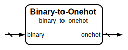

# Binary to One-Hot Encoder

|         |                                                                                  |
| ------- | -------------------------------------------------------------------------------- |
| Module  | Binary to One-Hot Encoder                                                        |
| Project | [OmniCores-BuildingBlocks](https://github.com/Louis-DR/OmniCores-BuildingBlocks) |
| Author  | Louis Duret-Robert - [louisduret@gmail.com](mailto:louisduret@gmail.com)         |
| Website | [louis-dr.github.io](https://louis-dr.github.io)                                 |
| License | MIT License - [mit-license.org](https://mit-license.org)                         |

## Overview

Converts binary numbers to one-hot encoding where exactly one bit is set in the output corresponding to the binary input value. One-hot encoding is widely used in digital systems for state machines, address decoding, multiplexer control, and priority encoding applications where mutually exclusive selection is required.

## Parameters

| Name           | Type    | Allowed Values | Default           | Description                             |
| -------------- | ------- | -------------- | ----------------- | --------------------------------------- |
| `WIDTH_BINARY` | integer | `≥1`           | `8`               | Bit width of the binary input vector.   |
| `WIDTH_ONEHOT` | integer | `≥2`           | `2**WIDTH_BINARY` | Bit width of the one-hot output vector. |

## Ports

| Name     | Direction | Width          | Clock | Reset | Reset value | Description                 |
| -------- | --------- | -------------- | ----- | ----- | ----------- | --------------------------- |
| `binary` | input     | `WIDTH_BINARY` |       |       |             | Binary input to be encoded. |
| `onehot` | output    | `WIDTH_ONEHOT` |       |       |             | One-hot encoded output.     |

## Operation

The binary-to-one-hot conversion uses a simple left shift operation where a single bit is shifted to the position specified by the binary input value. The conversion can be expressed as: `onehot = 1'b1 << binary`

For a binary input value `N`, the output will have exactly one bit set at position `N`, with all other bits being zero. This creates a direct mapping where each binary value corresponds to a unique one-hot pattern.

## Paths

| From     | To       | Type          | Comment                              |
| -------- | -------- | ------------- | ------------------------------------ |
| `binary` | `onehot` | combinational | Direct shift-based conversion logic. |

## Complexity

| Delay  | Gates             | Comment                                    |
| ------ | ----------------- | ------------------------------------------ |
| `O(1)` | `O(WIDTH_ONEHOT)` | Single level of logic for shift operation. |

The conversion requires a barrel shifter or equivalent logic structure and has a constant propagation delay independent of the input value, making it highly efficient for real-time applications.

## Verification

The binary-to-one-hot encoder is verified using a comprehensive SystemVerilog testbench that validates both the conversion correctness and the fundamental one-hot encoding properties. The testbench instanciates and verifies both the `binary_to_onehot` and `onehot_to_binary` modules.

The following table lists the checks performed by the testbench.

| Number | Check           | Description                                                                                         |
| ------ | --------------- | --------------------------------------------------------------------------------------------------- |
| 1a     | Exhaustive test | If `WIDTH_BINARY` ≤ 10, checks the one-hot encoding and its properties for all binary input values. |
| 1b     | Random test     | If `WIDTH_BINARY` > 10, checks the one-hot encoding and its properties for random sequences.        |

The following table lists the parameter values verified by the testbench.

| `WIDTH_BINARY` |           |
| -------------- | --------- |
| 8              | (default) |

## Constraints

There are no synthesis and implementation constraints for this block.

## Deliverables

| Type              | File                                                               | Description                                         |
| ----------------- | ------------------------------------------------------------------ | --------------------------------------------------- |
| Design            | [`binary_to_onehot.v`](binary_to_onehot.v)                         | Verilog design.                                     |
| Testbench         | [`onehot.testbench.sv`](onehot.testbench.sv)                       | SystemVerilog verification shared testbench.        |
| Waveform script   | [`onehot.testbench.gtkw`](onehot.testbench.gtkw)                   | Script to load the waveforms in GTKWave.            |
| Symbol descriptor | [`binary_to_onehot.symbol.sss`](binary_to_onehot.symbol.sss)       | Symbol descriptor for SiliconSuite-SymbolGenerator. |
| Symbol image      | [`binary_to_onehot.symbol.svg`](binary_to_onehot.symbol.svg)       | Generated vector image of the symbol.               |
| Symbol shape      | [`binary_to_onehot.symbol.drawio`](binary_to_onehot.symbol.drawio) | Generated DrawIO shape of the symbol.               |
| Datasheet         | [`binary_to_onehot.md`](binary_to_onehot.md)                       | Markdown documentation datasheet.                   |

## Dependencies

This module has no external module dependencies.

## Related modules

| Module                                        | Path                                               | Comment                    |
| --------------------------------------------- | -------------------------------------------------- | -------------------------- |
| [`onehot_to_binary`](onehot_to_binary.md)     | `omnicores-buildingblocks/sources/encoding/onehot` | One-hot to binary decoder. |
| [`binary_to_gray`](../gray/binary_to_gray.md) | `omnicores-buildingblocks/sources/encoding/gray`   | Binary to Gray encoder.    |
| [`binary_to_bcd`](binary_to_bcd.md)           | `omnicores-buildingblocks/sources/encoding/bcd`    | Binary to BCD encoder.     |
