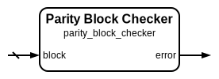

# Parity Block Checker

|         |                                                                                  |
| ------- | -------------------------------------------------------------------------------- |
| Module  | Parity Block Checker                                                             |
| Project | [OmniCores-BuildingBlocks](https://github.com/Louis-DR/OmniCores-BuildingBlocks) |
| Author  | Louis Duret-Robert - [louisduret@gmail.com](mailto:louisduret@gmail.com)         |
| Website | [louis-dr.github.io](https://louis-dr.github.io)                                 |
| License | MIT License - [mit-license.org](https://mit-license.org)                         |

## Overview

Validates the integrity of complete parity-encoded blocks containing both data and parity bits. This checker extracts the data and parity code from the input block, recomputes the expected parity, and detects errors by comparing the received and computed parity values. It is designed for systems where data and parity are handled as a unified block.

## Parameters

| Name         | Type    | Allowed Values | Default | Description                    |
| ------------ | ------- | -------------- | ------- | ------------------------------ |
| `DATA_WIDTH` | integer | `≥1`           | `8`     | Bit width of the data portion. |

## Ports

| Name    | Direction | Width          | Clock | Reset | Reset value | Description                          |
| ------- | --------- | -------------- | ----- | ----- | ----------- | ------------------------------------ |
| `block` | input     | `DATA_WIDTH+1` |       |       |             | Complete parity block to be checked. |
| `error` | output    | 1              |       |       |             | Error detection flag.                |

## Operation

The parity block checker separates the input block into its data and parity code components, with the data occupying the lower bits and the parity code in the most significant bit. It then uses the internal parity encoder to recompute the expected parity for the extracted data and compares this computed parity with the received parity code.

The module provides a unified interface for error detection in systems where parity-protected data is transmitted or stored as complete blocks. This approach simplifies system design by eliminating the need to handle data and parity separately during error checking operations.

## Paths

| From    | To      | Type          | Comment                                     |
| ------- | ------- | ------------- | ------------------------------------------- |
| `block` | `error` | combinatorial | Through data extraction and parity encoder. |

## Complexity

| Delay  | Gates           | Comment                                    |
| ------ | --------------- | ------------------------------------------ |
| `O(1)` | `O(DATA_WIDTH)` | Single level logic through parity encoder. |

The checker utilizes an internal parity encoder and simple comparison logic, resulting in efficient single-level delay suitable for high-performance error detection applications.

## Verification

The parity block checker is verified using a comprehensive SystemVerilog testbench that validates error detection with both correct and corrupted parity blocks. The testbench instanciates and verifies the `parity_encoder`, `parity_checker`, and `parity_block_checker` modules.

The following table lists the checks performed by the testbench.

| Number | Check                               | Description                                                  |
| ------ | ----------------------------------- | ------------------------------------------------------------ |
| 1      | Encoder exhaustive test             | Tests parity computation for all possible input data values. |
| 2      | Checker with correct parity         | Verifies no false errors with matching data and parity.      |
| 3      | Checker with incorrect parity       | Confirms error detection with mismatched data and parity.    |
| 4      | Block checker with correct blocks   | Verifies no false errors with valid parity blocks.           |
| 5      | Block checker with incorrect blocks | Confirms error detection with corrupted parity blocks.       |
| 6      | Complete encode-decode cycle        | Verifies end-to-end encoding and checking without errors.    |
| 7      | Single bit error detection          | Confirms single-bit errors are detectable in encoded blocks. |

The following table lists the parameter values verified by the testbench.

| `DATA_WIDTH` |           |
| ------------ | --------- |
| 8            | (default) |

## Constraints

There are no synthesis and implementation constraints for this block.

## Deliverables

| Type              | File                                                                       | Description                                         |
| ----------------- | -------------------------------------------------------------------------- | --------------------------------------------------- |
| Design            | [`parity_block_checker.v`](parity_block_checker.v)                         | Verilog design.                                     |
| Testbench         | [`parity.testbench.sv`](parity.testbench.sv)                               | SystemVerilog verification shared testbench.        |
| Testbench         | [`parity.testbench.sv`](parity.testbench.sv)                               | SystemVerilog verification shared testbench.        |
| Waveform script   | [`parity.testbench.gtkw`](parity.testbench.gtkw)                           | Script to load the waveforms in GTKWave.            |
| Symbol descriptor | [`parity_block_checker.symbol.sss`](parity_block_checker.symbol.sss)       | Symbol descriptor for SiliconSuite-SymbolGenerator. |
| Symbol image      | [`parity_block_checker.symbol.svg`](parity_block_checker.symbol.svg)       | Generated vector image of the symbol.               |
| Symbol shape      | [`parity_block_checker.symbol.drawio`](parity_block_checker.symbol.drawio) | Generated DrawIO shape of the symbol.               |
| Datasheet         | [`parity_block_checker.md`](parity_block_checker.md)                       | Markdown documentation datasheet.                   |

## Dependencies

| Module                                | Path                                                    | Comment |
| ------------------------------------- | ------------------------------------------------------- | ------- |
| [`parity_encoder`](parity_encoder.md) | `omnicores-buildingblocks/sources/error_control/parity` |         |

## Related modules

| Module                                | Path                                                    | Comment                                     |
| ------------------------------------- | ------------------------------------------------------- | ------------------------------------------- |
| [`parity_encoder`](parity_encoder.md) | `omnicores-buildingblocks/sources/error_control/parity` | Internal dependency for parity computation. |
| [`parity_checker`](parity_checker.md) | `omnicores-buildingblocks/sources/error_control/parity` | Variant for separate data and code.         |
