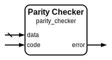

# Parity Checker

|         |                                                                                  |
| ------- | -------------------------------------------------------------------------------- |
| Module  | Parity Checker                                                                   |
| Project | [OmniCores-BuildingBlocks](https://github.com/Louis-DR/OmniCores-BuildingBlocks) |
| Author  | Louis Duret-Robert - [louisduret@gmail.com](mailto:louisduret@gmail.com)         |
| Website | [louis-dr.github.io](https://louis-dr.github.io)                                 |
| License | MIT License - [mit-license.org](https://mit-license.org)                         |

## Overview

Verifies the integrity of received data using its associated parity code. This checker detects single-bit errors by comparing the received parity bit with the parity bit computed from the received data. The module is designed for systems where data and parity are transmitted or stored separately.

## Parameters

| Name         | Type    | Allowed Values | Default | Description                  |
| ------------ | ------- | -------------- | ------- | ---------------------------- |
| `DATA_WIDTH` | integer | `≥1`           | `8`     | Bit width of the input data. |

## Ports

| Name    | Direction | Width        | Clock | Reset | Reset value | Description                  |
| ------- | --------- | ------------ | ----- | ----- | ----------- | ---------------------------- |
| `data`  | input     | `DATA_WIDTH` |       |       |             | Received data to be checked. |
| `code`  | input     | 1            |       |       |             | Received parity code.        |
| `error` | output    | 1            |       |       |             | Error detection flag.        |

## Operation

The parity checker validates data integrity by reconstructing the expected parity bit from the received data and comparing it with the received parity code. The checker internally forms a complete parity block by concatenating the received code and data, then delegates the actual error detection to the parity block checker module.

When the computed parity matches the received parity code, no error is detected (error = 0). If they differ, a single-bit error is detected and flagged (error = 1). This approach provides a simple yet effective method for detecting transmission or storage errors in digital systems.

## Paths

| From   | To      | Type          | Comment                                |
| ------ | ------- | ------------- | -------------------------------------- |
| `data` | `error` | combinatorial | Through internal parity block checker. |
| `code` | `error` | combinatorial | Through internal parity block checker. |

## Complexity

| Delay  | Gates           | Comment                                   |
| ------ | --------------- | ----------------------------------------- |
| `O(1)` | `O(DATA_WIDTH)` | Single level logic through block checker. |

The checker utilizes the parity block checker internally, inheriting its efficient single-level logic implementation for fast error detection suitable for high-speed applications.

## Verification

The parity checker is verified using a comprehensive SystemVerilog testbench that validates error detection capabilities with both correct and incorrect parity combinations. The testbench instanciates and verifies the `parity_encoder`, `parity_checker`, and `parity_block_checker` modules.

The following table lists the checks performed by the testbench.

| Number | Check                               | Description                                                  |
| ------ | ----------------------------------- | ------------------------------------------------------------ |
| 1      | Encoder exhaustive test             | Tests parity computation for all possible input data values. |
| 2      | Checker with correct parity         | Verifies no false errors with matching data and parity.      |
| 3      | Checker with incorrect parity       | Confirms error detection with mismatched data and parity.    |
| 4      | Block checker with correct blocks   | Verifies no false errors with valid parity blocks.           |
| 5      | Block checker with incorrect blocks | Confirms error detection with corrupted parity blocks.       |
| 6      | Complete encode-decode cycle        | Verifies end-to-end encoding and checking without errors.    |
| 7      | Single bit error detection          | Confirms single-bit errors are detectable in encoded blocks. |

The following table lists the parameter values verified by the testbench.

| `DATA_WIDTH` |           |
| ------------ | --------- |
| 8            | (default) |

## Constraints

There are no synthesis and implementation constraints for this block.

## Deliverables

| Type              | File                                                     | Description                                         |
| ----------------- | -------------------------------------------------------- | --------------------------------------------------- |
| Design            | [`parity_checker.v`](parity_checker.v)                   | Verilog design.                                     |
| Testbench         | [`parity.testbench.sv`](parity.testbench.sv)             | SystemVerilog verification shared testbench.        |
| Waveform script   | [`parity.testbench.gtkw`](parity.testbench.gtkw)         | Script to load the waveforms in GTKWave.            |
| Symbol descriptor | [`parity_checker.symbol.sss`](parity_checker.symbol.sss) | Symbol descriptor for SiliconSuite-SymbolGenerator. |
| Symbol image      | [`parity_checker.symbol.svg`](parity_checker.symbol.svg) | Generated vector image of the symbol.               |
| Datasheet         | [`parity_checker.md`](parity_checker.md)                 | Markdown documentation datasheet.                   |

## Dependencies

| Module                                            | Path                                                    | Comment |
| ------------------------------------------------- | ------------------------------------------------------- | ------- |
| [`parity_block_checker`](parity_block_checker.md) | `omnicores-buildingblocks/sources/error_control/parity` |         |
| [`parity_encoder`](parity_encoder.md)             | `omnicores-buildingblocks/sources/error_control/parity` |         |

## Related modules

| Module                                            | Path                                                    | Comment                              |
| ------------------------------------------------- | ------------------------------------------------------- | ------------------------------------ |
| [`parity_encoder`](parity_encoder.md)             | `omnicores-buildingblocks/sources/error_control/parity` | Parity encoder for generating codes. |
| [`parity_block_checker`](parity_block_checker.md) | `omnicores-buildingblocks/sources/error_control/parity` | Variant for combined data and code.  |
