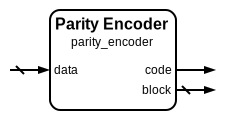

# Parity Encoder

|         |                                                                                  |
| ------- | -------------------------------------------------------------------------------- |
| Module  | Parity Encoder                                                                   |
| Project | [OmniCores-BuildingBlocks](https://github.com/Louis-DR/OmniCores-BuildingBlocks) |
| Author  | Louis Duret-Robert - [louisduret@gmail.com](mailto:louisduret@gmail.com)         |
| Website | [louis-dr.github.io](https://louis-dr.github.io)                                 |
| License | MIT License - [mit-license.org](https://mit-license.org)                         |

## Overview

Computes the parity bit for input data and generates the complete parity-protected block. Parity encoding is a fundamental error detection technique that adds a single redundancy bit to detect single-bit errors in data transmission or storage. This encoder supports even parity, where the total number of set bits (including the parity bit) is always even.

## Parameters

| Name         | Type    | Allowed Values | Default | Description                  |
| ------------ | ------- | -------------- | ------- | ---------------------------- |
| `DATA_WIDTH` | integer | `≥1`           | `8`     | Bit width of the input data. |

## Ports

| Name    | Direction | Width          | Clock | Reset | Reset value | Description                          |
| ------- | --------- | -------------- | ----- | ----- | ----------- | ------------------------------------ |
| `data`  | input     | `DATA_WIDTH`   |       |       |             | Input data to be parity encoded.     |
| `code`  | output    | 1              |       |       |             | Computed parity bit.                 |
| `block` | output    | `DATA_WIDTH+1` |       |       |             | Complete parity block (code + data). |

## Operation

The parity encoder computes an even parity bit by XORing all bits of the input data together. The parity bit is set such that the total number of '1' bits in the data plus the parity bit is always even. This allows single-bit error detection during subsequent checking operations.

The encoder generates two outputs: the individual parity code for separate transmission or storage, and the complete parity block that concatenates the parity bit with the original data for convenient handling as a single unit.

## Paths

| From   | To      | Type          | Comment                         |
| ------ | ------- | ------------- | ------------------------------- |
| `data` | `code`  | combinatorial | XOR reduction for parity.       |
| `data` | `block` | combinatorial | Direct concatenation with code. |

## Complexity

| Delay  | Gates           | Comment                                       |
| ------ | --------------- | --------------------------------------------- |
| `O(1)` | `O(DATA_WIDTH)` | Single level XOR tree for parity computation. |

The parity computation requires a reduction XOR tree that can be implemented with logarithmic depth but is typically synthesized as a single-level operation, making it highly efficient for real-time applications.

## Verification

The parity encoder is verified using a comprehensive SystemVerilog testbench that validates the parity computation correctness and integration with the checker modules. The testbench instanciates and verifies the `parity_encoder`, `parity_checker`, and `parity_block_checker` modules.

The following table lists the checks performed by the testbench.

| Number | Check                               | Description                                                  |
| ------ | ----------------------------------- | ------------------------------------------------------------ |
| 1      | Encoder exhaustive test             | Tests parity computation for all possible input data values. |
| 2      | Checker with correct parity         | Verifies no false errors with matching data and parity.      |
| 3      | Checker with incorrect parity       | Confirms error detection with mismatched data and parity.    |
| 4      | Block checker with correct blocks   | Verifies no false errors with valid parity blocks.           |
| 5      | Block checker with incorrect blocks | Confirms error detection with corrupted parity blocks.       |
| 6      | Complete encode-decode cycle        | Verifies end-to-end encoding and checking without errors.    |
| 7      | Single bit error detection          | Confirms single-bit errors are detectable in encoded blocks. |

The following table lists the parameter values verified by the testbench.

| `DATA_WIDTH` |           |
| ------------ | --------- |
| 8            | (default) |

## Constraints

There are no synthesis and implementation constraints for this block.

## Deliverables

| Type              | File                                                           | Description                                         |
| ----------------- | -------------------------------------------------------------- | --------------------------------------------------- |
| Design            | [`parity_encoder.v`](parity_encoder.v)                         | Verilog design.                                     |
| Testbench         | [`parity.testbench.sv`](parity.testbench.sv)                   | SystemVerilog verification shared testbench.        |
| Waveform script   | [`parity.testbench.gtkw`](parity.testbench.gtkw)               | Script to load the waveforms in GTKWave.            |
| Symbol descriptor | [`parity_encoder.symbol.sss`](parity_encoder.symbol.sss)       | Symbol descriptor for SiliconSuite-SymbolGenerator. |
| Symbol image      | [`parity_encoder.symbol.svg`](parity_encoder.symbol.svg)       | Generated vector image of the symbol.               |
| Symbol shape      | [`parity_encoder.symbol.drawio`](parity_encoder.symbol.drawio) | Generated DrawIO shape of the symbol.               |
| Datasheet         | [`parity_encoder.md`](parity_encoder.md)                       | Markdown documentation datasheet.                   |

## Dependencies

This module has no external module dependencies.

## Related modules

| Module                                            | Path                                                    | Comment                                  |
| ------------------------------------------------- | ------------------------------------------------------- | ---------------------------------------- |
| [`parity_checker`](parity_checker.md)             | `omnicores-buildingblocks/sources/error_control/parity` | Parity checker for data and code inputs. |
| [`parity_block_checker`](parity_block_checker.md) | `omnicores-buildingblocks/sources/error_control/parity` | Parity checker for complete blocks.      |
