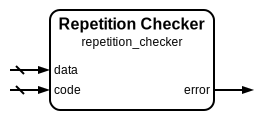

# Repetition Checker

|         |                                                                                  |
| ------- | -------------------------------------------------------------------------------- |
| Module  | Repetition Checker                                                               |
| Project | [OmniCores-BuildingBlocks](https://github.com/Louis-DR/OmniCores-BuildingBlocks) |
| Author  | Louis Duret-Robert - [louisduret@gmail.com](mailto:louisduret@gmail.com)         |
| Website | [louis-dr.github.io](https://louis-dr.github.io)                                 |
| License | MIT License - [mit-license.org](https://mit-license.org)                         |

## Overview

Verifies the integrity of received data using its associated repetition codes. This checker detects errors by comparing all repetitions to ensure they are identical, flagging discrepancies that indicate transmission or storage errors. The module is designed for systems where data and repetition codes are transmitted or stored separately.

## Parameters

| Name         | Type    | Allowed Values | Default | Description                  |
| ------------ | ------- | -------------- | ------- | ---------------------------- |
| `DATA_WIDTH` | integer | `≥1`           | `8`     | Bit width of the input data. |
| `REPETITION` | integer | `≥2`           | `3`     | Number of data repetitions.  |

## Ports

| Name    | Direction | Width                       | Clock | Reset | Reset value | Description                  |
| ------- | --------- | --------------------------- | ----- | ----- | ----------- | ---------------------------- |
| `data`  | input     | `DATA_WIDTH`                |       |       |             | Received data to be checked. |
| `code`  | input     | `(REPETITION-1)×DATA_WIDTH` |       |       |             | Received repetition codes.   |
| `error` | output    | 1                           |       |       |             | Error detection flag.        |

## Operation

The repetition checker validates data integrity by reconstructing the complete repetition block from the received data and code components, then delegates error detection to the repetition block checker module. The checker forms the block by concatenating the repetition codes with the original data and verifies that all repetitions are identical.

When all repetitions match, no error is detected (error = 0). If any repetition differs from the others, an error is flagged (error = 1). This approach provides reliable error detection for systems that handle data and repetition codes separately during transmission or storage.

## Paths

| From   | To      | Type          | Comment                                    |
| ------ | ------- | ------------- | ------------------------------------------ |
| `data` | `error` | combinatorial | Through internal repetition block checker. |
| `code` | `error` | combinatorial | Through internal repetition block checker. |

## Complexity

| Delay  | Gates                      | Comment                                   |
| ------ | -------------------------- | ----------------------------------------- |
| `O(1)` | `O(REPETITION×DATA_WIDTH)` | Single level logic through block checker. |

The checker utilizes the repetition block checker internally, inheriting its efficient comparison logic implementation for fast error detection suitable for high-speed applications.

## Verification

The repetition checker is verified using a comprehensive SystemVerilog testbench that validates error detection capabilities with both correct and incorrect repetition combinations. The testbench instanciates and verifies all repetition modules.

The following table lists the checks performed by the testbench.

| Number | Check                               | Description                                                      |
| ------ | ----------------------------------- | ---------------------------------------------------------------- |
| 1      | Encoder exhaustive test             | Tests repetition generation for all possible input data values.  |
| 2      | Checker with correct repetition     | Verifies no false errors with matching data and repetitions.     |
| 3      | Checker with incorrect repetition   | Confirms error detection with mismatched data and repetitions.   |
| 4      | Block checker with correct blocks   | Verifies no false errors with valid repetition blocks.           |
| 5      | Block checker with incorrect blocks | Confirms error detection with corrupted repetition blocks.       |
| 6      | Complete encode-decode cycle        | Verifies end-to-end encoding and checking without errors.        |
| 7      | Single bit error detection          | Confirms single-bit errors are detectable in encoded blocks.     |
| 8      | Corrector with correct data         | Validates proper operation with uncorrupted repetition data.     |
| 9      | Corrector with single bit errors    | Tests error correction capabilities with single-bit corruptions. |
| 10     | Double bit error detection          | Verifies detection of uncorrectable double-bit errors.           |

The following table lists the parameter values verified by the testbench.

| `DATA_WIDTH` | `REPETITION` |           |
| ------------ | ------------ | --------- |
| 8            | 3            | (default) |

## Constraints

There are no synthesis and implementation constraints for this block.

## Deliverables

| Type              | File                                                             | Description                                         |
| ----------------- | ---------------------------------------------------------------- | --------------------------------------------------- |
| Design            | [`repetition_checker.v`](repetition_checker.v)                   | Verilog design.                                     |
| Testbench         | [`repetition.testbench.sv`](repetition.testbench.sv)             | SystemVerilog verification shared testbench.        |
| Waveform script   | [`repetition.testbench.gtkw`](repetition.testbench.gtkw)         | Script to load the waveforms in GTKWave.            |
| Symbol descriptor | [`repetition_checker.symbol.sss`](repetition_checker.symbol.sss) | Symbol descriptor for SiliconSuite-SymbolGenerator. |
| Symbol image      | [`repetition_checker.symbol.svg`](repetition_checker.symbol.svg) | Generated vector image of the symbol.               |
| Datasheet         | [`repetition_checker.md`](repetition_checker.md)                 | Markdown documentation datasheet.                   |

## Dependencies

| Module                                                    | Path                                                        | Comment |
| --------------------------------------------------------- | ----------------------------------------------------------- | ------- |
| [`repetition_block_checker`](repetition_block_checker.md) | `omnicores-buildingblocks/sources/error_control/repetition` |         |

## Related modules

| Module                                                    | Path                                                        | Comment                                   |
| --------------------------------------------------------- | ----------------------------------------------------------- | ----------------------------------------- |
| [`repetition_encoder`](repetition_encoder.md)             | `omnicores-buildingblocks/sources/error_control/repetition` | Repetition encoder for generating codes.  |
| [`repetition_corrector`](repetition_corrector.md)         | `omnicores-buildingblocks/sources/error_control/repetition` | Variant with error correction capability. |
| [`repetition_block_checker`](repetition_block_checker.md) | `omnicores-buildingblocks/sources/error_control/repetition` | Variant for combined data and code.       |