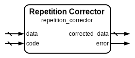

# Repetition Corrector

|         |                                                                                  |
| ------- | -------------------------------------------------------------------------------- |
| Module  | Repetition Corrector                                                             |
| Project | [OmniCores-BuildingBlocks](https://github.com/Louis-DR/OmniCores-BuildingBlocks) |
| Author  | Louis Duret-Robert - [louisduret@gmail.com](mailto:louisduret@gmail.com)         |
| Website | [louis-dr.github.io](https://louis-dr.github.io)                                 |
| License | MIT License - [mit-license.org](https://mit-license.org)                         |

## Overview

Detects and corrects errors in received data using majority voting among its repetition codes. This corrector can recover from single-bit errors by analyzing all repetitions and selecting the most common value for each bit position. The module is designed for systems where data and repetition codes are transmitted or stored separately and automatic error correction is required.

## Parameters

| Name         | Type    | Allowed Values | Default | Description                  |
| ------------ | ------- | -------------- | ------- | ---------------------------- |
| `DATA_WIDTH` | integer | `≥1`           | `8`     | Bit width of the input data. |
| `REPETITION` | integer | `≥2`           | `3`     | Number of data repetitions.  |

## Ports

| Name             | Direction | Width                       | Clock | Reset | Reset value | Description                  |
| ---------------- | --------- | --------------------------- | ----- | ----- | ----------- | ---------------------------- |
| `data`           | input     | `DATA_WIDTH`                |       |       |             | Received data to be checked. |
| `code`           | input     | `(REPETITION-1)×DATA_WIDTH` |       |       |             | Received repetition codes.   |
| `error`          | output    | 1                           |       |       |             | Error detection flag.        |
| `corrected_data` | output    | `DATA_WIDTH`                |       |       |             | Error-corrected output data. |

## Operation

The repetition corrector validates and corrects data integrity by reconstructing the complete repetition block from the received data and code components, then delegates both error detection and correction to the repetition block corrector module. The corrector uses majority voting to determine the correct value for each bit position across all repetitions.

For each bit position, the corrector counts the number of 1s and 0s across all repetitions and selects the majority value as the corrected bit. When all repetitions agree, no error is detected and the original data is output unchanged. When repetitions disagree, an error is flagged and the majority-voted corrected data is provided.

## Paths

| From   | To               | Type          | Comment                                      |
| ------ | ---------------- | ------------- | -------------------------------------------- |
| `data` | `error`          | combinatorial | Through internal repetition block corrector. |
| `code` | `error`          | combinatorial | Through internal repetition block corrector. |
| `data` | `corrected_data` | combinatorial | Through internal repetition block corrector. |
| `code` | `corrected_data` | combinatorial | Through internal repetition block corrector. |

## Complexity

| Delay  | Gates                      | Comment                                     |
| ------ | -------------------------- | ------------------------------------------- |
| `O(1)` | `O(REPETITION×DATA_WIDTH)` | Single level logic through block corrector. |

The corrector utilizes the repetition block corrector internally, inheriting its efficient majority voting logic implementation for fast error correction suitable for high-speed applications.

## Verification

The repetition corrector is verified using a comprehensive SystemVerilog testbench that validates both error detection and correction capabilities with various error patterns. The testbench instanciates and verifies all repetition modules.

The following table lists the checks performed by the testbench.

| Number | Check                               | Description                                                      |
| ------ | ----------------------------------- | ---------------------------------------------------------------- |
| 1      | Encoder exhaustive test             | Tests repetition generation for all possible input data values.  |
| 2      | Checker with correct repetition     | Verifies no false errors with matching data and repetitions.     |
| 3      | Checker with incorrect repetition   | Confirms error detection with mismatched data and repetitions.   |
| 4      | Block checker with correct blocks   | Verifies no false errors with valid repetition blocks.           |
| 5      | Block checker with incorrect blocks | Confirms error detection with corrupted repetition blocks.       |
| 6      | Complete encode-decode cycle        | Verifies end-to-end encoding and checking without errors.        |
| 7      | Single bit error detection          | Confirms single-bit errors are detectable in encoded blocks.     |
| 8      | Corrector with correct data         | Validates proper operation with uncorrupted repetition data.     |
| 9      | Corrector with single bit errors    | Tests error correction capabilities with single-bit corruptions. |
| 10     | Double bit error detection          | Verifies detection of uncorrectable double-bit errors.           |

The following table lists the parameter values verified by the testbench.

| `DATA_WIDTH` | `REPETITION` |           |
| ------------ | ------------ | --------- |
| 8            | 3            | (default) |

## Constraints

There are no synthesis and implementation constraints for this block.

## Deliverables

| Type              | File                                                                       | Description                                         |
| ----------------- | -------------------------------------------------------------------------- | --------------------------------------------------- |
| Design            | [`repetition_corrector.v`](repetition_corrector.v)                         | Verilog design.                                     |
| Testbench         | [`repetition.testbench.sv`](repetition.testbench.sv)                       | SystemVerilog verification shared testbench.        |
| Waveform script   | [`repetition.testbench.gtkw`](repetition.testbench.gtkw)                   | Script to load the waveforms in GTKWave.            |
| Symbol descriptor | [`repetition_corrector.symbol.sss`](repetition_corrector.symbol.sss)       | Symbol descriptor for SiliconSuite-SymbolGenerator. |
| Symbol image      | [`repetition_corrector.symbol.svg`](repetition_corrector.symbol.svg)       | Generated vector image of the symbol.               |
| Symbol shape      | [`repetition_corrector.symbol.drawio`](repetition_corrector.symbol.drawio) | Generated DrawIO shape of the symbol.               |
| Datasheet         | [`repetition_corrector.md`](repetition_corrector.md)                       | Markdown documentation datasheet.                   |

## Dependencies

| Module                                                        | Path                                                        | Comment |
| ------------------------------------------------------------- | ----------------------------------------------------------- | ------- |
| [`repetition_block_corrector`](repetition_block_corrector.md) | `omnicores-buildingblocks/sources/error_control/repetition` |         |

## Related modules

| Module                                                        | Path                                                        | Comment                                  |
| ------------------------------------------------------------- | ----------------------------------------------------------- | ---------------------------------------- |
| [`repetition_encoder`](repetition_encoder.md)                 | `omnicores-buildingblocks/sources/error_control/repetition` | Repetition encoder for generating codes. |
| [`repetition_checker`](repetition_checker.md)                 | `omnicores-buildingblocks/sources/error_control/repetition` | Variant with error detection only.       |
| [`repetition_block_corrector`](repetition_block_corrector.md) | `omnicores-buildingblocks/sources/error_control/repetition` | Variant for combined data and code.      |