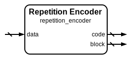

# Repetition Encoder

|         |                                                                                  |
| ------- | -------------------------------------------------------------------------------- |
| Module  | Repetition Encoder                                                               |
| Project | [OmniCores-BuildingBlocks](https://github.com/Louis-DR/OmniCores-BuildingBlocks) |
| Author  | Louis Duret-Robert - [louisduret@gmail.com](mailto:louisduret@gmail.com)         |
| Website | [louis-dr.github.io](https://louis-dr.github.io)                                 |
| License | MIT License - [mit-license.org](https://mit-license.org)                         |

## Overview

Duplicates input data according to the repetition parameter to create redundancy for error detection and correction. Repetition encoding is a fundamental error control technique that replicates data multiple times, enabling the detection and correction of single-bit errors through majority voting. This encoder supports configurable repetition factors, with odd values providing optimal error correction capabilities.

## Parameters

| Name         | Type    | Allowed Values | Default | Description                     |
| ------------ | ------- | -------------- | ------- | ------------------------------- |
| `DATA_WIDTH` | integer | `≥1`           | `8`     | Bit width of the input data.    |
| `REPETITION` | integer | `≥2`           | `3`     | Number of times to repeat data. |

## Ports

| Name    | Direction | Width                       | Clock | Reset | Reset value | Description                              |
| ------- | --------- | --------------------------- | ----- | ----- | ----------- | ---------------------------------------- |
| `data`  | input     | `DATA_WIDTH`                |       |       |             | Input data to be repetition encoded.     |
| `code`  | output    | `(REPETITION-1)×DATA_WIDTH` |       |       |             | Repetition code (additional copies).     |
| `block` | output    | `REPETITION×DATA_WIDTH`     |       |       |             | Complete repetition block (code + data). |

## Operation

The repetition encoder creates multiple identical copies of the input data to provide redundancy for error detection and correction. The module generates the required number of data repetitions by simply replicating the input data pattern. The original data occupies the least significant portion of the output block, while additional repetitions form the redundancy code.

The encoder produces two outputs: the repetition code containing the additional data copies for separate transmission or storage, and the complete repetition block that concatenates all repetitions for convenient handling as a unified error-protected data unit.

## Paths

| From   | To      | Type          | Comment                           |
| ------ | ------- | ------------- | --------------------------------- |
| `data` | `code`  | combinatorial | Direct replication of input data. |
| `data` | `block` | combinatorial | Concatenation with repetitions.   |

## Complexity

| Delay  | Gates  | Comment                                      |
| ------ | ------ | -------------------------------------------- |
| `O(0)` | `O(0)` | Direct routing and concatenation operations. |

The repetition encoding requires only direct routing and concatenation wiring, there is no real logic.

## Verification

The repetition encoder is verified using a comprehensive SystemVerilog testbench that validates the repetition generation correctness and integration with the checker and corrector modules. The testbench instanciates and verifies all repetition modules.

The following table lists the checks performed by the testbench.

| Number | Check                               | Description                                                      |
| ------ | ----------------------------------- | ---------------------------------------------------------------- |
| 1      | Encoder exhaustive test             | Tests repetition generation for all possible input data values.  |
| 2      | Checker with correct repetition     | Verifies no false errors with matching data and repetitions.     |
| 3      | Checker with incorrect repetition   | Confirms error detection with mismatched data and repetitions.   |
| 4      | Block checker with correct blocks   | Verifies no false errors with valid repetition blocks.           |
| 5      | Block checker with incorrect blocks | Confirms error detection with corrupted repetition blocks.       |
| 6      | Complete encode-decode cycle        | Verifies end-to-end encoding and checking without errors.        |
| 7      | Single bit error detection          | Confirms single-bit errors are detectable in encoded blocks.     |
| 8      | Corrector with correct data         | Validates proper operation with uncorrupted repetition data.     |
| 9      | Corrector with single bit errors    | Tests error correction capabilities with single-bit corruptions. |
| 10     | Double bit error detection          | Verifies detection of uncorrectable double-bit errors.           |

The following table lists the parameter values verified by the testbench.

| `DATA_WIDTH` | `REPETITION` |           |
| ------------ | ------------ | --------- |
| 8            | 3            | (default) |

## Constraints

There are no synthesis and implementation constraints for this block.

## Deliverables

| Type              | File                                                             | Description                                         |
| ----------------- | ---------------------------------------------------------------- | --------------------------------------------------- |
| Design            | [`repetition_encoder.v`](repetition_encoder.v)                   | Verilog design.                                     |
| Testbench         | [`repetition.testbench.sv`](repetition.testbench.sv)             | SystemVerilog verification shared testbench.        |
| Waveform script   | [`repetition.testbench.gtkw`](repetition.testbench.gtkw)         | Script to load the waveforms in GTKWave.            |
| Symbol descriptor | [`repetition_encoder.symbol.sss`](repetition_encoder.symbol.sss) | Symbol descriptor for SiliconSuite-SymbolGenerator. |
| Symbol image      | [`repetition_encoder.symbol.svg`](repetition_encoder.symbol.svg) | Generated vector image of the symbol.               |
| Datasheet         | [`repetition_encoder.md`](repetition_encoder.md)                 | Markdown documentation datasheet.                   |

## Dependencies

This module has no external module dependencies.

## Related modules

| Module                                                        | Path                                                        | Comment                                      |
| ------------------------------------------------------------- | ----------------------------------------------------------- | -------------------------------------------- |
| [`repetition_checker`](repetition_checker.md)                 | `omnicores-buildingblocks/sources/error_control/repetition` | Repetition checker for data and code inputs. |
| [`repetition_corrector`](repetition_corrector.md)             | `omnicores-buildingblocks/sources/error_control/repetition` | Repetition corrector with error correction.  |
| [`repetition_block_checker`](repetition_block_checker.md)     | `omnicores-buildingblocks/sources/error_control/repetition` | Repetition checker for complete blocks.      |
| [`repetition_block_corrector`](repetition_block_corrector.md) | `omnicores-buildingblocks/sources/error_control/repetition` | Repetition corrector for complete blocks.    |