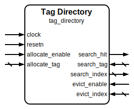

# Tag Directory

|         |                                                                                  |
| ------- | -------------------------------------------------------------------------------- |
| Module  | Tag Directory                                                                    |
| Project | [OmniCores-BuildingBlocks](https://github.com/Louis-DR/OmniCores-BuildingBlocks) |
| Author  | Louis Duret-Robert - [louisduret@gmail.com](mailto:louisduret@gmail.com)         |
| Website | [louis-dr.github.io](https://louis-dr.github.io)                                 |
| License | MIT License - [mit-license.org](https://mit-license.org)                         |

## Overview

A directory in which tags can be allocated, searched for, and evicted. It can be used to implement a content-addressable memory or a simple cache.

When the directory is not full, the allocation interface can be used to write a tag to the first free slot and get the corresponding index.

Searching a tag in the directory using the search interface can result in a hit or a miss. In case of a hit, the index of the first matching tag in the directory is returned.

The eviction interface is used to invalidate and free the slot at a specified index.

## Parameters

| Name    | Type    | Allowed Values | Default | Description                         |
| ------- | ------- | -------------- | ------- | ----------------------------------- |
| `WIDTH` | integer | `≥1`           | `8`     | Bit width of the tag vector.        |
| `DEPTH` | integer | `≥2`           | `16`    | Number of entries in the directory. |

## Ports

| Name              | Direction | Width         | Clock   | Reset    | Reset value | Description                                                                            |
| ----------------- | --------- | ------------- | ------- | -------- | ----------- | -------------------------------------------------------------------------------------- |
| `clock`           | input     | 1             | self    |          |             | Clock signal.                                                                          |
| `resetn`          | input     | 1             | `clock` | self     | active-low  | Asynchronous active-low reset.                                                         |
| `full`            | output    | 1             | `clock` | `resetn` | `0`         | Directory full status. `0`: Directory has free space. `1`: Directory is full.  |
| `empty`           | output    | 1             | `clock` | `resetn` | `1`         | Directory empty status. `0`: Directory contains data. `1`: Directory is empty. |
| `allocate_enable` | input     | 1             | `clock` |          |             | Allocate enable signal. `0`: Idle. `1`: Allocate a new tag.                    |
| `allocate_tag`    | input     | `WIDTH`       | `clock` |          |             | Tag to be written to the directory.                                                    |
| `allocate_index`  | output    | `INDEX_WIDTH` | `clock` |          |             | Index of the newly allocated tag.                                                      |
| `search_tag`      | input     | `WIDTH`       | `clock` |          |             | Tag to be searched for in the directory.                                               |
| `search_index`    | output    | `INDEX_WIDTH` | `clock` |          |             | Index of the first matching tag found.                                                 |
| `search_hit`      | output    | 1             | `clock` |          |             | Search hit status. `0`: No match found (miss). `1`: Match found (hit).         |
| `evict_enable`    | input     | 1             | `clock` |          |             | Evict enable signal. `0`: Idle. `1`: Evict a tag.                              |
| `evict_index`     | input     | `INDEX_WIDTH` | `clock` |          |             | Index of the tag to be evicted.                                                        |

## Operation

The tag directory manages entries using an internal `memory` array for tags and a `valid` bit-vector to track occupied slots.

For **allocation**, when `allocate_enable` is asserted and the directory is not full, `allocate_tag` is written to the first free slot, which is found using a priority encoder. The index of this new entry is provided on `allocate_index`.

For **searching**, the module performs a fully parallel search. A combinational vector of matching entries is generated by comparing `search_tag` against all valid tags in the memory. A priority encoder then finds the first match in this vector, and its index is driven on `search_index`. The `search_hit` signal is asserted if any match is found.

For **eviction**, asserting `evict_enable` invalidates the entry at `evict_index` by clearing its corresponding `valid` bit.

If `allocate_enable` and `evict_enable` are asserted in the same cycle for the same index, the eviction takes precedence.

If the same tag is allocated twice and written at different indicies, the search operation will return the first match.

## Paths

| From              | To                           | Type          | Comment                                                                        |
| ----------------- | ---------------------------- | ------------- | ------------------------------------------------------------------------------ |
| `allocate_enable` | `full`, `empty`              | sequential    | Control path through the `valid` register.                                     |
| `allocate_enable` | `search_index`, `search_hit` | sequential    | Control path through the `memory` tag array and `valid` register.              |
| `allocate_tag`    | `search_index`, `search_hit` | sequential    | Control path through the `memory` tag array.                                   |
| `search_tag`      | `search_index`, `search_hit` | combinational | Combinational parallel search through the `memory` array and `valid` register. |
| `evict_enable`    | `full`, `empty`              | sequential    | Control path through the `valid` register.                                     |
| `evict_index`     | `full`, `empty`              | sequential    | Control path through the `valid` register.                                     |

## Complexity

| Delay           | Gates              | Comment                                                       |
| --------------- | ------------------ | ------------------------------------------------------------- |
| `O(log₂ DEPTH)` | `O(DEPTH × WIDTH)` | Critical path is the search logic (comparators and encoders). |

The module requires `DEPTH × WIDTH` flip-flops for the tag memory array and `DEPTH` flip-flops for the valid bits.

## Verification

The tag directory is verified using a SystemVerilog testbench with six check sequences that validate all operations and data integrity under various conditions.

The following table lists the checks performed by the testbench.

| Number | Check                   | Description                                                                                                  |
| ------ | ----------------------- | ------------------------------------------------------------------------------------------------------------ |
| 1      | Allocate once           | Allocates a single entry, verifies flags, and performs a full search to check hit/miss logic.                |
| 2      | Evict once              | Evicts the single entry, verifies flags, and performs a full search to confirm it is gone.                   |
| 3      | Allocate all            | Fills the directory completely and verifies flags and search functionality.                                  |
| 4      | Evict all               | Empties the directory completely and verifies flags and search functionality.                                |
| 5      | Simultaneous operations | Concurrently allocates, searches, and evicts entries to test for race conditions and correct prioritization. |
| 6      | Random stimulus         | Performs a randomized sequence of all operations to verify robustness.                                       |

The following table lists the parameter values verified by the testbench.

| `WIDTH` | `DEPTH` |           |
| ------- | ------- | --------- |
| 8       | 16      | (default) |

## Constraints

There are no specific synthesis or implementation constraints for this block.

## Deliverables

| Type              | File                                                           | Description                                         |
| ----------------- | -------------------------------------------------------------- | --------------------------------------------------- |
| Design            | [`tag_directory.sv`](tag_directory.sv)                         | Verilog design file.                                |
| Testbench         | [`tag_directory.testbench.sv`](tag_directory.testbench.sv)     | SystemVerilog verification testbench.               |
| Waveform script   | [`tag_directory.testbench.gtkw`](tag_directory.testbench.gtkw) | Script to load the waveforms in GTKWave.            |
| Symbol descriptor | [`tag_directory.symbol.sss`](tag_directory.symbol.sss)         | Symbol descriptor for SiliconSuite-SymbolGenerator. |
| Symbol image      | [`tag_directory.symbol.svg`](tag_directory.symbol.svg)         | Generated vector image of the symbol.               |
| Symbol shape      | [`tag_directory.symbol.drawio`](tag_directory.symbol.drawio)   | Generated DrawIO shape of the symbol.               |
| Datasheet         | [`tag_directory.md`](tag_directory.md)                         | Markdown documentation datasheet.                   |

## Dependencies

| Module                                                          | Path                                                    | Comment                               |
| --------------------------------------------------------------- | ------------------------------------------------------- | ------------------------------------- |
| [`first_one`](../../operations/first_one/first_one.md)          | `omnicores-buildingblocks/sources/operations/first_one` | Used for allocation and search logic. |
| [`onehot_to_binary`](../../encoding/onehot/onehot_to_binary.md) | `omnicores-buildingblocks/sources/encoding/onehot`      | Used for allocation and search logic. |

## Related modules

| Module                                                                                           | Path                                                                          | Comment                                                                      |
| ------------------------------------------------------------------------------------------------ | ----------------------------------------------------------------------------- | ---------------------------------------------------------------------------- |
| [`simple_dual_port_ram`](../simple_dual_port_ram/simple_dual_port_ram.md)                        | `omnicores-buildingblocks/sources/memory/simple_dual_port_ram`                | Standard memory module, accessed by address instead of content.              |
| [`reorder_buffer`](../../data/valid_ready/reorder_buffer/reorder_buffer.md)                      | `omnicores-buildingblocks/sources/data/valid_ready/reorder_buffer`            | Buffer with in-order allocation, out-of-order writing, and in-order reading. |
| [`out_of_order_buffer`](../../data/read_write_enable/out_of_order_buffer/out_of_order_buffer.md) | `omnicores-buildingblocks/sources/data/read_write_enable/out_of_order_buffer` | Buffer with in-order writing and out-of-order reading.                       |
