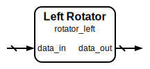

# Left Rotator

|         |                                                                                  |
| ------- | -------------------------------------------------------------------------------- |
| Module  | Left Rotator                                                                     |
| Project | [OmniCores-BuildingBlocks](https://github.com/Louis-DR/OmniCores-BuildingBlocks) |
| Author  | Louis Duret-Robert - [louisduret@gmail.com](mailto:louisduret@gmail.com)         |
| Website | [louis-dr.github.io](https://louis-dr.github.io)                                 |
| License | MIT License - https://mit-license.org/                                           |

## Overview

Rotates an input vector `data_in` to the left by a static number of bits specified by the `ROTATION` parameter. The bits shifted out from the most significant bit (MSB) are wrapped around to the least significant bit (LSB).

## Parameters

| Name       | Type    | Allowed Values | Default | Description                                                                                                   |
| ---------- | ------- | -------------- | ------- | ------------------------------------------------------------------------------------------------------------- |
| `WIDTH`    | integer | `>0`           | `8`     | Bit width of the data vector.                                                                                 |
| `ROTATION` | integer | `≥0`           | `1`     | Number of bit positions to rotate to the left. Rotation by `WIDTH` or more is effectively `ROTATION % WIDTH`. |

## Ports

| Name       | Direction | Width   | Clock        | Reset | Reset value | Description                      |
| ---------- | --------- | ------- | ------------ | ----- | ----------- | -------------------------------- |
| `data_in`  | input     | `WIDTH` | asynchronous |       |             | Input data vector to be rotated. |
| `data_out` | output    | `WIDTH` | asynchronous |       |             | Left-rotated output data vector. |

## Operation

The module performs a left circular rotation of the `data_in` vector by `ROTATION` bit positions. This is implemented within a Verilog function by first creating a `2*WIDTH`-bit temporary vector, `data_extended`, by concatenating `data_in` with itself (`{data_in, data_in}`). The final `data_out` is then obtained by selecting `WIDTH` bits from `data_extended` starting at bit position `WIDTH - (ROTATION % WIDTH)`.

## Paths

| From      | To         | Type          | Comment                                                 |
| --------- | ---------- | ------------- | ------------------------------------------------------- |
| `data_in` | `data_out` | combinational | No logic, only reordering of the bits within the vector |

## Complexity

The operation is only a static reordering of the bits within the vector. Therefore, this module is zero-cost.

## Verification

The `rotator_left` module is verified using a SystemVerilog testbench. A top-level testbench, `rotator_left.tb.sv`, instantiates the testcase module, `rotator_left.tc.sv`, once for each parameter set configured.

The large number of parameter sets (`WIDTH` and `ROTATION`) ensure a broad coverage of the functionality of the module. Due to limitations of sime simulators like IcarusVerilog not supporting parameter arrays, the testbench is instead templatized using Jinja2 and rendered with J2GPP. The template contains the configuration of the parameter ranges to be tested.

The `rotator_left.tc.sv` module performs one of the following checks for each parameter set:
- **Exhaustive Check**: If `WIDTH≤10`, all possible values of `data_in` are checked.
- **Random Stimulus Check**: For larger `WIDTH` values, a total of 1024 random `data_in` values are generated and checked.

## Constraints

There are no synthesis and implementation constraints for this block.

## Deliverables

| Type              | File                                           | Description                                         |
| ----------------- | ---------------------------------------------- | --------------------------------------------------- |
| Design            | [`rotator_left.v`](rotator_left.v)             | Verilog design file.                                |
| Testbench (Top)   | [`rotator_left.tb.sv`](rotator_left.tb.sv)     | Top-level SystemVerilog testbench.                  |
| Testcase          | [`rotator_left.tc.sv`](rotator_left.tc.sv)     | Generic SystemVerilog testcase.                     |
| Waveform script   | [`rotator_left.tb.gtkw`](rotator_left.tb.gtkw) | Script to load waveforms in GTKWave (assumed).      |
| Symbol descriptor | [`rotator_left.sss`](rotator_left.sss)         | Symbol descriptor for SiliconSuite-SymbolGenerator. |
| Symbol image      | [`rotator_left.svg`](rotator_left.svg)         | Generated vector image of the symbol.               |
| Datasheet         | [`rotator_left.md`](rotator_left.md)           | Markdown documentation datasheet (this file).       |

## Dependencies

This module has no external module dependencies.

## Related modules

| Module                                                                    | Path                                                               | Comment                                    |
| ------------------------------------------------------------------------- | ------------------------------------------------------------------ | ------------------------------------------ |
| [`barrel_rotator_left`](../barrel_rotator_left/barrel_rotator_left.md)    | `omnicores-buildingblocks/sources/operations/barrel_rotator_left`  | Barrel rotator for dynamic left rotation.  |
| [`barrel_rotator_right`](../barrel_rotator_right/barrel_rotator_right.md) | `omnicores-buildingblocks/sources/operations/barrel_rotator_right` | Barrel rotator for dynamic right rotation. |
| [`barrel_shifter_left`](../barrel_shifter_left/barrel_shifter_left.md)    | `omnicores-buildingblocks/sources/operations/barrel_shifter_left`  | Barrel shifter for dynamic left shift.     |
| [`barrel_shifter_right`](../barrel_shifter_right/barrel_shifter_right.md) | `omnicores-buildingblocks/sources/operations/barrel_shifter_right` | Barrel shifter for dynamic right shift.    |
