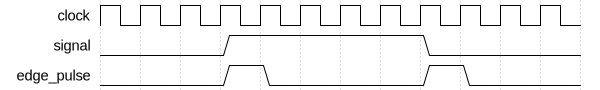

# Edge Detector

|         |                                                                                  |
| ------- | -------------------------------------------------------------------------------- |
| Module  | Edge Detector                                                                    |
| Project | [OmniCores-BuildingBlocks](https://github.com/Louis-DR/OmniCores-BuildingBlocks) |
| Author  | Louis Duret-Robert - [louisduret@gmail.com](mailto:louisduret@gmail.com)         |
| Website | [louis-dr.github.io](https://louis-dr.github.io)                                 |
| License | MIT License - [mit-license.org](https://mit-license.org)                         |

## Overview

Synchronous edge detector that generates a single-cycle pulse on both the rising and falling edges of an input signal. It provides reliable edge detection with one clock cycle latency, making it suitable for event detection and pulse generation applications.

## Parameters

This module has no parameters.

## Ports

| Name         | Direction | Width | Clock        | Reset    | Reset value | Description                                                                                 |
| ------------ | --------- | ----- | ------------ | -------- | ----------- | ------------------------------------------------------------------------------------------- |
| `clock`      | input     | 1     | self         |          |             | Clock signal.                                                                               |
| `resetn`     | input     | 1     | asynchronous | self     | active-low  | Asynchronous active-low reset.                                                              |
| `signal`     | input     | 1     | `clock`      |          |             | Input signal to detect edges on.                                                            |
| `edge_pulse` | output    | 1     | `clock`      | `resetn` | `0`         | Edge detection output. `0`: no edge detected. `1`: rising or falling edge detected. |

## Operation

The edge detector operates by maintaining a registered copy of the input signal from the previous clock cycle. On each rising edge of the clock, the current input signal is compared with the previous value using XOR logic. When the current and previous values differ, indicating either a rising or falling edge, a single-cycle pulse is generated on the `edge_pulse` output.

The module has a one clock cycle latency between the input signal transition and the output pulse generation. This latency is inherent to the synchronous operation and ensures reliable edge detection synchronized to the clock domain.

During reset, the internal previous signal register is cleared to 0, ensuring a known initial state. If the input signal is high when coming out of reset, this will be detected as a rising edge on the first active clock cycle.

## Paths

| From     | To           | Type          | Comment                   |
| -------- | ------------ | ------------- | ------------------------- |
| `signal` | `edge_pulse` | sequential    | Through delay register.   |
| `signal` | `edge_pulse` | combinational | Through comparison logic. |

## Complexity

| Delay  | Gates  | Comment                                        |
| ------ | ------ | ---------------------------------------------- |
| `O(1)` | `O(1)` | Single XOR gate and one flip-flop for storage. |

The critical timing path consists of the XOR gate delay, making this a very fast operation. The module requires minimal hardware resources: one flip-flop for the signal delay and one XOR gate for edge detection.

## Verification

The edge detector is verified using a SystemVerilog testbench with five check sequences that validate the edge detection functionality under various conditions.

The following table lists the checks performed by the testbench.

| Number | Check                  | Description                                                                           |
| ------ | ---------------------- | ------------------------------------------------------------------------------------- |
| 1      | Reset state            | Verifies the state after reset.                                                       |
| 2      | Rising edge detection  | Tests that a rising edge generates a single-cycle pulse.                              |
| 3      | Falling edge detection | Tests that a falling edge generates a single-cycle pulse.                             |
| 4      | Consecutive edges      | Verifies proper operation with rapid alternating signal transitions.                  |
| 5      | Random stimulus        | Performs random signal changes and verifies edge detection against expected behavior. |

## Constraints

There are no specific synthesis or implementation constraints for this block.

## Deliverables

| Type              | File                                                           | Description                                         |
| ----------------- | -------------------------------------------------------------- | --------------------------------------------------- |
| Design            | [`edge_detector.v`](edge_detector.v)                           | Verilog design.                                     |
| Testbench         | [`edge_detector.testbench.sv`](edge_detector.testbench.sv)     | SystemVerilog verification testbench.               |
| Waveform script   | [`edge_detector.testbench.gtkw`](edge_detector.testbench.gtkw) | Script to load the waveforms in GTKWave.            |
| Symbol descriptor | [`edge_detector.symbol.sss`](edge_detector.symbol.sss)         | Symbol descriptor for SiliconSuite-SymbolGenerator. |
| Symbol image      | [`edge_detector.symbol.svg`](edge_detector.symbol.svg)         | Generated vector image of the symbol.               |
| Datasheet         | [`edge_detector.md`](edge_detector.md)                         | Markdown documentation datasheet.                   |

## Dependencies

This module has no external module dependencies.

## Related modules

| Module                                                                       | Path                                                           | Comment                                                          |
| ---------------------------------------------------------------------------- | -------------------------------------------------------------- | ---------------------------------------------------------------- |
| [`rising_edge_detector`](../rising_edge_detector/rising_edge_detector.md)    | `omnicores-buildingblocks/sources/pulse/rising_edge_detector`  | Edge detector variant for rising edges only.                     |
| [`falling_edge_detector`](../falling_edge_detector/falling_edge_detector.md) | `omnicores-buildingblocks/sources/pulse/falling_edge_detector` | Edge detector variant for falling edges only.                    |
| [`multi_edge_detector`](../multi_edge_detector/multi_edge_detector.md)       | `omnicores-buildingblocks/sources/pulse/multi_edge_detector`   | Edge detector with separate output for rising and falling edges. |
