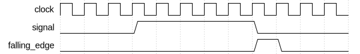

# Falling Edge Detector

|         |                                                                                  |
| ------- | -------------------------------------------------------------------------------- |
| Module  | Falling Edge Detector                                                            |
| Project | [OmniCores-BuildingBlocks](https://github.com/Louis-DR/OmniCores-BuildingBlocks) |
| Author  | Louis Duret-Robert - [louisduret@gmail.com](mailto:louisduret@gmail.com)         |
| Website | [louis-dr.github.io](https://louis-dr.github.io)                                 |
| License | MIT License - [mit-license.org](https://mit-license.org)                         |

## Overview

Synchronous edge detector that generates a single-cycle pulse exclusively on the falling edges of an input signal. It provides reliable falling edge detection with one clock cycle latency, making it suitable for event detection and synchronization applications.

## Parameters

This module has no parameters.

## Ports

| Name           | Direction | Width | Clock        | Reset    | Reset value | Description                                                                              |
| -------------- | --------- | ----- | ------------ | -------- | ----------- | ---------------------------------------------------------------------------------------- |
| `clock`        | input     | 1     | self         |          |             | Clock signal.                                                                            |
| `resetn`       | input     | 1     | asynchronous | self     | active-low  | Asynchronous active-low reset.                                                           |
| `signal`       | input     | 1     | `clock`      |          |             | Input signal to detect falling edges on.                                                 |
| `falling_edge` | output    | 1     | `clock`      | `resetn` | `0`         | Falling edge detection output. `0`: no falling edge. `1`: falling edge detected. |

## Operation

The falling edge detector operates by maintaining a registered copy of the input signal from the previous clock cycle. On each rising edge of the clock, the current input signal is compared with the previous value using AND logic with inverted current signal. When the current signal is low and the previous signal was high, indicating a falling edge, a single-cycle pulse is generated on the `falling_edge` output.

The module has a one clock cycle latency between the input signal transition and the output pulse generation. This latency is inherent to the synchronous operation and ensures reliable edge detection synchronized to the clock domain.

During reset, the internal previous signal register is cleared to 0, ensuring a known initial state. Since both current and previous signals would be low after reset, no falling edge will be detected until the signal transitions high and then low again.

## Paths

| From     | To             | Type          | Comment                   |
| -------- | -------------- | ------------- | ------------------------- |
| `signal` | `falling_edge` | sequential    | Through delay register.   |
| `signal` | `falling_edge` | combinational | Through comparison logic. |

## Complexity

| Delay  | Gates  | Comment                                        |
| ------ | ------ | ---------------------------------------------- |
| `O(1)` | `O(1)` | Single AND gate and one flip-flop for storage. |

The critical timing path consists of the AND gate delay, making this a very fast operation. The module requires minimal hardware resources: one flip-flop for the signal delay and one AND gate for falling edge detection.

## Verification

The falling edge detector is verified using a SystemVerilog testbench with five check sequences that validate the falling edge detection functionality under various conditions.

The following table lists the checks performed by the testbench.

| Number | Check                       | Description                                                                           |
| ------ | --------------------------- | ------------------------------------------------------------------------------------- |
| 1      | Reset state                 | Verifies the state after reset.                                                       |
| 2      | No detection on rising edge | Tests that a rising edge does not generate any pulse.                                 |
| 3      | Falling edge detection      | Tests that a falling edge generates a single-cycle pulse.                             |
| 4      | Consecutive rising edges    | Verifies proper operation with alternating signal transitions.                        |
| 5      | Random stimulus             | Performs random signal changes and verifies edge detection against expected behavior. |

## Constraints

There are no specific synthesis or implementation constraints for this block.

## Deliverables

| Type              | File                                                                           | Description                                         |
| ----------------- | ------------------------------------------------------------------------------ | --------------------------------------------------- |
| Design            | [`falling_edge_detector.v`](falling_edge_detector.v)                           | Verilog design.                                     |
| Testbench         | [`falling_edge_detector.testbench.sv`](falling_edge_detector.testbench.sv)     | SystemVerilog verification testbench.               |
| Waveform script   | [`falling_edge_detector.testbench.gtkw`](falling_edge_detector.testbench.gtkw) | Script to load the waveforms in GTKWave.            |
| Symbol descriptor | [`falling_edge_detector.symbol.sss`](falling_edge_detector.symbol.sss)         | Symbol descriptor for SiliconSuite-SymbolGenerator. |
| Symbol image      | [`falling_edge_detector.symbol.svg`](falling_edge_detector.symbol.svg)         | Generated vector image of the symbol.               |
| Datasheet         | [`falling_edge_detector.md`](falling_edge_detector.md)                         | Markdown documentation datasheet.                   |

## Dependencies

This module has no external module dependencies.

## Related modules

| Module                                                                    | Path                                                          | Comment                                                          |
| ------------------------------------------------------------------------- | ------------------------------------------------------------- | ---------------------------------------------------------------- |
| [`edge_detector`](../edge_detector/edge_detector.md)                      | `omnicores-buildingblocks/sources/pulse/edge_detector`        | Edge detector for both rising and falling edges.                 |
| [`rising_edge_detector`](../rising_edge_detector/rising_edge_detector.md) | `omnicores-buildingblocks/sources/pulse/rising_edge_detector` | Edge detector variant for rising edges only.                     |
| [`multi_edge_detector`](../multi_edge_detector/multi_edge_detector.md)    | `omnicores-buildingblocks/sources/pulse/multi_edge_detector`  | Edge detector with separate output for rising and falling edges. |
