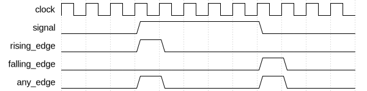

# Multi Edge Detector

|         |                                                                                  |
| ------- | -------------------------------------------------------------------------------- |
| Module  | Multi Edge Detector                                                              |
| Project | [OmniCores-BuildingBlocks](https://github.com/Louis-DR/OmniCores-BuildingBlocks) |
| Author  | Louis Duret-Robert - [louisduret@gmail.com](mailto:louisduret@gmail.com)         |
| Website | [louis-dr.github.io](https://louis-dr.github.io)                                 |
| License | MIT License - [mit-license.org](https://mit-license.org)                         |

## Overview

Synchronous edge detector that generates separate single-cycle pulses for rising edges, falling edges, as well as a combined any edge pulse for an input signal. It provides comprehensive edge detection with one clock cycle latency, making it suitable for applications requiring separate handling of different edge types.

## Parameters

This module has no parameters.

## Ports

| Name           | Direction | Width | Clock        | Reset    | Reset value | Description                                                                              |
| -------------- | --------- | ----- | ------------ | -------- | ----------- | ---------------------------------------------------------------------------------------- |
| `clock`        | input     | 1     | self         |          |             | Clock signal.                                                                            |
| `resetn`       | input     | 1     | asynchronous | self     | active-low  | Asynchronous active-low reset.                                                           |
| `signal`       | input     | 1     | `clock`      |          |             | Input signal to detect edges on.                                                         |
| `any_edge`     | output    | 1     | `clock`      | `resetn` | `0`         | Any edge detection output. `0`: no edge. `1`: rising or falling edge detected.   |
| `rising_edge`  | output    | 1     | `clock`      | `resetn` | `0`         | Rising edge detection output. `0`: no rising edge. `1`: rising edge detected.    |
| `falling_edge` | output    | 1     | `clock`      | `resetn` | `0`         | Falling edge detection output. `0`: no falling edge. `1`: falling edge detected. |

## Operation

The multi edge detector operates by maintaining a registered copy of the input signal from the previous clock cycle. On each rising edge of the clock, the current input signal is compared with the previous value using three different logic operations:

- **Any edge detection**: Uses XOR logic to detect any transition (rising or falling).
- **Rising edge detection**: Uses AND logic with inverted previous signal to detect only rising transitions.
- **Falling edge detection**: Uses AND logic with inverted current signal to detect only falling transitions.

The module has a one clock cycle latency between the input signal transition and the output pulse generation. This latency is inherent to the synchronous operation and ensures reliable edge detection synchronized to the clock domain.

During reset, the internal previous signal register is cleared to 0, ensuring a known initial state. If the input signal is high when coming out of reset, this will be detected as a rising edge on the first active clock cycle.

## Paths

| From     | To             | Type          | Comment                   |
| -------- | -------------- | ------------- | ------------------------- |
| `signal` | `any_edge`     | sequential    | Through delay register.   |
| `signal` | `any_edge`     | combinational | Through comparison logic. |
| `signal` | `rising_edge`  | sequential    | Through delay register.   |
| `signal` | `rising_edge`  | combinational | Through comparison logic. |
| `signal` | `falling_edge` | sequential    | Through delay register.   |
| `signal` | `falling_edge` | combinational | Through comparison logic. |

## Complexity

| Delay  | Gates  | Comment                                                     |
| ------ | ------ | ----------------------------------------------------------- |
| `O(1)` | `O(1)` | One XOR gate, two AND gates, and one flip-flop for storage. |

The critical timing path consists of the logic gate delays, making this a very fast operation. The module requires minimal hardware resources: one flip-flop for the signal delay and three logic gates for the different edge detection operations.

## Verification

The multi edge detector is verified using a SystemVerilog testbench with five check sequences that validate the edge detection functionality under various conditions.

The following table lists the checks performed by the testbench.

| Number | Check                  | Description                                                                           |
| ------ | ---------------------- | ------------------------------------------------------------------------------------- |
| 1      | Reset state            | Verifies the state after reset.                                                       |
| 2      | Rising edge detection  | Tests that a rising edge generates pulses on rising_edge and any_edge outputs.        |
| 3      | Falling edge detection | Tests that a falling edge generates pulses on falling_edge and any_edge outputs.      |
| 4      | Consecutive edges      | Verifies proper operation with rapid alternating signal transitions.                  |
| 5      | Random stimulus        | Performs random signal changes and verifies edge detection against expected behavior. |

## Constraints

There are no specific synthesis or implementation constraints for this block.

## Deliverables

| Type                | File                                                                       | Description                                         |
| ------------------- | -------------------------------------------------------------------------- | --------------------------------------------------- |
| Design              | [`multi_edge_detector.v`](multi_edge_detector.v)                           | Verilog design.                                     |
| Testbench           | [`multi_edge_detector.testbench.sv`](multi_edge_detector.testbench.sv)     | SystemVerilog verification testbench.               |
| Waveform script     | [`multi_edge_detector.testbench.gtkw`](multi_edge_detector.testbench.gtkw) | Script to load the waveforms in GTKWave.            |
| Symbol descriptor   | [`multi_edge_detector.symbol.sss`](multi_edge_detector.symbol.sss)         | Symbol descriptor for SiliconSuite-SymbolGenerator. |
| Symbol image        | [`multi_edge_detector.symbol.svg`](multi_edge_detector.symbol.svg)         | Generated vector image of the symbol.               |
| Symbol shape        | [`multi_edge_detector.symbol.drawio`](multi_edge_detector.symbol.drawio)   | Generated DrawIO shape of the symbol.               |
| Waveform descriptor | [`multi_edge_detector.wavedrom.json`](multi_edge_detector.wavedrom.json)   | Waveform descriptor for Wavedrom.                   |
| Waveform image      | [`multi_edge_detector.wavedrom.svg`](multi_edge_detector.wavedrom.svg)     | Generated image of the waveform.                    |
| Datasheet           | [`multi_edge_detector.md`](multi_edge_detector.md)                         | Markdown documentation datasheet.                   |

## Dependencies

This module has no external module dependencies.

## Related modules

| Module                                                                       | Path                                                           | Comment                                                   |
| ---------------------------------------------------------------------------- | -------------------------------------------------------------- | --------------------------------------------------------- |
| [`edge_detector`](../edge_detector/edge_detector.md)                         | `omnicores-buildingblocks/sources/pulse/edge_detector`         | Edge detector for both rising and falling edges combined. |
| [`rising_edge_detector`](../rising_edge_detector/rising_edge_detector.md)    | `omnicores-buildingblocks/sources/pulse/rising_edge_detector`  | Edge detector variant for rising edges only.              |
| [`falling_edge_detector`](../falling_edge_detector/falling_edge_detector.md) | `omnicores-buildingblocks/sources/pulse/falling_edge_detector` | Edge detector variant for falling edges only.             |
