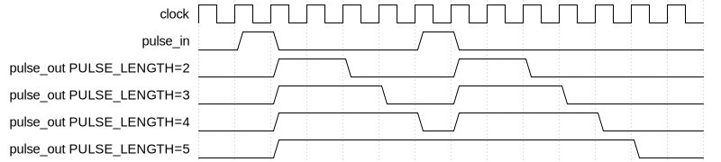

# Pulse Extender

|         |                                                                                  |
| ------- | -------------------------------------------------------------------------------- |
| Module  | Pulse Extender                                                                   |
| Project | [OmniCores-BuildingBlocks](https://github.com/Louis-DR/OmniCores-BuildingBlocks) |
| Author  | Louis Duret-Robert - [louisduret@gmail.com](mailto:louisduret@gmail.com)         |
| Website | [louis-dr.github.io](https://louis-dr.github.io)                                 |
| License | MIT License - [mit-license.org](https://mit-license.org)                         |

## Overview

Pulse extender that forwards input pulses and extends their duration to a configurable number of clock cycles. It ensures that all output pulses have a minimum duration regardless of the input pulse width, making it suitable for pulse conditioning and timing control applications. If another pulse occurs while the pulse extender is still outputing a pulse, then the internal counter is reset and the output pulse is extended even more, but it will not output two separate pulse.

## Parameters

| Name           | Type    | Allowed Values | Default | Description                                     |
| -------------- | ------- | -------------- | ------- | ----------------------------------------------- |
| `PULSE_LENGTH` | integer | `≥1`           | `2`     | Duration of the extended pulse in clock cycles. |

## Ports

| Name        | Direction | Width | Clock        | Reset    | Reset value | Description                        |
| ----------- | --------- | ----- | ------------ | -------- | ----------- | ---------------------------------- |
| `clock`     | input     | 1     | self         |          |             | Clock signal.                      |
| `resetn`    | input     | 1     | asynchronous | self     | active-low  | Asynchronous active-low reset.     |
| `pulse_in`  | input     | 1     | `clock`      |          |             | Input pulse signal to be extended. |
| `pulse_out` | output    | 1     | `clock`      | `resetn` | `0`         | Extended pulse output.             |

## Operation

The pulse extender operates using an internal countdown that tracks the remaining duration of the current output pulse. When an input pulse is detected (transition to high), the counter is loaded with the `PULSE_LENGTH` parameter value, and the output pulse becomes active. The counter decrements on each clock cycle while non-zero, keeping the output pulse active. When the counter reaches zero, the output pulse goes inactive.

If a new input pulse arrives while the output is already active, the counter is reloaded, effectively extending or restarting the output pulse duration.

## Paths

| From       | To          | Type       | Comment                |
| ---------- | ----------- | ---------- | ---------------------- |
| `pulse_in` | `pulse_out` | sequential | Through counter logic. |

## Complexity

| Delay                  | Gates                  | Comment                                                   |
| ---------------------- | ---------------------- | --------------------------------------------------------- |
| `O(log₂ PULSE_LENGTH)` | `O(log₂ PULSE_LENGTH)` | Counter register and comparison logic for zero detection. |

The critical timing path consists of the counter comparison and output generation logic. The module requires `⌈log₂(PULSE_LENGTH+1)⌉` flip-flops for the counter register plus associated increment/decrement and comparison logic.

## Verification

The pulse extender is verified using a SystemVerilog testbench with four check sequences that validate the pulse extension functionality under various conditions.

The following table lists the checks performed by the testbench.

| Number | Check                        | Description                                                                      |
| ------ | ---------------------------- | -------------------------------------------------------------------------------- |
| 1      | Single one-cycle pulse       | Tests that a single-cycle input pulse generates an extended output pulse.        |
| 2      | Single multi-cycle pulse     | Tests that a multi-cycle input pulse generates a properly extended output pulse. |
| 3      | Multiple single-cycle pulses | Tests multiple short input pulses and verifies proper pulse extension behavior.  |
| 4      | Random stimulus              | Performs random input pulse generation and verifies correct extension behavior.  |

The following table lists the parameter values verified by the testbench.

| `PULSE_LENGTH` |           |
| -------------- | --------- |
| 2              | (default) |

## Constraints

There are no specific synthesis or implementation constraints for this block.

## Deliverables

| Type                | File                                                             | Description                                         |
| ------------------- | ---------------------------------------------------------------- | --------------------------------------------------- |
| Design              | [`pulse_extender.v`](pulse_extender.v)                           | Verilog design.                                     |
| Testbench           | [`pulse_extender.testbench.sv`](pulse_extender.testbench.sv)     | SystemVerilog verification testbench.               |
| Waveform script     | [`pulse_extender.testbench.gtkw`](pulse_extender.testbench.gtkw) | Script to load the waveforms in GTKWave.            |
| Symbol descriptor   | [`pulse_extender.symbol.sss`](pulse_extender.symbol.sss)         | Symbol descriptor for SiliconSuite-SymbolGenerator. |
| Symbol image        | [`pulse_extender.symbol.svg`](pulse_extender.symbol.svg)         | Generated vector image of the symbol.               |
| Waveform descriptor | [`pulse_extender.wavedrom.json`](pulse_extender.wavedrom.json)   | Waveform descriptor for Wavedrom.                   |
| Waveform image      | [`pulse_extender.wavedrom.svg`](pulse_extender.wavedrom.svg)     | Generated image of the waveform.                    |
| Datasheet           | [`pulse_extender.md`](pulse_extender.md)                         | Markdown documentation datasheet.                   |

## Dependencies

| Module     | Path                                               | Comment                                              |
| ---------- | -------------------------------------------------- | ---------------------------------------------------- |
| `clog2.vh` | `omnicores-buildingblocks/sources/common/clog2.vh` | Ceiling log2 function for counter width calculation. |

## Related modules

| Module                                                                                         | Path                                                                 | Comment                                                          |
| ---------------------------------------------------------------------------------------------- | -------------------------------------------------------------------- | ---------------------------------------------------------------- |
| [`edge_detector`](../edge_detector/edge_detector.md)                                           | `omnicores-buildingblocks/sources/pulse/edge_detector`               | Edge detector for both rising and falling edges combined.        |
| [`pulse_separator`](../pulse_separator/pulse_separator.md)                                     | `omnicores-buildingblocks/sources/pulse/pulse_separator`             | Separates consecutive pulses with minimum gap.                   |
| [`toggle_pulse_synchronizer`](../toggle_pulse_synchronizer/toggle_pulse_synchronizer.md)       | `omnicores-buildingblocks/sources/pulse/toggle_pulse_synchronizer`   | Synchronizes pulses across clock domains using toggle flip-flop. |
| [`feedback_pulse_synchronizer`](../feedback_pulse_synchronizer/feedback_pulse_synchronizer.md) | `omnicores-buildingblocks/sources/pulse/feedback_pulse_synchronizer` | Synchronizes pulses across clock domains using feedback.         |
