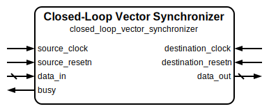

# Closed Loop Vector Synchronizer

|         |                                                                                  |
| ------- | -------------------------------------------------------------------------------- |
| Module  | Closed Loop Vector Synchronizer                                                  |
| Project | [OmniCores-BuildingBlocks](https://github.com/Louis-DR/OmniCores-BuildingBlocks) |
| Author  | Louis Duret-Robert - [louisduret@gmail.com](mailto:louisduret@gmail.com)         |
| Website | [louis-dr.github.io](https://louis-dr.github.io)                                 |
| License | MIT License - [mit-license.org](https://mit-license.org)                         |

## Overview



Resynchronizes a multi-bit vector signal `data_in` from the source `source_clock` clock domain to the destination `destination_clock` domain using a closed-loop mechanism that guarantees atomic vector updates. This helps prevent metastability issues when crossing clock domains. The number of flip-flop stages can be increased from the default two to three or more for even better MTBF. The synchronized data must be synchronous to its clock to be correctly captured.

Unlike the standard `vector_synchronizer`, this module ensures that all bits of the vector are transmitted and captured atomically, preventing intermediate or corrupted values from appearing at the output. A synchronization sequence is triggered when the input signal changes. The sequence performs cross-domain handshake to ensure the data is transmitted atomically. While the synchronization is ongoing, the `busy` signal is high, and any changes of the input data is ignored. This variant is ideal for applications where data integrity is critical and spurious intermediate values cannot be tolerated, but the cost of an asynchronous FIFO is too high.

## Parameters

| Name     | Type    | Allowed Values | Default | Description                                     |
| -------- | ------- | -------------- | ------- | ----------------------------------------------- |
| `WIDTH`  | integer | `≥1`           | `8`     | Width of the data vector to be synchronized.    |
| `STAGES` | integer | `≥1`           | `2`     | Number of flip-flop stages in the synchronizer. |

## Ports

| Name                 | Direction | Width   | Clock               | Reset                | Reset value | Description                                               |
| -------------------- | --------- | ------- | ------------------- | -------------------- | ----------- | --------------------------------------------------------- |
| `source_clock`       | input     | 1       | self                |                      |             | Source clock domain for the input signal.                 |
| `source_resetn`      | input     | 1       | `source_clock`      | self                 | active-low  | Asynchronous active-low reset for the source domain.      |
| `destination_clock`  | input     | 1       | self                |                      |             | Destination clock domain for the synchronized signal.     |
| `destination_resetn` | input     | 1       | `destination_clock` | self                 | active-low  | Asynchronous active-low reset for the destination domain. |
| `data_in`            | input     | `WIDTH` | `source_clock`      |                      |             | Input data vector from the source clock domain.           |
| `data_out`           | output    | `WIDTH` | `destination_clock` | `destination_resetn` | `0`         | Synchronized output data vector to `destination_clock`.   |
| `busy`               | output    | 1       | `source_clock`      | `source_resetn`      | `0`         | Busy signal indicating synchronization in progress.       |

## Operation

The `closed_loop_vector_synchronizer` module consists of source and destination capture stages connected by pulse synchronizers forming a closed feedback loop. When `data_in` changes, it is captured in the source stage and an update pulse is generated. This pulse is synchronized to the destination domain using a `toggle_pulse_synchronizer`, where it triggers the capture of the source stage data into the destination stage. The delay introduced by the pulse synchronization ensure the stability of the signal between the source and destination stages.

A feedback pulse is then synchronized back to the source domain to clear the busy signal and allow new data to be captured. The `busy` signal is asserted when an update is detected and remains active until the feedback confirms the synchronization is complete. During this time, the source stage holds its current value and ignores changes to `data_in`. If the `data_in` is changes once during the synchronization sequence, the new value will be synchronized sequentially. If the input data changes multiple times, only the last value will be synchronized.

This mechanism ensures that the entire vector is captured atomically in the destination domain, with no risk of partial updates or intermediate values. The feedback loop guarantees that the source domain knows when the synchronization is complete and can safely capture new data.

## Paths

| From      | To         | Type       | Comment                                                                                                     |
| --------- | ---------- | ---------- | ----------------------------------------------------------------------------------------------------------- |
| `data_in` | `data_out` | sequential | The signal passes through source capture, pulse synchronization, and destination capture stages atomically. |
| `data_in` | `busy`     | sequential | Changes in data trigger the busy signal through the update pulse detection logic.                           |

The latency from `data_in` to `data_out` is approximately `2×STAGES + 1` clock cycles, accounting for the update pulse synchronization and data propagation delay.

## Complexity

| Delay       | Gates                 |
| ----------- | --------------------- |
| `O(STAGES)` | `O(WIDTH + 2×STAGES)` |

## Verification

The closed loop vector synchronizer is verified using a SystemVerilog testbench with a single check sequence.

The following table lists the checks performed by the testbench.

| Number | Check       | Description                                                                                              |
| ------ | ----------- | -------------------------------------------------------------------------------------------------------- |
| 1      | Random test | Changes the `data_in` randomly and checks that it propagates with the expected delay and without glitch. |

The following table lists the parameter values verified by the testbench.

| `WIDTH` | `STAGES` |           |
| ------- | -------- | --------- |
| 8       | 2        | (default) |

## Constraints

The constraints file `closed_loop_vector_synchronizer.sdc` contains the procedure `::omnicores::buildingblocks::timing::closed_loop_vector_synchronizer::apply_constraints_to_instance`. It takes as parameter the hierarchical path to the instance of the synchronizer and applies constraints to it.

```tcl
set closed_loop_vector_synchronizer_path "path/to/closed_loop_vector_synchronizer"

::omnicores::buildingblocks::timing::closed_loop_vector_synchronizer::apply_constraints_to_instance $closed_loop_vector_synchronizer_path
```

The procedure applies a false-path from the output of the source capture stage to the input of the destiation capture stage, and applies appropriate constraints for the pulse synchronizers within the module. The constraints handle the asynchronous nature of the data paths while ensuring proper setup and hold times for the synchronized capture pulses.

To call the procedure automatically on all instances of the synchronizer, use the common procedure `::omnicores::common::apply_constraints_to_all_module_instances` with the module name `closed_loop_vector_synchronizer` and the constraints procedure `::omnicores::buildingblocks::timing::closed_loop_vector_synchronizer::apply_constraints_to_instance`. It will search the design for all instances of the module and call the constraints procedure on each.

```tcl
::omnicores::common::apply_constraints_to_all_module_instances "closed_loop_vector_synchronizer" "::omnicores::buildingblocks::timing::closed_loop_vector_synchronizer::apply_constraints_to_instance"
```

## Deliverables

| Type              | File                                                                                               | Description                                         |
| ----------------- | -------------------------------------------------------------------------------------------------- | --------------------------------------------------- |
| Design            | [`closed_loop_vector_synchronizer.v`](closed_loop_vector_synchronizer.v)                           | Verilog design file.                                |
| Testbench         | [`closed_loop_vector_synchronizer.testbench.sv`](closed_loop_vector_synchronizer.testbench.sv)     | SystemVerilog verification testbench.               |
| Waveform script   | [`closed_loop_vector_synchronizer.testbench.gtkw`](closed_loop_vector_synchronizer.testbench.gtkw) | Script to load the waveforms in GTKWave.            |
| Symbol descriptor | [`closed_loop_vector_synchronizer.symbol.sss`](closed_loop_vector_synchronizer.symbol.sss)         | Symbol descriptor for SiliconSuite-SymbolGenerator. |
| Symbol image      | [`closed_loop_vector_synchronizer.symbol.svg`](closed_loop_vector_synchronizer.symbol.svg)         | Generated vector image of the symbol.               |
| Datasheet         | [`closed_loop_vector_synchronizer.md`](closed_loop_vector_synchronizer.md)                         | Markdown documentation datasheet.                   |

## Dependencies

This module depends on the following external modules:

| Module                                                                                                               | Path                                                                        | Description                                  |
| -------------------------------------------------------------------------------------------------------------------- | --------------------------------------------------------------------------- | -------------------------------------------- |
| [`toggle_pulse_synchronizer`](../toggle_pulse_synchronizer/toggle_pulse_synchronizer.md)                             | `omnicores-buildingblocks/sources/timing/toggle_pulse_synchronizer`         | Pulse synchronizer using toggle mechanism.   |
| [`synchronizer`](../synchronizer/synchronizer.md)                                                                    | `omnicores-buildingblocks/sources/timing/synchronizer`                      | Basic single-bit synchronizer module.        |
| [`edge_detector`](../../pulse/edge_detector/edge_detector.md)                                                        | `omnicores-buildingblocks/sources/pulse/edge_detector`                      | Signal edge detector                         |
| [`toggle_flip_flop_with_reset`](../../flip_flop/toggle_flip_flop_with_reset/toggle_flip_flop_with_reset.md)          | `omnicores-buildingblocks/sources/flip_flop/toggle_flip_flop_with_reset`    | Roggle flip-flop                             |
| [`set_reset_flip_flop_with_reset`](../../flip_flop/set_reset_flip_flop_with_reset/set_reset_flip_flop_with_reset.md) | `omnicores-buildingblocks/sources/flip_flop/set_reset_flip_flop_with_reset` | Set-reset flip-flop for busy signal control. |

## Related modules

| Module                                                                                                  | Path                                                                     | Comment                                                                      |
| ------------------------------------------------------------------------------------------------------- | ------------------------------------------------------------------------ | ---------------------------------------------------------------------------- |
| [`synchronizer`](../synchronizer/synchronizer.md)                                                       | `omnicores-buildingblocks/sources/timing/synchronizer`                   | Basic single-bit synchronizer.                                               |
| [`fast_synchronizer`](../fast_synchronizer/fast_synchronizer.md)                                        | `omnicores-buildingblocks/sources/timing/fast_synchronizer`              | A slightly faster synchronizer.                                              |
| [`registered_synchronizer`](../registered_synchronizer/registered_synchronizer.md)                      | `omnicores-buildingblocks/sources/timing/registered_synchronizer`        | Single-bit synchronizer with source domain registration to prevent glitches. |
| [`vector_synchronizer`](../vector_synchronizer/vector_synchronizer.md)                                  | `omnicores-buildingblocks/sources/timing/vector_synchronizer`            | Multi-bit synchronizer without source domain registration.                   |
| [`registered_vector_synchronizer`](../registered_vector_synchronizer/registered_vector_synchronizer.md) | `omnicores-buildingblocks/sources/timing/registered_vector_synchronizer` | Multi-bit synchronizer with source domain registration.                      |
| [`grey_vector_synchronizer`](../grey_vector_synchronizer/grey_vector_synchronizer.md)                   | `omnicores-buildingblocks/sources/timing/grey_vector_synchronizer`       | Vector synchronizer using Grey encoding for incremental counters.            |
| [`reset_synchronizer`](../reset_synchronizer/reset_synchronizer.md)                                     | `omnicores-buildingblocks/sources/timing/reset_synchronizer`             | Synchronizer specifically for reset signals.                                 |
| [`feedback_pulse_synchronizer`](../feedback_pulse_synchronizer/feedback_pulse_synchronizer.md)          | `omnicores-buildingblocks/sources/timing/feedback_pulse_synchronizer`    | Synchronizer for pulses using a feedback mechanism.                          |
| [`toggle_pulse_synchronizer`](../toggle_pulse_synchronizer/toggle_pulse_synchronizer.md)                | `omnicores-buildingblocks/sources/timing/toggle_pulse_synchronizer`      | Synchronizer for pulses using a toggle mechanism.                            |
