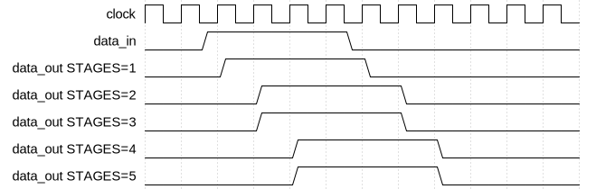

# Fast Synchronizer

|         |                                                                                  |
| ------- | -------------------------------------------------------------------------------- |
| Module  | Fast Synchronizer                                                                |
| Project | [OmniCores-BuildingBlocks](https://github.com/Louis-DR/OmniCores-BuildingBlocks) |
| Author  | Louis Duret-Robert - [louisduret@gmail.com](mailto:louisduret@gmail.com)         |
| Website | [louis-dr.github.io](https://louis-dr.github.io)                                 |
| License | MIT License - https://mit-license.org/                                           |

## Overview


Resynchronizes a single-bit signal `data_in` from an asynchronous or different clock domain to the destination `clock` domain using a chain of flip-flops. This helps prevent metastability issues when crossing clock domains. The number of flip-flop stages can be increased from the default two to three or more for even better MTBF. The synchronized signal must remain stable for at least one cycle of the destination `clock` to be correctly captured.

This variant is slightly faster than the standard `synchronizer` because it leverages both the rising and falling edges of the destination clock.

To prevent glitches at the capture stage, there should be no combinational logic between the last flop in the source domain and the capture flop in the capture domain. The variant `registered_synchrnoizer` add a built-in flop stage in the source domain to ensure this.



## Parameters

| Name     | Type    | Allowed Values | Default | Description                                     |
| -------- | ------- | -------------- | ------- | ----------------------------------------------- |
| `STAGES` | integer | `≥1`           | `2`     | Number of flip-flop stages in the synchronizer. |

## Ports

| Name       | Direction | Width | Clock        | Reset    | Reset value | Description                                           |
| ---------- | --------- | ----- | ------------ | -------- | ----------- | ----------------------------------------------------- |
| `clock`    | input     | 1     | self         |          |             | Destination clock domain for the synchronized signal. |
| `resetn`   | input     | 1     | `clock`      | self     | `0`         | Asynchronous active-low reset.                        |
| `data_in`  | input     | 1     | asynchronous |          |             | Asynchronous input data signal to be synchronized.    |
| `data_out` | output    | 1     | `clock`      | `resetn` | `0`         | Synchronized output data signal to `clock`.           |

## Operation

The `fast_synchronizer` module consists of a chain of `STAGES` D-type flip-flops. On each rising edge of `clock`, the value of `data_in` is captured by the first flip-flop in the chain (called the capture stage). Subsequent flip-flops (called synchronization stages) capture the output of the preceding flip-flop in the chain. The `data_out` signal is the output of the last flip-flop in the chain.

The last flop in the destination domain captures on the rising edge, and the previous flops alternate between capturating on the negative and positive edges. This reduces the latency of the synchronizer, but degrades MTBF. It can also confuse the tools that recognize typical synchronizer structures.

## Paths

| From      | To         | Type       | Comment                                            |
| --------- | ---------- | ---------- | -------------------------------------------------- |
| `data_in` | `data_out` | sequential | The signal propagates through `STAGES` flip-flops. |

The latency from `data_in` to `data_out` is `STAGES/2` clock cycles of the `clock` domain.

## Complexity

| Delay       | Gates       |
| ----------- | ----------- |
| `O(STAGES)` | `O(STAGES)` |

## Verification

The `fast_synchronizer` module is verified using a SystemVerilog testbench. The testbench instantiates multiple `fast_synchronizer` DUTs with the `STAGES` parameter ranging from 1 to `MAX_TEST_STAGES` (set to 5). It provides the same stimulus to all DUTs and checks their output in parallel.

The following table lists the checks performed by the testbench.

| Number | Check                                        | Description                                                                                                                                     |
| ------ | -------------------------------------------- | ----------------------------------------------------------------------------------------------------------------------------------------------- |
| 1      | Low-to-high transition at 25% of clock cycle | Toggles the `data_in` from 0 to 1 slightly after the clock edge and checks that it propagates with the expected delay and without glitch.       |
| 2      | High-to-low transition at 25% of clock cycle | Toggles the `data_in` from 1 to 0 slightly after the clock edge and checks that it propagates with the expected delay and without glitch.       |
| 3      | Low-to-high transition at 75% of clock cycle | Toggles the `data_in` from 0 to 1 slightly before the next clock edge and checks that it propagates with the expected delay and without glitch. |
| 4      | High-to-low transition at 75% of clock cycle | Toggles the `data_in` from 1 to 0 slightly before the next clock edge and checks that it propagates with the expected delay and without glitch. |

The following table lists the parameter values verified by the testbench.

| `STAGES`    |
| ----------- |
| 1           |
| 2 (default) |
| 3           |
| 4           |
| 5           |

## Constraints

The constraints file `fast_synchronizer.sdc` contains the procedure `::omnicores::buildingblocks::timing::fast_synchronizer::apply_constraints_to_instance`. It takes as parameter the hierarchical path to the instance of the synchronizer and applies constraints to it.

```tcl
set fast_synchronizer_path "path/to/fast_synchronizer"

::omnicores::buildingblocks::timing::fast_synchronizer::apply_constraints_to_instance $fast_synchronizer_path
```

The procedure applies a false-path to the input of the capture flop and a max-delay of 0 between the synchronization flops. The false-path tells the tool to not consider this timing path as this is clock-domain-crossing. The max-delay forces the tool to place the synchronization flops as close as possible to each other to minimize metastability. This max-delay of 0 will necessarily violate as it is impossible to meet, so the violation should be waived. Alternatively, the max-delay can be removed and replaced by special instructions for the place-ant-route tool.

To call the procedure automatically on all instances of the synchronizer, use the common procedure `::omnicores::common::apply_constraints_to_all_module_instances` with the module name `fast_synchronizer` and the constraints procedure `::omnicores::buildingblocks::timing::fast_synchronizer::apply_constraints_to_instance`. It will search the design for all instances of the module and call the constraints procedure on each.

```tcl
::omnicores::common::apply_constraints_to_all_module_instances "fast_synchronizer" "::omnicores::buildingblocks::timing::fast_synchronizer::apply_constraints_to_instance"
```

## Deliverables

| Type                | File                                                                   | Description                                         |
| ------------------- | ---------------------------------------------------------------------- | --------------------------------------------------- |
| Design              | [`fast_synchronizer.v`](fast_synchronizer.v)                           | Verilog design file.                                |
| Testbench           | [`fast_synchronizer.testbench.sv`](fast_synchronizer.testbench.sv)     | SystemVerilog verification testbench.               |
| Waveform script     | [`fast_synchronizer.testbench.gtkw`](fast_synchronizer.testbench.gtkw) | Script to load the waveforms in GTKWave.            |
| Constraint script   | [`fast_synchronizer.sdc`](fast_synchronizer.sdc)                       | Tickle SDC constraint script for synthesis.         |
| Symbol descriptor   | [`fast_synchronizer.symbol.sss`](fast_synchronizer.symbol.sss)         | Symbol descriptor for SiliconSuite-SymbolGenerator. |
| Symbol image        | [`fast_synchronizer.symbol.svg`](fast_synchronizer.symbol.svg)         | Generated vector image of the symbol.               |
| Waveform descriptor | [`fast_synchronizer.wavedrom.json`](fast_synchronizer.wavedrom.json)   | Waveform descriptor for Wavedrom.                   |
| Waveform image      | [`fast_synchronizer.wavedrom.svg`](fast_synchronizer.wavedrom.svg)     | Generated image of the waveform.                    |
| Datasheet           | [`fast_synchronizer.md`](fast_synchronizer.md)                         | Markdown documentation datasheet.                   |

## Dependencies

This module has no external module dependencies.

## Related modules

| Module                                                                                         | Path                                                                  | Comment                                                                           |
| ---------------------------------------------------------------------------------------------- | --------------------------------------------------------------------- | --------------------------------------------------------------------------------- |
| [`synchronizer`](../synchronizer/synchronizer.md)                                              | `omnicores-buildingblocks/sources/timing/synchronizer`                | More standard slower synchronizer.                                                |
| [`registered_synchronizer`](../registered_synchronizer/registered_synchronizer.md)             | `omnicores-buildingblocks/sources/timing/registered_synchronizer`     | Synchronizer variant with a final stage in the source domain to prevent glitches. |
| [`vector_synchronizer`](../vector_synchronizer/vector_synchronizer.md)                         | `omnicores-buildingblocks/sources/timing/vector_synchronizer`         | Synchronizer for multi-bit data vectors.                                          |
| [`reset_synchronizer`](../reset_synchronizer/reset_synchronizer.md)                            | `omnicores-buildingblocks/sources/timing/reset_synchronizer`          | Synchronizer specifically for reset signals.                                      |
| [`feedback_pulse_synchronizer`](../feedback_pulse_synchronizer/feedback_pulse_synchronizer.md) | `omnicores-buildingblocks/sources/timing/feedback_pulse_synchronizer` | Synchronizer for pulses using a feedback mechanism.                               |
| [`toggle_pulse_synchronizer`](../toggle_pulse_synchronizer/toggle_pulse_synchronizer.md)       | `omnicores-buildingblocks/sources/timing/toggle_pulse_synchronizer`   | Synchronizer for pulses using a toggle mechanism.                                 |
